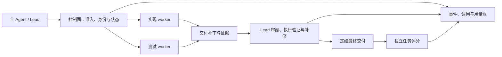

# DPswarm

**面向异构多模型 Agent 的协作控制面与实验研究项目。**

DPswarm 的目标是让主 Agent 根据任务需要调用不同模型协作，由代码约束预算、容量、执行身份和验收流程，并记录每次调用、交付、采用与最终结果。LLM 负责语义判断，控制面负责可检查的约束和状态一致性。

目前已有 Python 控制面、DSH 插件接入和真实模型实验运行器。**当前定位是有实验证据的研究原型**：固定团队与 CM 已有结果；自主组队、动态路由和模型升级策略的净收益尚未验证。

[鹈鹕动画实验快照](reports/2026-09-08/pelican/README.md) · [实验报告与数据](reports/README.md) · [具体贡献拆解](reports/2026-09-07/component-attribution/REPORT_ZH.md) · [机制设计](DPswarm-机制架构.md) · [Python 实现](dpswarm-plugin/README.md) · [DSH 接入](dpswarm-dsh-plugin/README.md)

## 历史 SWE 实验说明了什么

截至 **2026-09-07**，综合库存包含 **306 次尝试、249 条合格 SWE 评分、26 道去重题目**。不同阶段有重复题、不同模型、预算和运行时版本，这些数是库存，不是 249 道独立题，也不能直接混算总体通过率。

| 问题 | 已观察到的结果 | 解释边界 |
|---|---|---|
| 固定异构团队是否有帮助？ | 同源 A1+A2 的 18 题中，Sol Lead＋Terra 实现＋GLM-5.3 测试通过 **13/18**，Sol 单体 **11/18** | 描述性多通过 2 题；未证明新任务上的普遍增益 |
| 提升发生在哪里？ | 同 18 题，团队交付生产补丁 **17/18**，单体 **13/18**；两侧都交付的 13 题通过模式完全相同 | 两次增益都发生在仅团队有生产补丁的题上；尚不能单独归因于交付纪律 |
| 哪个角色实际作出了贡献？ | Pylint 中测试暴露实现遗漏，Lead 随后补修；Matplotlib 中实现者失败，测试者给出诊断，Lead 接管完成 | 有具体贡献链；没有测试者平均净贡献或 review 正确率 |
| CM 是否值得用？ | C1：Sol Lead＋双 GLM-5.3-Flash worker，DeepSeek CM ON/OFF 均通过 **4/9**；ON 总 token **−5.125%**、价卡费用 **−20.373%** | 三题各三次；未显示质量提升，未证明质量等价或普遍净节省，未达到预设 15% token 节约门槛 |
| 多给预算是否更好？ | B1 三个核心任务，T00→T11 的通过数 **2/3→1/3**，token **+206.5%** | 多个预算旋钮联动，不能解释为单一额度的因果效应；也不能推断测试者份额越大越好 |
| 复杂任务是否突破？ | Xarray-6992 的 B1 核心三格均未满足官方 12 个目标节点 | 本地测试通过与无回归，不自动代表实现了任务所需语义 |

质量信号主要来自**生产交付、能区分错误实现的验收反馈，以及 Lead 的补修和接管**。CM 则有独立开关对照中的资源收益。二者的证据性质不同。

在该固定异构组合的全部正向比较层内，10 次团队运行的最终生产来源为：4 次实现者改动直接保留、4 次 Lead 接管、2 次初稿加补修。**这只涉及三道题，是代码来源统计，不是角色贡献百分比。**

## 已实现的能力与待验证的机制

| 部分 | 当前状态 |
|---|---|
| 事件与恢复 | JSONL 事件存储、回放、不变量校验、写入锁和异常恢复逻辑已有实现与离线测试 |
| 准入与生命周期 | 根约束、节点容量、身份绑定、提交／验收、重试、封存等控制接口已有实现 |
| 异构角色 | 运行器支持按 Lead、实现者、测试者配置模型，保存 requested／reported 身份与调用归属 |
| 上下文 | 摘要压缩、上下文装配、记忆生命周期及保护开关已有实现；只有部分设置有直接效果对照 |
| 观测 | 分开记录输入、缓存、输出、已知用量、未知用量、预约额度、运行终止与官方结果 |
| DSH 插件 | 0.7.4 显式开启后强制团队派发；手动额度由用户决定，Auto 才由 Lead 决定。已接入 DPH 模型注册服务，新增模型无需重复登记；提供原生设置子页面、独立团队／CM 开关、每个子 agent 的额度、真实 Lead 路由继承与持久身份绑定；原生宿主工程链路已验证，插件质量与净收益另按实验判定 |
| 自主决策 | 自主组队、动态拆分、模型路由、升级与画像闭环是研究目标；固定派生实验不能证明这些策略有效 |

详细实现映射见 [Python 控制面说明](dpswarm-plugin/README.md)，设计约定见 [机制架构](DPswarm-机制架构.md)与[分层架构](DPswarm-架构设计.md)。设计文档中的目标、控制路径的存在和实测净收益分别判定。

## 执行与证据链



worker 完成不等于交付被接受，采用补丁不等于补丁带来了通过，根任务通过也不代表所有 worker 都成功。未知用量保持未知，预约 token 不当作实际使用量。实验中的固定团队由协议创建，不据此宣称 Lead 自主选择了最优团队。

## 在 DPH／DSH 中使用固定团队与 CM

**当前源码插件版本为 0.7.4，团队与 CM 均默认关闭。** 开启团队后宿主强制派发，手动额度严格遵循用户设置，只有 Auto 由 Lead 决定；见 [工程验证](reports/2026-09-08/team-required/README.md)。 安装后，在 **设置 → DPswarm → 模型分工** 中选择角色模型，在 **预算与运行** 中设置每个子 agent 的额度，再到已有会话的罗盘菜单中按需开启。

| 角色／选项 | 默认与作用 |
|---|---|
| 实现者 | 跟随本次 Lead 实际请求的 Provider、模型与推理强度；可显式选择其他模型 |
| 测试者 | `glm-5.3-flash`；首次需从 DPH 模型目录保存完整 Provider 与模型 |
| Reviewer | 当前 Lead，不另开审查 agent；选独立模型后才增加审查，最终验收仍归 Lead |
| CM | 独立开关，产品默认 `deepseek-v4-flash`、推理 `off`；单 agent 也可使用 |
| 子 agent 额度 | 默认不限制；手动时严格使用用户保存的每 worker token／调用上限；只有 Auto 由实际 Lead 读任务后决定各角色额度与理由 |

手动额度分别属于每个 child；Auto 允许各角色额度不同，没有隐藏评估模型。Lead 主对话和 Lead 的 CM 不受这些子额度限制；每个 worker 的普通请求与自身 CM 记入自己的额度。选择“不做限制”时不添加 token／调用累计限制；角色超时与服务商限制仍各自生效。

0.7.3 让固定团队直接使用 DPH 后端的精确模型解析服务，AA 评分不再作为新模型的可用性门槛。自定义模型同样支持；能力和价格缺失仍记录未知。安装后的宿主需要在空闲时更新并重启才能生效。 本机配套安装与重启已核验，见[0.7.3 验证摘要](reports/2026-09-08/host-model-registry/README.md)。

0.7.2 修复了“已在对话中换模型，子角色仍继承启动模型”的错路由，并核对推理强度实际到达子模型请求。角色路由绑定真实子会话后持久保存；旧会话缺少可信绑定时拒绝继续执行，原日志仍保留。只开 CM 不创建团队或 worker；CM 的持久审计按需使用本地 sidecar。

```powershell
node dpswarm-dsh-plugin/bin/setup.mjs --check
node dpswarm-dsh-plugin/bin/setup.mjs --install --profile web
```

需要 DSH、Node.js、pnpm 和 Python 3.10+（含 pip、setuptools 68+）。可用 `--python` 指定解释器；安装器自动发现宿主并在独立目录安装 Python 组件。安装后重启 DSH。详见 [安装与使用](dpswarm-dsh-plugin/README.md) 和 [验证范围](dpswarm-dsh-plugin/VALIDATION.md)。**CM 已接入 DSH 的真实历史替换与回放**，开启后在请求前整理较早上下文，失败不采用摘要；宿主原有压缩策略保留。插件工程验证不意味着实验中的节省比例已迁移到 DSH。

## 快速开始：本地演示

需要 Python **3.10+**。以下演示使用 MockProvider，可检查控制流程，不消耗模型额度，也不构成真实模型实验。

```bash
cd dpswarm-plugin
python -m pip install -e ".[dev]"
python -m dpswarm.cli init --dir .demo
python -m dpswarm.cli run --task "整理日志并汇总统计" --mock examples/mock_single.json --dir .demo
python -m dpswarm.cli status --dir .demo
python -m dpswarm.cli replay --dir .demo
```

本地面板可通过 `python -m dpswarm.server` 启动。DSH 的端口、顶层会话约束和工具安装方式见 [DSH 插件说明](dpswarm-dsh-plugin/README.md)。真实模型与实验入口分别见 [Python Provider 配置](dpswarm-plugin/README.md)、[B1 预算实验运行器](modelbench/big_budget_team_20260906/README.md)和 [C1 消融运行器](modelbench/mechanism_ablation_20260906/README.md)。

## 测试与复核

从 `dpswarm-plugin` 目录运行核心离线测试：

```bash
python -m pytest -q
```

Windows 下跨进程测试需要统一文本编码，可先在 PowerShell 设置 `$env:PYTHONUTF8 = "1"`。不同实验目录存在同名测试模块，合并收集时使用 `--import-mode=importlib`，或分别运行各目录。

0.7.2 的工程检查及本次发布哈希复核见 [同步验证记录](reports/2026-09-08/SYNC_VALIDATION.json)；[2026-09-07 记录](reports/2026-09-07/SYNC_VALIDATION.json) 保留为历史依据。核心控制面测试、依赖本地归档的历史实验合同测试、真实模型实验三者分开记录，不把测试数量当作产品成熟度或 benchmark 胜场。

## DPH 鹈鹕动画实验快照

[实验说明与逐组索引](reports/2026-09-08/pelican/README.md) · [动画对比页](reports/2026-09-08/pelican/index.html)

这批任务在 DPH 中比较对话模型、标准／创造模式、团队与 CM 开关，以及子 worker 额度设置。统一任务是生成“SVG 鹈鹕骑自行车”的 HTML；按任务要求没有运行作品测试。发布的是进行中实验的时点快照，状态、缺失格、失败、恢复和版本差异以报告内记录为准，后续运行不会自动改写这个快照。

**本批 CM 明确配置为 `glm-5.3-flash`，产品默认仍为 DeepSeek。** 作品交付、视觉表现、token 与耗时分别记录；保存后的 HTML 不是 SWE 官方通过结果。该快照独立于上面的历史 SWE 数据，也不能据此宣称 CM 或团队带来因果提升。

## 报告阅读顺序

1. [全历史综合报告](reports/2026-09-07/full-history/REPORT_ZH.md)：按配置、阶段、题型、角色与机制汇总正面、负面和未知证据。
2. [具体贡献拆解](reports/2026-09-07/component-attribution/REPORT_ZH.md)：沿补丁来源、测试反馈和 Lead 修改顺序解释局部增益，并拆分 CM 收支。
3. [报告索引与发布口径](reports/README.md)：图表、HTML 下载、汇总 CSV 和原始归档的边界。

报告使用各阶段冻结的 API 等价价卡，**不等于 Coding Plan 订阅的实际现金支出**。GitHub 发布版保留完整正文、图表与选定汇总数据；完整调用日志、模型响应、运行工作区、镜像和本地配置另行归档。原始分析保持不变，发布副本的来源与变换记录在 [发布清单](reports/2026-09-07/PUBLICATION_MANIFEST.json)。

## 仓库结构

| 路径 | 用途 |
|---|---|
| `dpswarm-plugin/` | Python 控制面、Provider 抽象、CLI、面板与核心测试 |
| `dpswarm-dsh-plugin/` | DSH Host／Client 插件与 sidecar 接口 |
| `modelbench/` | 固定团队、预算实验和 CM 消融的运行器及合同测试 |
| `reports/` | 面向 GitHub 阅读的报告、图表、汇总表和发布验证 |
| `scripts/publish_reports.py` | 从本地冻结分析导出发布副本；不调用模型或评分器 |
| `prototype*/` | 早期逻辑原型，保留其历史验证范围 |
| `DPswarm-机制架构.md` | 机制约定与设计目标 |
| `DPswarm-架构设计.md` | 观测、画像、事实注入、委派与路由的分层设计 |

## 接下来的研究问题

优先区分测试者文字诊断、测试代码和执行反馈各自的净贡献；将交付检查点同样施加于单体，分离交付纪律与团队结构；比较仅 Lead、仅 worker、全角色与关闭 CM 的资源效果；对封存候选补做独立判定，建立 review 的可审计真值。Memory／Scout／Bootstrap 与自主路由仍需相应对照。上述方向是待验证问题，不是已经启动或已证明有效的能力。
