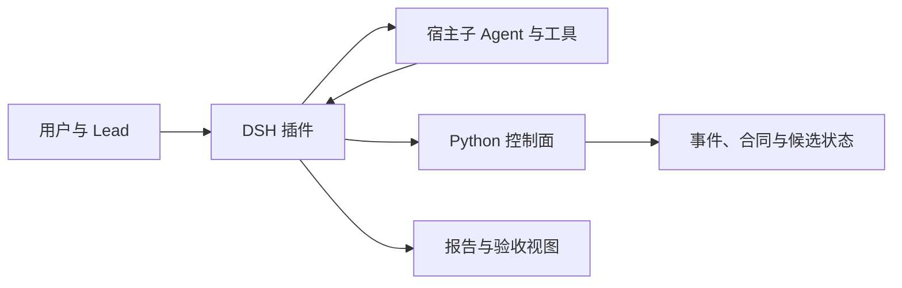

# 架构与机制

DPswarm 包含 Python 控制面、DSH 固定团队插件和实验运行器。LLM 负责理解任务、选择行动和给出语义判断；程序负责身份、预算、依赖、候选与验收状态的一致性。

## 产品入口

DSH 插件默认关闭，由用户为当前任务显式开启。开启后采用固定团队流程，实现者交付，测试者独立检查，Lead 负责协调与验收。Reviewer 可以由 Lead 承担，也可以配置独立模型。插件支持串行、并行及分阶段交付；这些执行方式不等于已经实现自主选择 solo 或 team。

角色可以使用不同模型和推理配置。Provider 与凭据由宿主管理。角色状态 `completed` 表示该次执行结束，不代表候选已通过验收；报告提交、候选接受和资源清理也分别记录。

## 组件边界

| 组件 | 责任 | 代码 |
|---|---|---|
| 固定团队与宿主桥接 | 角色派发、上下文、工作区约束、续接与报告收集 | [fixed-team.js](../dpswarm-dsh-plugin/lib/fixed-team.js) |
| 合同与报告交互 | 版本协商、提示模板、语法诊断和合法动作摘要 | [acceptance-runtime.js](../dpswarm-dsh-plugin/lib/acceptance-runtime.js) |
| Python 验收 | 候选绑定、版本和 revision、证据与 finding 处置校验 | [acceptance.py](../dpswarm-plugin/dpswarm/acceptance.py) |
| 会话控制服务 | 按宿主会话隔离控制面状态，发布运行能力 | [session_server.py](../dpswarm-plugin/dpswarm/session_server.py) |
| 用量账本 | 按活动和角色记录调用、已知用量与未知预约 | [usage-ledger.js](../dpswarm-dsh-plugin/lib/usage-ledger.js) |
| 研究运行器 | 冻结配置下的模型与机制对照实验 | [modelbench](../modelbench/README.md) |

## 合同、验收与恢复

插件优先使用双方支持的报告合同，创建后冻结。支持 v2 的服务会声明能力；旧服务回落 v1，缺少版本字段的历史合同继续按 v1。模板、验证派发和补报告都遵循该冻结合同。

候选与文件内容、任务要求、验证 revision 绑定。报告里的 pass 不是单独的验收权力：程序检查当前候选、审查身份、测试证据和未处置 finding。格式补报告不能改变已经表达的语义；内容重审与产品返工各有自己的状态转换。恢复保留原任务与预算约束，不把重启当作新的成功执行。

v2 增加验证计划、check results 与 finding disposition，但 completed check 可能是静态阅读。当前合同检查不能代替对真实工具执行、浏览器观察或测试充分性的判断。

## 上下文与能力边界

CM 接入宿主上下文管理。提示分开呈现用户要求、Lead 派生计划和不可信的上游报告；交接提供摘要、关键原文及原始产物引用。确定性状态由程序保存，模型按现场信息选择探索和验证方式。

执行能力取决于宿主可用工具、权限与运行环境。不能用工具名称或角色名称推断某次测试确实执行。团队结构、上下文管理及额外审查的质量和成本收益需要分别测量。

## 研究边界

[公开报告](../reports/README.md)保留冻结的历史观察、可复核数据与限制。不同版本、任务和预算不合并成一个总胜率。自动组队、动态路由和新增减负机制的净收益尚未得到普遍验证。
