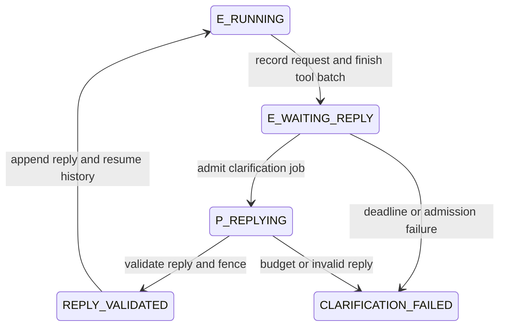

# Agent Team 根因复核与修复计划

日期：2026-09-03。实施更新：协议、交接、有界澄清、计量及恢复已落地到Provider合约和独立团队运行器；397项测试通过，最终4轮真实回归3轮通过，27次GLM原生调用无协议错误。生产Orchestrator普通文本循环尚未迁移。详细结果、失败保留与代码范围见[修复实施记录](<K:/秋招/项目/DPswarm/modelbench/team_runtime_v2/IMPLEMENTATION_REPORT.md>)。

以下正文保留原始计划快照：撰写时仅只读分析既有16轮实验与当前实现，修复及复测尚未启动，没有新增候选模型调用、重跑grader或改写原始成绩。计划建议与后续已实现范围以实施记录区分。

## 1. 结论与责任边界

本次问题主要分布在三个不同层次：模型传输协议、规划信息交接、角色再调度。它们连起来会形成“知道要做什么，却无法稳定发出动作；拿到的规格不完整；追问又收不到及时回复”的失败链。不能只给 Executor 增加提示或换更强 Planner 来覆盖这三个缺口。

| 问题 | 已证实的直接机制 | 所在层 | 不能据此下的结论 |
|---|---|---|---|
| GLM 主实验大量协议失败 | 普通回复必须整段通过自定义 JSON 解析；说明前缀、错误嵌套和括号导致动作未执行 | 本次实验的 transport/AgentLoop 适配 | GLM 编码能力差，或官方原生 tools 本身失效 |
| Planner 漏传约束 | 完整规格已到 P，但自由文本计划没有逐字段覆盖校验，缺失值仍被交给 E | 角色交接契约与校验 | 完整规格被网络截断，或 P 达到输出上限 |
| 澄清无法及时恢复 | send_message 只入箱；run 固定只执行一次 P，E 发问不产生可调度工作 | 本次实验的顺序调度器 | Planner 上下文已丢失，或 CP 的 wakeup 自带模型执行能力 |
| 复测解释不充分 | native 同时改变工具通道、历史、结束响应和错误处理 | 实验设计与统计口径 | 25/35 → 0/33 是严格单变量的因果效应 |

主实验使用了真实 DPswarm ControlPlane，但没有走原生 Orchestrator/生产 provider 的完整执行路径。下面单列的生产迁移问题来自本轮源码审计，不冒充已在这 16 轮中复现的生产故障。

## 2. GLM 协议问题：究竟哪里失败

### 2.1 不是原生工具接口调用失败

主实验 36 次 GLM 请求只有 model、messages、thinking、reasoning_effort、temperature、max_tokens、stream，没有顶层 tools、tool_choice 或 response_format。工具 Schema 是 system 中的普通文本，模型必须自行写出外层 type/calls/arguments 包装。[请求构造](<K:/秋招/项目/DPswarm/modelbench/team_eval20260903/transports.py:196>)、[system 拼接](<K:/秋招/项目/DPswarm/modelbench/team_eval20260903/run_experiment.py:235>)。

这个设计把“选择正确工具与参数”和“把整条聊天回复精确排成自定义 JSON”绑在一起。严格拒绝无效动作本身是必要的；问题在于给支持原生工具的模型增加了不必要的自由文本包装负担，并把失败直接消耗进执行预算。GLM 正常的行动说明会在字符 0 被解析器拒绝，实际工具没有机会运行。

GLM 的官方接口通过 tools 声明函数、通过 tool_calls 返回调用，并用 tool_call_id 配对工具结果；function.arguments 仍需合法 JSON，因此改用原生接口也不能省去参数校验。[官方函数工具文档](https://docs.bigmodel.cn/cn/guide/capabilities/function-calling)

### 2.2 对全部 25 次错误重新细分

| 模型 | 协议错误 / 收到响应并进入解析的 E 调用 | 另列传输异常 |
|---|---:|---:|
| GLM-5.3 | 13/18，72.2% | 0 |
| GLM-5.3-Flash | 12/17，70.6% | 1 次超时 |

| 第一处失败 | 次数 | 进一步核对 |
|---|---:|---|
| 输出以说明文字开头 | 20 | 3 次没有 JSON 对象；17 次后接 JSON，其中 11 次完整后缀满足原 parse_action，6 次后缀仍有错误 |
| JSON 括号结构错误 | 3 | 原诊断标签较宽；本次逐条核对为结尾结构错误，不能称为已证实的转义错误 |
| 工具参数层级错误 | 2 | path/content 等放在 call 顶层，缺少要求的 arguments 对象 |

没有纯 Markdown 围栏案例。“去掉代码围栏”不对应这批数据。11 次可解析后缀只证明有些工具意图被说明前缀挡住，**不证明执行后任务就会成功**，也没有据此执行任何动作或修改原分数。

离线复核方法为：仅对说明前缀案例，从第一个左花括号取到输出结尾，交给冻结版本的 parse_action；不搜索后续对象、不补括号、不改引号。11 次通过者均是完整单一顶层对象，无尾部说明。各类完整 call ID 清单、方法与源哈希保存在 [REPAIR_EVIDENCE.json](<K:/秋招/项目/DPswarm/modelbench/team_eval20260903/REPAIR_EVIDENCE.json>)。

代表证据：

- [首轮只有行动说明](<K:/秋招/项目/DPswarm/modelbench/team_eval20260903/calls/e3ae4dce-6a03-4e1e-a2d6-128311124f12/output.md>)：没有历史也已失败，所以历史遗漏不是全部错误的解释。
- [Flash 说明前缀后有完整工具对象](<K:/秋招/项目/DPswarm/modelbench/team_eval20260903/calls/17351cee-c202-47ab-91c0-0bd0b67a34c7/output.md>)：原 driver 在全文首字符拒绝。
- [参数缺少 arguments 层](<K:/秋招/项目/DPswarm/modelbench/team_eval20260903/calls/a3e33a1b-7b6e-4347-b53e-caa80e3ba22d/output.md>)。
- [括号结构错误](<K:/秋招/项目/DPswarm/modelbench/team_eval20260903/calls/5e1168e0-a1f4-49d4-bfc3-a9420cda3142/output.md>)。
- [独立的 600.297 秒超时](<K:/秋招/项目/DPswarm/modelbench/team_eval20260903/calls/2936228d-3b42-4866-a63e-7550dd0e9c53/metadata.json:20>)：无 usage/输出，不属于 JSON 错误。

### 2.3 历史与提示的缺口，需要修，但不能过度归因

35 次成功响应中，33 次包含 reasoning_content；主实验后续 assistant 历史仅保留 role/content，工具结果则包装为普通 user 消息。[响应提取](<K:/秋招/项目/DPswarm/modelbench/team_eval20260903/transports.py:228>)、[历史追加](<K:/秋招/项目/DPswarm/modelbench/team_eval20260903/run_experiment.py:260>)、[工具反馈](<K:/秋招/项目/DPswarm/modelbench/team_eval20260903/run_experiment.py:280>)。

官方文档要求交错工具调用时完整回传原始 reasoning 历史；Coding 端点默认使用保留式思考。主实验采用文本模拟工具，遗漏历史可能影响后续连续性，但本批四个 GLM 运行首轮均已出现错误，因此不能把全部失败归给历史遗漏。GLM-5.3/Flash 为强制思考型号，修复方案不采用关闭 thinking 的办法。[官方思考模式文档](https://docs.bigmodel.cn/cn/guide/capabilities/thinking-mode)

官方角色提示要求完成后输出 DONE，实验追加提示要求 JSON final；二者可通过 final 的 content=“DONE”兼容，但没有显式说明。它是可消除的歧义，25 次错误中没有直接由 DONE 触发的案例，也没有依据说原提示要求先输出说明文字。[原角色提示](<K:/秋招/项目/DPswarm/modelbench/team_eval20260903/TeamBench/harness/agent_interface.py:515>)、[追加提示](<K:/秋招/项目/DPswarm/modelbench/team_eval20260903/run_experiment.py:202>)。

### 2.4 目前可以排除和不能确认的解释

- **没有输出硬截断证据。** 35 次成功响应均为 HTTP 200、finish_reason=stop，没有 length；GLM-5.3 最大输出 4,728 token，Flash 最大 15,360，均低于请求上限 32,768。模型 content 与 driver text 一致，没有发现本地截断/脱敏改写导致这批错误。
- 工具 stdout/stderr 的 4,000/2,000 字符限制确实存在，它限制的是工具反馈，不是模型输出；不能混为 JSON 被截断。
- temperature 固定 1.0，没有温度对照或重复采样，不能断言高温是根因；也没有依据推断厂商内部重试或推理预算实现。
- GPT 经 Codex CLI，有额外包装提示与上下文，输出 cap 也不同。GPT E 的 3/38 与 GLM 的 25/35 描述的是本部署栈，不是纯权重的同条件比较。

### 2.5 native 复测实际上是组合适配方案

| 维度 | 主实验 | native 复测 |
|---|---|---|
| 工具声明 | system 文本 | API tools |
| 外层动作 JSON | 模型自行排版 | 适配器从原生调用生成 |
| 工具反馈 | user 文本 | role=tool，按 ID 配对 |
| reasoning 历史 | 不回传 | 原样回传 |
| 结束提示 | 自定义 JSON final | 普通文本 final |
| 非空、无工具的说明文字 | 通常是协议错误 | 自动规范化为 final |
| 参数/历史校验失败 | 文本解析错误后继续消耗下一调用 | 原生校验错误记入 record.error，结束当前 phase |

此外 P/E/V 全部重新采样。原生复测 33 次 GLM 调用没有通道协议错误、两模型各 2/2 通过，支持优先采用这套原生适配；但两套“协议成功”判定并非完全同构。特别是普通文本被接受为 final 不表示工作已完成，仍需独立验证、交付检查和最终验收。[native 规范化](<K:/秋招/项目/DPswarm/modelbench/team_eval20260903/native_tools.py:72>)。

## 3. Planner 为什么漏传

根因复核覆盖 16 个运行，其中 2 个 Solo 没有 Planner；实际有 14 个 Planner phase、28 次 Planner 调用。

- 28/28 个实际 Planner prompt 均包含完整 spec 原文。
- 14/14 条 P→E 交接消息均已进入 E 首轮请求；按消息对象逐项对比一致，没有消息截断或漏投。
- 7 个 SPEC5 团队规划中，在键名、默认值、env 映射、整数范围和枚举这些精确信息上，只有主矩阵 E=Terra、Luna 的 2 份完整明示；其余 5 份至少遗漏精确 env 映射。
- 这 5 个不完整规划的 P phase 均正常 final，没有撞到 turn_limit。已知三个协作案例的规划输出分别只有 1,820/1,977/1,197 token，正常结束，不能归因为输出上限不足。

以上覆盖核对是针对 SPEC5 公开规格中的有限字段，包含人工逐字段语义检查；不是凭关键词出现就宣称任意自然语言规格完整。

下表所有 Planner 都是 Sol，模型名指该运行的 Executor 条件。默认值/env 必须明确绑定到键；“按精确值实现”不计作已经提供该值。

| SPEC5 条件 | 显式键名 /10 | 键→默认值 /10 | 键→env /10 | 整数范围 /4 | 枚举信息 |
|---|---:|---:|---:|---:|---|
| 主矩阵 GLM-5.3 | 3 | 0 | 0 | 0 | 有集合/大小写规则，未显式命名 log_level |
| 主矩阵 Flash | 3 | 0 | 0 | 0 | 同上 |
| 主矩阵 Sol | 8 | 0 | 0 | 4 | 同上；还缺 debug_mode 键名 |
| 主矩阵 Terra | 10 | 10 | 10 | 4 | 明确 |
| 主矩阵 Luna | 10 | 10 | 10 | 4 | 明确 |
| native GLM-5.3 | 10 | 10 | 0 | 0 | 明确 |
| native Flash | 10 | 10 | 0 | 4 | 明确 |

E 自带的 partial schema 只有前五项，不能补齐上述五份遗漏消息的全部精确 env 映射。这个表只量化明示字段，不能据此宣布所有自然语言行为都语义正确。七条原规划分别位于对应 run 的 messages/dialogue.jsonl:1。

直接问题是交接协议把“清晰计划、突出隐藏约束”当作足够的产物，却没有要求逐字段移交完整规格、声明未知项并通过检查。send_message 校验的是字符串/收件角色等基础合法性，不验证配置键、默认值、环境变量及范围是否齐全。模型因此可以产出读起来合理、但无法无歧义实现的摘要。

权限边界并非完全没提示：runner 已标明 spec 只对 P/V/Solo 可见，E 原角色提示也明确只有 brief、需求不清时应问 Planner。缺的是把已告知的信息边界变成可检查的交付责任。[P 提示](<K:/秋招/项目/DPswarm/modelbench/team_eval20260903/TeamBench/harness/agent_interface.py:321>)、[权限说明](<K:/秋招/项目/DPswarm/modelbench/team_eval20260903/run_experiment.py:202>)、[E 提示](<K:/秋招/项目/DPswarm/modelbench/team_eval20260903/TeamBench/harness/agent_interface.py:511>)、[公开完整规格](<K:/秋招/项目/DPswarm/modelbench/team_eval20260903/instances/SPEC5_config_system/task/spec.md:13>)。

另外七份 INT1 规划均传递了主要阶段格式、字段、邮箱加号规则、数量、错误日志和报告路径；该检查不等于所有自然语言语义已证明完整。Flash INT1 的输出产物遗漏不能简单归给 Planner 未说明产物。

三个可复核案例展示了不同后果：

| 运行 | 缺失内容及 Executor 行为 | 最终如何恢复 |
|---|---|---|
| 主实验 SPEC5 / Sol | P 未交完整 schema；E 多次追问，初次阶段没有创建实现 | V 补齐后，既定修复通过 |
| native SPEC5 / GLM-5.3 | P 未给 WEB_DEBUG 与 [1,300]；E 未追问，采用 WEB_DEBUG_MODE 与 [0,3600] | V 指出差异，修复后通过 |
| native SPEC5 / Flash | P 未给 WEB_DEBUG；E 使用 WEB_DEBUG_MODE，自身 66 项测试仍通过 | V 独立映射检查发现差异，修复后通过 |

这既包含 Planner 的遗漏，也包含 Executor 对未知信息的处理差异。特例映射 WEB_DEBUG 不能保证从 debug_mode 名称机械推导出来。即使换更强 E，也不应把猜对未提供的值作为正确协作机制。

证据：[主实验 Sol 交接时间线](<K:/秋招/项目/DPswarm/modelbench/team_eval20260903/results/SPEC5_config_system__team__gpt-5.6-sol/messages/dialogue.jsonl>)、[native GLM 规划](<K:/秋招/项目/DPswarm/modelbench/team_eval20260903/native_followup/results/SPEC5_config_system__native_team__glm-5.3/messages/dialogue.jsonl:1>)、[native Flash 规划](<K:/秋招/项目/DPswarm/modelbench/team_eval20260903/native_followup/results/SPEC5_config_system__native_team__glm-5.3-flash/messages/dialogue.jsonl:1>)。完整运行成绩及案例见 [原综合报告](<K:/秋招/项目/DPswarm/modelbench/team_eval20260903/EXPERIMENT_REPORT.md>)。

## 4. 澄清为什么不能及时被回答

当前实验的执行顺序是 P → E → V → 可选 E 修复 → V 复检。

1. send_message 仅向 self.dialogue 和 dialogue.jsonl 追加一条消息，没有安排收件角色执行。[代码](<K:/秋招/项目/DPswarm/modelbench/team_eval20260903/run_experiment.py:215>)
2. messages_for 只有在目标角色下一次模型调用前才被读取。[轮询点](<K:/秋招/项目/DPswarm/modelbench/team_eval20260903/run_experiment.py:246>)
3. run 只执行一次 Planner，后续恢复名单里没有 P。[固定调度](<K:/秋招/项目/DPswarm/modelbench/team_eval20260903/run_experiment.py:329>)
4. E 发问后仍继续消耗自己的调用次数；没有等待答复状态、关联问题 ID、回复截止时间或调度唤醒规则。

所以问题是“消息送进了一个暂时不会再执行的收件箱”。这不是上下文被清空：同进程的 self.histories 保留了角色历史，E repair 也确实复用了历史。另一个独立边界是进程重启恢复尚未实现：phase 末尾才写 conversation，遇到未完成目录会拒绝运行，native wire 历史还在内存，不能把 CP journal replay 当模型会话恢复。

CP 的 phase submitted 也不是 accepted；本轮直到最终 grader 后才验收。已提交 planning artifact 应保持不可变，不能靠重复 submit、重新接受旧 P item 或伪造成功来唤醒 Planner。[阶段提交](<K:/秋招/项目/DPswarm/modelbench/team_eval20260903/control_bridge.py:233>)、[最终接受](<K:/秋招/项目/DPswarm/dpswarm-plugin/dpswarm/control.py:673>)。

生产核心的 peer_send/peer_deliver 记录 queued/delivered，wakeup 记录通知；state 对 node_wakeup 没有调度副作用。原生 Orchestrator 有 Memory PULL 补料和 split 主从顺序执行，尚不能当作任意角色消息的恢复闭环。[peer API](<K:/秋招/项目/DPswarm/dpswarm-plugin/dpswarm/control.py:515>)、[wakeup 投影](<K:/秋招/项目/DPswarm/dpswarm-plugin/dpswarm/state.py:448>)、[现有 PULL](<K:/秋招/项目/DPswarm/dpswarm-plugin/dpswarm/orchestrator.py:476>)。这些事实说明需要接入调度器，不说明生产路径已经在本实验中运行失败。

## 5. 实施顺序与明确产物

原主矩阵及 native followup 的冻结程序、输入、计划、分数均保留。建议在新的 modelbench/team_runtime_v2 目录实现下一版实验运行器，先验证后迁入生产；该目录及下面新接口目前尚未创建。

| 优先级 | 工作包 | 主要改动 | 完成标准 |
|---|---|---|---|
| P0-A | 工具协议与统一语义 | 从已验证 native_tools 提取显式 provider adapter；保留原消息/推理历史；统一 action、final、blocked、错误分类 | 合法 native 工具回合可继续；非法参数从不执行；普通说明不被记作任务完成 |
| P0-B | 可校验规划交接 | Planner 输出结构化 HandoffPackage，完整字段/来源/未知项；执行前检查 | SPEC5 十项 schema 的所有适用字段齐全，漏任意一项都不能进入实现 |
| P1-A | 有界澄清调度 | 逐模型调用 yield；关联问题与答复；新 clarification 工作项；恢复原 E 状态 | E 发问后 P 能被调度，E 只在有效答复或明确失败后继续，预算不重置 |
| P1-B | 用量与超时完整性 | 已知/未知与预算预留分开；持久事件、调用状态、总 deadline | 缺 usage 不变成 0；重复/超时恢复不重复执行或重复计费；实际总量与估计分离 |
| P2 | 回归与新冻结实验 | 先离线接口/调度证据，再有界模型探针，再同预算团队回归 | 用统一语义比较配置；不重算旧成绩、不把组合修复说成单因素因果 |

### P0-A：原生工具优先，严格区分四类结果

建议规范化结果至少分为 ToolCalls、Final、NeedsInput、Error。Final 是角色声明结束，不是业务任务 accepted；完成产物仍需检查。普通文本若没有明确完成声明，应记为无动作/提前结束等可观察状态，不能让两种通道在统计上一个算成功、一个算 JSON 失败。

具体采用显式 finish_phase 操作声明 done/blocked、产物和未解决项；native 用函数工具表达，文本通道用对应的规范化动作表达。普通非空文本记为 NoAction 并消费该次调用，不因它非空就自动完成；请求澄清用独立操作进入 NeedsInput。两通道都不靠 DONE 子串或自然语言猜测决定是否完成。

- 请求：按 provider 能力显式构造 tools，不靠字符串替换旧 system 后缀；任务、角色、输出协议分别生成。GPT CLI 继续作为单独声明的部署栈，不能假称与 GLM API 同推理栈。
- 返回：保存原始 assistant 消息、tool_calls、reasoning_content 和 finish_reason；工具结果严格按 ID 配对。同一角色的 native 历史原样续接。
- 执行前：校验工具 allowlist、参数 Schema、当前角色权限、调用 ID 和运行/epoch/fence。先验证整批结构，再逐项执行并落盘；不承诺文件操作具有原子回滚。
- 错误：分别记录 transport、argument_json、envelope_schema、tool_runtime、task_validation。文本与原生适配对相同错误采用相同的继续/终止规则，并按相同预算计费；不可重复执行已完成的工具动作。
- 文本 fallback：只接受预先声明的格式，给出明确错误反馈；不从任意说明或代码中搜索一个“看起来可用”的 JSON 自动执行。

生产迁移需额外注意：OpenAICompatProvider 已支持把 tools 放入请求体，但当前 finish_reason 映射只有 stop/length，tool_calls 会落入 ABORTED；ProviderResult 的明确字段也只有 text/stop/usage/raw。**只增加 tools 参数并没有完成工具循环接入。** 应扩展规范化响应/runner 分支，使合法工具回合成为可继续状态，避免被误计入能力失败；兼容旧文本调用方后再迁移。[生产请求构造](<K:/秋招/项目/DPswarm/dpswarm-plugin/dpswarm/providers/openai_compat.py:130>)、[响应解析](<K:/秋招/项目/DPswarm/dpswarm-plugin/dpswarm/providers/openai_compat.py:144>)、[Provider 契约](<K:/秋招/项目/DPswarm/dpswarm-plugin/dpswarm/providers/base.py:70>)。

### P0-B：HandoffPackage 与责任分工

建议包字段为 task_id、source_spec_sha256、contract_revision、producer_role/session、recipient_visibility、requirements、deliverables、validation_commands、assumptions、unresolved、coverage_report。已确认要求与假设必须分开。

SPEC5 的 requirements 至少携带完整十行：key、type、typed default、env_var、适用的 inclusive min/max 或 enum；另附优先级、类型转换、非法值和未知键行为。INT1 附跨模块输入输出形状、字段、文件交付、记录数量、路径及错误处理要求。source_ref 必须能定位到授权给 P 的公开 spec，不能引用 private expected 或 grader 隐藏断言。

责任分配：

1. Task adapter 在实验冻结前声明“公开规格有哪些必填槽位”和提取/校验规则，不读取隐藏答案。
2. Planner 自行填包，可附精确的公开规格片段，不只给摘要；未确定项显式放入 unresolved，不编造值。
3. HandoffValidator 检查结构、字段覆盖和可确定的公开事实；缺项清单只反馈给 P，由其在规划预算内补齐，不由主导 agent 暗中填答案。
4. Executor 首次消费包时核对版本与未解决项；关键未知触发 NeedsInput，不能凭命名约定默认为正确。它只能获得经角色交接的授权信息，继续保持原 benchmark 的信息边界。
5. 对一般自然语言规格，只能验证结构/引用与已显式提取的字段，不能声称 JSON Schema 可证明语义完整。复杂歧义交给带完整 spec 的验证者或澄清流程。

Verifier 始终独立对照原始完整 spec 检查实现，不能只验证 Planner 生成的包，否则会把 Planner 的遗漏变成全队共同盲点。

本次 P 大多第二次调用只是结束说明。优先在原 2 次规划调用内加入缺项反馈和修正；不要未经验证先单纯增加规划调用次数。

### P1-A：把等待答复变成可调度状态

下面是拟议的 runner 状态，**不是直接新增或重命名核心 acceptance 枚举**。

新增 request_clarification/reply_clarification 类型，字段至少为 run_id、request_id/reply_to、source/target role、requester item/attempt/node/session/epoch、contract_revision、missing_fields、deadline。普通 send_message 保留为通知；不靠自然语言猜“这是不是一个必须回答的问题”。

- 将 phase 拆成 RoleExecutionState 与 step：每步完成一次模型调用及整批工具结果落盘后可 yield。E 等待期间不继续烧调用，也不在 native 多工具批次中间切断 ID 配对。
- 为答复创建新的、有准入与预算的 Planner clarification 工作项；旧 planning item/artifact 不变，复用 P 的上下文。恢复 E 时沿用原 history、工作区、turn 计数、handle 与剩余额度，禁止重新启动完整 phase。
- 答复被消费只表示控制消息校验通过，不等于业务 work item accepted；最终提交和验收仍遵守现有证据边界。
- 当前 bridge 的 submitted 节点直到最终接受才释放 lease。MVP 应在初始准入时为澄清预留必要 slot/points；等待 E 可让出实际执行机会，但不能声称其 CP 占用已释放。容量不足要明确失败，不提前 accepted 腾槽。真正 suspend/resume lease 需单独设计与 invariant 测试。
- 每个运行最多一轮关键澄清、最多两次 P 回复调用；禁止 P/E 互相递归无限追问。重复 request 只安排一次，答复绑定发起方当前 attempt/epoch，过期或错误目标的回复只记录不恢复。
- 新版建议总上限 20 次：原 18 次角色预算加最多 2 次澄清；所有新版对照组与 Solo 均用 20 次相同上限。旧 18 次结果只作历史参照，不能宣称新增调用后的改善为原预算收益。若要坚持 18 次，必须先重新冻结共享预算分配，不能运行中暗加。

### P1-B：持久状态、计量和超时

每次模型请求前落盘 started，完成后落盘 completed；工具动作按 call ID 保存 planned/running/completed 和输出摘要。恢复时已完成动作不重做，不确定的在途动作先核对实际状态，不按“没有回包”直接重发有副作用操作。持久化原生 assistant/tool/reasoning 序列及消费游标，并校验历史哈希，才可宣称支持重启恢复。

token 指标同时保存 observed_total（完整才有值）、known_subtotal、unknown_call_count 和 reservation。超时的未知用量继续为 null；预算可保留保守预留，不能把预估写成实测，也不能把未知当 0 继续免费准入。修正新 runner 中 result 汇总的 or 0 语义，并审查生产 Usage 默认零值如何向外展示。[旧 runner 用量边界](<K:/秋招/项目/DPswarm/modelbench/team_eval20260903/run_experiment.py:241>)、[生产 Usage](<K:/秋招/项目/DPswarm/dpswarm-plugin/dpswarm/providers/base.py:54>)。

实验 API 账本的 input 已含 cached input，而生产 Usage 的 input 与 cache_read 分账；迁移时只转换一次，不能重复计缓存。GPT CLI 不能强制与 GLM 相同的单次输出 cap，因此累计 token 仍只能在调用边界停止新增请求，不宣称严格服务端硬封顶。

区分连接超时、读空闲超时和整次调用 deadline；urllib 的 timeout 本身不是所有情况下都严格的总时长上限。600 秒异常应保留具体阶段、原始异常和未知用量，不能被归成模型协议失败。最终冻结/评分后拒绝任何唤醒与新动作。

## 6. 验收与复测方案

### 第一关：离线回归，不调用候选模型

| 范围 | 必须覆盖的有意义用例 | 通过标准 |
|---|---|---|
| 工具接口 | 25 个原文本失败样本、57 个 native 调用参数、缺失/重复 ID、多工具配对、缺 reasoning 历史、普通说明与显式完成 | 类型分类正确；坏动作零执行；合法工具回合不当 ABORTED；两通道结束/错误语义一致 |
| 规划包 | 有限字段逐项缺失、错误 env/range、未解决歧义、错误 source hash | 关键缺项不能准入 E；公开来源可核验；不读取 private grader |
| 澄清 | E 请求后 P 调度、有效答复恢复、重复/错目标/旧 epoch/超时、容量与预算耗尽 | 无无限循环、无预算重置、无提前验收、无跨运行串话 |
| 恢复与提交 | 在模型/工具边界中断、已 submitted 的 P 生成新答复项、最终 freeze 后消息 | 旧 artifact 不变；已完成动作不重复；无越过冻结边界 |
| 用量 | 一次 timeout 缺 usage、缓存/推理包含关系、重复 completed | 完整总量 null，已知小计准确，重复记录不重复计量 |

先复用现有 native adapter 的离线测试基础，再补上述缺口；不要把旧 12 项 mock 测试或核心已有测试总数当作新闭环的验证结果。

### 第二关：先辨别机制，再比较团队

1. **首轮固定输入的协议探针（拟议）**：两 GLM × 6 种动作场景 × 3 次重复 × 文本/native 两组，共 72 个单轮请求。首轮没有历史，固定任务事实、工具参数和模型配置；事先统一“无动作、显式结束、非法动作”的判定。只测解析/参数/行动选择，不运行任务 grader，不据此给编码能力排名。
2. **合规 native 提示对照（按第一步结果决定是否需要）**：两组均保留完整 reasoning 与工具历史，只比较现有结束指令和明确的角色完成协议。禁止把缺少官方必需历史的 native 配置作为生产候选；历史缺失用离线 fixture 检查。
3. **调度因果检查先用脚本角色**：给两组同一份有一个已知缺项的公开规格交接和同一个 request；只改变调度器能否安排回复。这样验证“消息→调度→恢复”的机制，不把模型随机性混入是否唤醒这一事实。
4. **新版团队回归（拟议）**：先两 GLM × 两题 × 2 次重复，8 轮；通过工程门槛后再五个 E 条件加 Solo × 两题 × 3 次重复，36 轮，统一新版预算与判定。每轮全新工作区、消息、参数、manifest，失败全保留。完整任务分数用于评估组合修复效果，不声称隔离了 transport、handoff 和 scheduler 的单独贡献。

新增模型实验尚未执行。探针和回归在启动前分别冻结总调用/总 token/总历时上限及停止规则；GPT 继续按 max+fast 请求，GLM 保留 thinking+max，实际回显未知仍为 null。用量未知的调用保守占用预算且单列，不靠补跑挑最佳。这里不从两题推断 99% 等总体可靠性。

新版至少增加：handoff 字段覆盖率与事实正确率、关键未解决项、澄清请求/入队/开始/答复/消费时间、未答复率、恢复后的有效动作率、协议/工具/任务错误分层、首次验证通过率、修复后通过率、整队及 P/E/V token 与时间。一次缺省值猜对不算交接完整，消息 delivered 不算问题解决，模型 Final 不算任务 accepted。

## 7. 建议落地边界

先完成 P0-A 与 P0-B，复用已有 native 原型并补齐结束/错误契约；再做 P1-A 的有界调度和 P1-B 的可靠计量/恢复。生产迁移落点为 providers/base.py、providers/openai_compat.py、runner/Orchestrator 接入与相应测试，但工具执行、交接校验和再调度不应塞进纯 HTTP provider。ControlPlane 继续承担准入、fence、提交和证据验收。

迁移按显式版本/能力开关逐步接入，协议版本在 run manifest 中冻结；出现错误时不能悄悄换协议或换模型继续计同一个结果。保留旧版本作为对照与回退入口，恢复运行须产生可追溯的新 attempt，保留全部旧调用、费用未知项和错误。

原生工具、结构化交接、有界澄清是本次证据支持的修复方向；是否降低整队成本、是否提高更广任务成功率，还需要上述新冻结回归验证。原实验的通过/失败、超时未知用量及比较局限保持原样。
