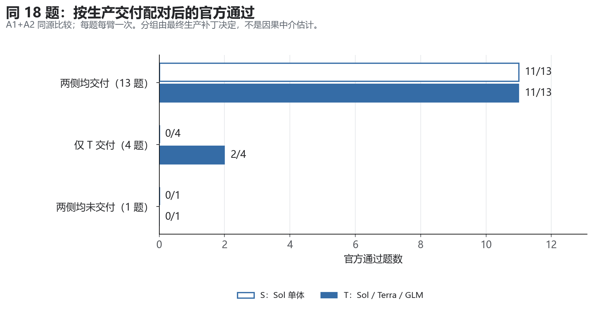
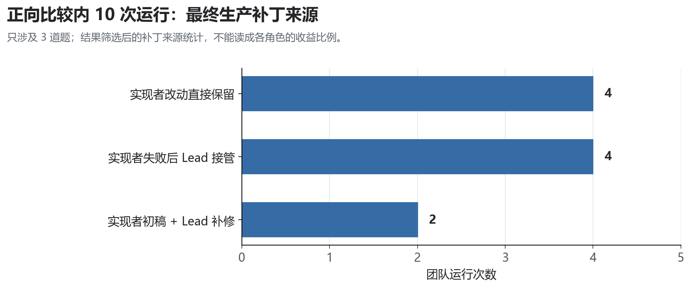
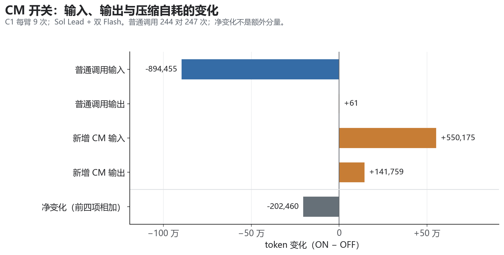

# 机制提升具体来自哪里：生产交付、验收反馈与上下文成本

## 1. 质量提升落在“形成补丁—检验语义—Lead 完成交付”，CM 提供另一种资源收益

**现有数据能够追到具体代码和反馈链，但还不能把平均通过率提升按百分比分给各角色。**此前只说“测试者独立贡献未知”，把两个层次压在了一起：去掉测试者会怎样，仍缺同配置对照；测试者在某次运行中是否发现实际缺陷、是否推动后续修复，已有比“补丁被采用”更强的证据。

本次在全历史综合的基础上做两条拆分。质量线追踪 Sol Lead、Terra 实现、GLM-5.3 测试这一具体组合产生正差的全部 6 个比较层；效率线重新聚合 C1 的 550 条调用账，并核验对应元数据哈希。不同模型组合和实验层不混成一个 team。

- **交付是最一致的结果差异位置。**最大可比层 A1+A2 的同 18 题，S 交付生产补丁 13 题、通过 11 题；T 交付 17 题、通过 13 题。额外通过的两题均发生在 S 没有生产补丁、T 有补丁的题上。
- **测试者已有可追溯的功能贡献。**Pylint 上，实现者的部分修复没有真正开启 verbose；GLM 的测试暴露这一遗漏，Lead 随后补修，官方要求也正是这个行为。Matplotlib 上，GLM 提供复现、状态丢失诊断与测试，Lead 在实现者失败后完成修复。
- **实现者贡献并非所有成功中的同一种模式。**10 次正向层内团队运行中，4 次最终生产改动直接来自实现者，4 次由 Lead 接管实现，2 次是实现者初稿加 Lead 补修。这里统计代码来源，不是因果份额。
- **CM 的资源收益可进一步定位到普通调用的输入成本。**C1 普通调用少约 89.4 万 token，CM 自身增加约 69.2 万，净省约 20.2 万，即 5.125%；价卡费用净省 20.373%，主要来自 Sol Lead 费用下降。两臂均通过 4/9，未观察到质量提升。

这份补充报告保留原全历史综合报告（本地归档）的判断范围，只细化贡献链；它不是一轮新实验，也不替代完整报告。

## 2. 同 18 题的两次增益，全部出现在单体未交付生产补丁的题上

这里的“生产交付”指冻结最终补丁中存在生产代码改动；只有测试、只有文字、空补丁均不算。它不保证官方通过。S 是 Sol 单体；T 是 Sol Lead＋Terra 实现＋GLM-5.3 测试。A1-v2 与 A2 的冻结源码一致，沿用此前验证过的同源 18 题范围，每题每臂一次。

| 按两侧生产交付配对 | 题数 | S 官方通过 | T 官方通过 | T 多通过 |
|---|---:|---:|---:|---:|
| 两侧均有生产补丁 | 13 | 11 | 11 | 0 |
| 仅 T 有生产补丁 | 4 | 0 | 2 | +2 |
| 两侧均无生产补丁 | 1 | 0 | 0 | 0 |
| 仅 S 有生产补丁 | 0 | 0 | 0 | 0 |
| 合计 | 18 | 11 | 13 | +2 |

**这不是单体普遍“写错而团队写对”的结构。**在两侧都形成生产补丁的 13 题上，逐题通过模式完全一致；差异来自 T 多完成了 4 次生产交付，其中两次达到官方要求，另外两次仍失败。应把“有没有交付”与“交付后是否满足任务语义”分开诊断。

图中每个格子按同一题比较。仅 T 交付的四题是 Matplotlib-20826、Pylint-6386、Seaborn-3187、Xarray-7229，前两题通过，后两题失败。两侧均未交付的是 Sphinx-8548；两侧均交付但都失败的是 Sympy-13852、Xarray-6992。

这是一项**结果的描述性分解**，不是经过识别的中介因果效应。团队同时改变了角色提示、工作上下文、模型、交付形式与局部调用约束，没有单独操纵“停止纪律”。也不能拿 T 的 13/17 与 S 的 11/13 条件通过率给代码能力排名：两侧交付的任务集合不同。

来源：[18 题逐题配对](<PAIRED_18_DELIVERY.csv>)、[交付分组汇总](<DELIVERY_DECOMPOSITION.csv>)。

## 3. 全部正向比较中的 10 次团队成功，有三条不同的生产修复路径

从全历史团队比较表筛出“Lead 同为 Sol，worker 按实现、测试顺序为 Terra 与 GLM-5.3，团队平均官方结果高于对应单体”的全部比较层，得到 6 层、10 次去重团队运行、8 次去重单体运行，涉及 **3 道题**。Sphinx 两种装配配置共用单体基线；其中装配 OFF 与该组 Solo 的部分开关也不同，不能称纯派生实验。该范围用于追成功来源，不用于估计总体胜率。

| 最终生产代码的来源 | 团队运行数 | 具体运行 |
|---|---:|---|
| 实现者完成，生产改动被直接保留 | 4 | Sphinx v10 ON 第 1、3 次；OFF 第 3 次；B1 Pylint T11 |
| 实现者失败，Lead 接管生产实现 | 4 | Sphinx v10 ON 第 2 次；OFF 第 1、2 次；A2 Matplotlib T |
| 实现者提供初稿，Lead 补齐生产修复 | 2 | A2 Pylint T；Sphinx v13 OFF／CM24 |

生产改动来源由 worker delta、实际采用或拒绝事件、后续 Lead 编辑和冻结最终补丁共同判定。“直接保留”只指最终生产补丁的增删行与被采用的实现者改动一致，不等于整个工作区文件哈希一致；Lead 仍可能写测试、修测试或改文档。

**4 次接管与 2 次补修说明，Lead 并非只负责分配任务和点击采用；它实际承担了重要的生产修复。**另 4 次则说明实现角色能够直接交付最终使用的生产改动。这两种贡献都真实存在，不宜把全部增益归给 Terra 的模型能力，或反过来说 worker 没用。

对照侧的 8 次 Solo 最终补丁均为空，均因根 token 预约额度不足结束。它们不是“生产补丁形成后官方语义判错”；日志中有持续调查、重复查看目标和部分工具问题。余额不足以准入下一次请求不等于余额精确为零，也不等于普通调用额度全部用光。

实现者在这 10 次中 6 次完成并被采用、4 次 blocked 后被拒绝；测试者有 7 次非空交付被采用，1 次非空交付被拒绝，另 2 次空交付被拒绝但其文字分析被 Lead 明确参考。成功路径并不要求每个 worker 都完整交付。

来源：[逐次来源与 review 行号](<POSITIVE_10_ORIGINS.csv>)、[六个原始比较层](<POSITIVE_STRATA.csv>)、[去重单体对照](<MATCHED_8_SOLO.csv>)。

## 4. Pylint：测试发现实现遗漏，Lead 修复了官方真正要求的行为

A2 的 Pylint-6386 是目前最清楚的“测试反馈参与实际修复”个案。题目既要求 `-v` 不索取参数，也要求它确实开启 verbose。前者成立并不推出后者成立。

| 顺序 | 角色与动作 | 观测到的结果 | 对最终修复的贡献 |
|---|---|---|---|
| 1 | Terra 实现者给选项增加 `nargs=0` | 解决 `-v` 被当成需要参数的选项；旧有局部验证通过 | 提供实际使用的一部分生产修复 |
| 2 | GLM 测试者新增 `exit=False` 后检查 `run.verbose` 的测试 | 不只检查命令能否退出，还检查模式是否开启 | 提供能区分“表面修好”和“功能生效”的验收条件 |
| 3 | Lead 采用两份交付并运行组合测试 | **1 失败、1 通过**；失败断言是 `-v should enable verbose mode` | 将潜在遗漏变成可观测、可定位的缺陷 |
| 4 | Lead 修改参数预处理：注册 `-v`，并允许该短选项进入处理分支 | **2 通过**；CLI 也输出 verbose 信息 | 补齐最终通过所需的另一部分生产修复 |
| 5 | 冻结补丁后的官方评测 | 新目标测试 1/1、回归 7/7；题目通过 | 验证最终交付，而非单独评分各阶段候选 |

关键证据是时间顺序：先采用实现者补丁，再采用测试者补丁，组合测试实际变红，Lead 随后修改另一份生产文件，测试再变绿。不是看完最终答案后推测某份测试“应该有帮助”。

保存的官方测试通过 `Run(..., '-v', exit=False)` 调用，并检查 stderr 中出现 `Using config file`。它与 GLM 的 `run.verbose` 断言对齐于同一行为要求。没有重新运行评分，也没有向模型提供官方测试；这里是结果封存后的离线语义核对。

**因此，能够确认 GLM 提供了实际暴露不完整实现的测试，Lead 完成了缺口修复。**不能进一步声称“去掉 GLM 必定失败”：没有冻结其余条件的 tester-off，也没有对 Terra 半成品单独跑官方评分。局部反馈的功能贡献已经有证据，平均净贡献仍未识别。

这也细分了 review：最初“采用实现补丁”没有发现全部语义缺口；有信息量的是**采用后实际执行测试，再根据失败反馈补修**。不能把这次成功归为静态审阅已经准确判对。

B1 的同题显示预算改变后，责任会迁移：T00 中 Terra 仍只完成 `nargs=0`，GLM 耗尽局部工作次数、没有可交付测试，但 Lead 明确使用其分析，自行编写测试并补修；T11 中 Terra 已完成两份生产文件，GLM 提供更全面测试，Lead 采用并验证即可。两格最终都通过，因此更多角色活动没有新增一题收益；T00 的文字贡献也不能冒充测试者亲自运行过测试。

来源：[关键事件摘录](<KEY_EVENTS.json>)。A2 原始事件的 144–146、174–176、180–182、186–189 行依次记录采用、采用、失败、补修后通过。失败命令虽然外层退出码为 0，输出明确保存 `PYTEST_STATUS=1`，本次按真实测试输出判读。

## 5. Matplotlib：失败实现被拒绝，测试者给出根因线索，Lead 接管修复

A2 Matplotlib-20826 涉及坐标轴清空之后，刻度和标签的可见性状态被错误重置。五臂只有 T 通过，但它不是“实现者完成、Lead 原样合并”的成功。

**Terra 的生产候选失败了。**它试图在 Axes 清空周围保存和恢复状态，留下了非空补丁，却没有通过自己的复现，并明确提醒不要采用。Lead 拒绝了这份改动；该候选修改的生产文件没有进入最终补丁。因此，本次不能给 Terra 记“最终修复作者”的功劳，最多保留失败路径和诊断信息的过程作用。

**GLM 的贡献不止测试文件。**它交付共享轴和非共享轴的复现测试，基线实际得到 2 失败、17 通过；交付摘要指出 `_major_tick_kw` 在清空后只剩 `gridOn`，刻度可见性参数被丢失。这是与最终修复位置相吻合的具体状态诊断。Lead 采用了测试，又修正测试对绘图样式的依赖。

**Sol Lead 完成最终生产修复。**它把修改落在 Axis 的清空逻辑：重置需要重置的网格值，同时保留其他刻度可见性配置，再重建刻度。最终保存的三组验证状态均为成功，补丁随后通过官方评分。根任务虽以 budget_exhausted 结束，补丁已经在此之前形成；“耗尽”本身不能判断有没有有效交付。

还要修正一处旧叙述：日志里查看的 `a15bc47816` 是引入相关重置行为的历史提交，另一个 `e4dafa2d3f` 是更早的刻度可见性修复。现有输出没有显示它直接找到了本题的现成正确提交。因此应称为**利用历史追查回归原因**，不应写成“从上游找到本题答案”。

这一例支持“失败分支可以被停止，测试和诊断仍能被吸收，Lead 可以接管完成”的具体执行价值。它没有单独验证容错开关的平均收益，也不能证明每次 worker 失败都能靠接管恢复。

来源：[关键事件摘录](<KEY_EVENTS.json>)、[worker 补丁来源](<WORKER_PROVENANCE.csv>)。原始事件 127 行为测试交付诊断，141 行为实现失败交付，144／149 行为采用测试和拒绝实现，170／179 行为历史调查，192 行为最终修复验证。

## 6. Sphinx：重复成功显示多条可行路径，也暴露测试和 review 的局限

Sphinx-8035 的问题是私有成员选项既支持全选，又支持指定名单，并须在不同成员过滤分支中保持语义一致。v10 的装配 ON、OFF 各重复 3 次，团队均通过；共享的 Solo 三次都为空补丁失败。它增强了同一道题内的重复性证据，没有增加六道独立题。

三次最终生产修改直接来自 Terra：ON 第 1、3 次和 OFF 第 3 次。另三次 Terra 未留下生产改动，Lead 自行完成实现。v13 的 OFF／CM24 又出现第三种路径：Terra 的初稿被采用，Lead 随后补充指定私有成员与显式成员名单的组合处理。相同最终成功可以由不同分工实现。

测试与 review 有三类重要反例，必须与成功链一起保留：

- **测试者不是永远正确。**v10 OFF 第 3 次采用测试后出现 2 失败、3 通过，Lead 修正测试的文本缩进比较，之后通过。测试变红既可能是生产缺陷，也可能是断言或夹具有问题。
- **拒绝非空交付有具体合理案例。**v10 ON 第 3 次的测试角色越界修改生产实现，交付含不合适的测试变更和无效相对导入，Lead 拒绝它并保留 Terra 实现。可以审计这一拒绝的依据，但未单独评分被拒候选，不能把它当 review 正确率分母中的一个已知“真阳性”。
- **官方通过不代表自建测试全绿。**v10 ON 第 2 次 Lead 接管后，保存的新增测试仍为 2 失败、5 通过，根预算结束，最终官方却通过。自建验收与官方目标有差异，不能把所有绿色根结果描述成完美的测试闭环。

部分其他 Sphinx 成功轨迹的广泛回归也有 docutils 警告相关失败，定向验证与官方结果需分别陈述。这些异常削弱“团队流程完整就一定更正确”的叙事，却不抹去已核实的生产来源和局部缺陷发现。

从题型看，正向支持目前落在 CLI 行为、绘图状态生命周期、文档生成选项语义三类。测试者能够把需求转成可运行、能区分错误实现的断言时，个案价值最清楚。Xarray-6992 的 MultiIndex／坐标状态问题仍是反例：B1 三个核心格都有生产补丁，官方目标节点均 0/12；C1 的 6 份生产 delta 也全部来自最终失败的 Xarray。共同误读验收语义时，多角色、更多测试和采用行为都不足以救回任务。这是诊断假说的边界，不是已识别的题型处理效应。

来源：[十次来源明细](<POSITIVE_10_ORIGINS.csv>)、[关键事件](<KEY_EVENTS.json>)，以及完整报告的问题特征与角色综合章节。

## 7. CM 的 token 收益来自输入减少，价卡收益集中在 Sol Lead

C1 的配置与上述 Terra／GLM 团队不同：**Sol Lead＋两个 GLM-5.3-Flash worker**，60 万根 token、28 普通调用、8 worker 工作调用；比较 DeepSeek CM ON／OFF，三题各三次，Memory 和编辑保护关闭。两臂官方通过均 4/9、生产交付均 8/9，9 个同题轮次配对的通过结果完全一致。

重新按调用类型和输入／输出聚合后，token 差额可以完整对账：

| 分量：ON 相对 OFF | token 变化 |
|---|---:|
| 普通解题调用的输入 | −894,455 |
| 普通解题调用的输出 | +61 |
| 普通调用合计 | −894,394 |
| 新增 CM 输入 | +550,175 |
| 新增 CM 输出 | +141,759 |
| 最终净变化 | **−202,460（−5.125%）** |

**普通调用的总 token 减少几乎全部表现为输入减少，但 CM 自身吃回了 77.4% 的差额。**因此，单次摘要把上下文缩短约四成，不能直接换算成端到端也省四成。普通调用数量为 ON 244 次、OFF 247 次，输出合计几乎相同；不同角色的输出变化互相抵消，不表示两臂行为或推理路径相同。

图中比较单位是每臂九次运行的 token 总量；普通调用节省和新增 CM 开销分列。它说明资源差额落在哪些调用上，不能还原“相同下一次请求只换摘要”的反事实。

按角色拆开又发现，token 节省的位置与费用节省的位置不同：

| 角色 | 普通调用 token 变化 | 价卡费用变化（USD） | 解释 |
|---|---:|---:|---|
| Sol Lead | −246,297 | **−3.149224** | 输入少约 21.1 万、输出少约 3.5 万，单价较高 |
| Flash 实现者 | −294,930 | +0.001397 | 输入减少，但输出增加约 3.6 万，输入缓存占比下降 |
| Flash 测试者 | −353,167 | −0.003751 | 输入减少明显，但模型本身便宜，缓存占比也下降 |
| DeepSeek CM | +691,934 | +0.204866 | 压缩服务本身的新增消耗 |
| 净变化 | **−202,460** | **−2.946712** | token −5.125%；价卡费用 −20.373% |

实现者输入缓存占比从约 60.1% 降至 35.3%，测试者从约 61.7% 降至 26.4%；这使输入总量下降不等于同比例费用下降。Lead 的输出减少与便宜实现者的输出增加，也会使费用变化大于总 token 变化。**支持的结论是：本组净省钱主要体现于昂贵 Lead 的调用账；不能推出“只压缩 Lead”已经被验证最优。**当前开关同时影响多个角色，缺角色级 CM 消融。

C1 59 次摘要请求中 56 次采用、3 次因长度拒绝；没有充分证据确认摘要提高了语义记忆、减少了失忆重读或增加正确答案。费用是冻结 API 等价价卡，不是 Coding Plan 现金账单。原报告中仅 5/9 配对 token 更少、净 token 收益集中于第一轮失败轨迹的局限继续成立，当前也未达到预设 15% token 节约门槛。

来源：[CM 分量对账](<CM_COMPONENT_BRIDGE.json>)、[角色调用账](<CM_ROLE_ACCOUNTING.csv>)。550 份调用元数据哈希与既有逐调用会计表重新一致性核对；未新发任何模型请求。

## 8. 各环节现在能领到哪一份“贡献”，哪些不能领

| 环节 | 现在有证据支持的贡献 | 仍不能声称的贡献 |
|---|---|---|
| 实现 worker | 直接提供最终使用的生产改动；也能提供由 Lead 完成的初稿 | Terra 普遍强于单体，或实现者解释全部团队收益 |
| 测试 worker | Pylint 实际暴露部分实现的语义漏洞；Matplotlib 提供复现、状态诊断及验收测试 | 平均增加多少通过率；更多测试份额必然更好；交付次数就是质量贡献 |
| Lead 执行反馈后的补修 | Pylint 补齐模式开启；Matplotlib 接管修复；多次 Sphinx 接管、补齐或修正测试 | review 静态判断已经正确；Lead 每次都能修好错误测试或共同误读 |
| 失败分支拒绝与接管 | 至少有失败实现被停止、其他交付仍被吸收、最终通过的完整路径 | 容错策略单独带来多少净增益，或任何自动接管阈值最优 |
| CM | C1 输入减少，扣除压缩后净 token 少 5.125%，价卡费用少 20.373% | 让上述三题团队胜出；提高正确率；跨模型或长期任务普遍净节省 |
| Memory／Scout／Bootstrap | 存在装配执行证据，组合控制尚无质量分离 | 分别贡献了多少成功，或可把 CM 效果记给团队记忆 |
| R2 选择器 | 固定双候选配置有局部正差；Pylint 可在没有 GLM 测试者时通过 | 选择器准确率、GLM 对该题是必要条件；候选未逐个官方评分 |
| 自主组队／拆分／升级 | 固定派生和控制路径运行过 | 实验已证明系统能自主选择最佳角色、模型、预算或任务拆分 |

“局部功能贡献”与“平均净收益未知”可以同时成立。应避免两个相反错误：把所有模块都标为未知而看不到真实贡献链；或者看到一条有效反馈链，就给该角色分配一个未经测量的总体收益比例。

## 9. 本次核验能保证来源和顺序，不能代替候选反事实评分

本次新增分析提取 35 次相关运行、42 个独立 worker、1,662 条已完成工具记录；质量归因主集合是其中上述 10 次团队运行和 8 次对照。另按原口径重算同源 18 题，重算 C1 全 550 次调用，并保存 706 项输入哈希。所有新表与报告位于独立补充目录，原报告和实验结果未改写。

补丁归属同时检查实际 review 决策和最终增删行，人工核对接管／补修的编辑顺序。空 delta 不当作成功交付；被改写不当作零贡献；官方根成功不分摊为两个 worker 成功。Pylint 的失败与补修顺序做了程序校验，官方测试只用于封存后的行为对齐核对。

限制仍包括：只有三道正向支持题；大量已知诊断题被反复使用；正向运行是结果筛选，不能从该子集估计成功概率；角色、模型和调用纪律没有全因子拆开；未对中间实现或被拒交付补做官方评分；本次为本地自检，没有声称新增独立审阅。具体口径与校验结果保存在 [DATA_VALIDATION.json](<DATA_VALIDATION.json>)。

## 10. 下一步应验证“哪种反馈起效”，而不是笼统增加团队预算

现有证据支持保留“独立产出候选或验收条件、Lead 集成执行、发现缺口后补修”的可审计流程。对收益尚未识别的部分，最有区分度的后续问题是：

1. **测试的代码、文字诊断、实际执行反馈，哪一项产生净收益？**冻结相同实现候选，分别给 Lead 无额外材料、仅测试者文字、测试及运行结果，再比较；先明确候选隔离和隐藏测试边界。
2. **团队减少空补丁，来自交付约束还是模型／上下文分工？**对 Solo 也设置相同交付检查点，并保持总预算一致，才能把交付纪律与团队效应拆开。
3. **CM 是否主要值得部署在昂贵 Lead？**在同一团队上比较全角色、仅 Lead、仅 worker、全部关闭；同时记录输入、缓存、输出、CM 自耗和最终质量，不能只看摘要长度。
4. **review 能否正确区分坏生产补丁与坏测试？**封存采用前的候选，再做统一离线判定，才有计算判断正确率的真值。

这些是由当前贡献链导出的待验证问题，本次未启动新实验。当前最具体的工程亮点是：团队在部分任务上把单体未完成的调查转化为生产交付，并出现了测试揭示语义缺口、Lead 据此完成修复的真实案例；CM 则另外提供了小规模对照中可对账的资源节省。
