# DPswarm 全历史逐机制综合：具体配置、累积证据与适用边界

版本：2026-09-07 v2；全部既有数据重新分机制综合，未新增实验。

## 1. 全历史逐机制综合后的判断

**固定异构团队有局部配置价值；CM 有小规模直接对照中的资源净节省；装配组合尚未显示质量增益。测试者平均独立净贡献、review 正确率、自主组队和动态路由仍未识别。**这些判断来自逐机制筛查全部历史记录，而非把最新阶段当成全系统结论。

**2026-09-07 归因补充：**测试者的平均独立净收益仍未识别，但逐次轨迹已确认 Pylint 的测试暴露实现遗漏、Lead 随后补修，以及 Matplotlib 的测试诊断与 Lead 接管。10 次正向层内团队运行的生产来源为：4 次实现者改动直接保留、4 次 Lead 接管、2 次共同补修；只涉及三道题，不是因果贡献百分比。详见 [具体贡献拆解](../component-attribution/REPORT_ZH.md)。

本版修正上一版“全量盘点充分、逐机制综合不足”的问题：不仅保留阶段结果，也对冻结条件一致的记录重新合并，对不同条件的正面、负面和未暴露证据分别汇总。全部 306 条尝试均有去向；163 条团队配置对涉及 147 个去重 episode、20 道题、56 组共享来源基线，**不是 163 次独立实验**。角色层另整合 248 个独立 worker 和 92 个脚本角色阶段；上下文层逐条核对 306 次尝试的开关、调用与明细覆盖。

| 机制 | 综合所有适用历史后的结论 | 量级与条件 | 仍不知道 |
|---|---|---|---|
| Sol Lead＋Terra 实现＋GLM-5.3 测试 | 跨设置的正向支持去重仅集中于 Sphinx-8035、Matplotlib-20826、Pylint-6386；19 道有对照的去重题未见负差 | 最大同源合并 A1+A2：13/18 对 Sol 的 11/18，+11.1 个百分点；token +30.5%、价卡费用 +0.1%、平均生成时间 +37.6% | 不同条件不能合成统一总体增益；未证明新题普遍有效 |
| 其他固定团队 | 方向随具体模型、角色、预算变化 | 两 Sol worker 在同一 Sphinx 的不同设置下既赢过也输过；Sol＋GLM 测试的 A1+A2 为 11/18 对 11/18，但 B1 大预算 Matplotlib 有单题胜出 | 不能用一个 team 标签或模型标签预测收益 |
| CM（C1 直接对照为 DeepSeek） | 广泛实际执行，直接开关对照仅支持一项局部资源取舍 | 全历史 220 条尝试配置 CM ON、219 条尝试存在 CM 调用；其中旧阶段另含 24 次使用 GLM-5.3-Flash 压缩模型；C1 三题各三次，ON/OFF 均 4/9，净 token −5.125%、价卡费用 −20.373% | 未证明质量等价、普遍净节省、Flash Lead 下净收益或最优压缩策略 |
| Memory＋Scout＋Bootstrap | 两个可比历史层均未出现质量分离，时间增加 | 同源两题 OFF/ON 均 6/6，平均生成时间 +30.6%；v16 另两题均 0/4，时间 +43.3%，且 Scout 不可用 | 三开关联动，单项贡献未知；地板和天花板限制区分能力 |
| 预算、停止与交付 | 放大不保证改善；局部准入、CM 消耗、交付阶段共同决定资源可用性 | T00→T11 三题 2/3→1/3；D00→D11 单题失败转成功；新增 token 33.2% 实现、32.8% CM、18.9% 测试、15.2% Lead | 固定总量下的最优角色份额、调用纪律因果效应未知 |
| 测试与 review | 真实编辑、审阅、采纳、改写链成立；不能把过程数量当净贡献 | 248 个独立 worker 按模型、角色、预算和可观测分母分层；C1 六个生产 delta 全出现在最终失败的 Xarray | 缺固定配置 tester-off 和封存候选的独立评分；review 正确率未知 |
| R2 | 整体配置有小幅正差，选择层多样性有限，局部预算是实际约束 | A1+A2 共 18 个父任务、36 候选；5 题生产候选不同、9 题选择但生产相同、4 题无合格候选回退 | 36 候选均无独立官方评分，选择准确率和预算转移后的反事实未知 |
| 自主派生、分裂、裂变、升级及长期续接 | 有固定派生、控制与恢复证据，未建立自主策略净收益 | 所有历史都纳入暴露检查；固定流程、脚本阶段、原型事件分别记录 | 不能把强制建队成功当自主决策有效 |

费用使用各实验冻结的公开 API 等价价卡，**不是 Coding Plan 或 ChatGPT 订阅实际现金账单**。本表时间明确使用按题等权的平均生成时间；后文保留原实验中位数时单独标注。没有计算跨版本的“全系统总通过率”或把未知用量补零。

新增内容不仅是更多历史案例：第 5 节给出全部同 Lead 配置层与跨设置去重任务支持；第 7–8 节把上下文真实暴露、资源账与直接开关证据连接起来；第 9 节统一角色阶段；第 10 节扩展全部 R2。每一部分都列出哪些历史能改变判断，哪些只能证明执行，哪些不具备该机制的对照资格。

## 2. 全量究竟包括多少：记录多，独立题目仍少

去除汇总视图、嵌套候选、重复评分副本后，共识别 **306 条尝试记录**。其中 251 条有 SWE 官方分数；保留但排除原协议资格不合格的 2 条后，**249 条可用于相应层次的 SWE 结果分析，覆盖 26 道完整题号、12 个仓库**。

| 实验层 | 尝试记录 | 可用 SWE 评分 | 分析中的作用 |
|---|---:|---:|---|
| 早期固定团队 SWE | 111 | 107 | 模型方向、装配、CM 池、编辑保护、预算历史 |
| 早期 SWE verified | 12 | 10 | 更早的模型/团队与困难题观察 |
| TeamEval 真实协议题 | 16 | 0 | 自含任务的协议与执行证据；不是 SWE 评分 |
| runtime-v2 真实协议题 | 10 | 0 | 控制路径与自含任务验证 |
| 旧原型及未归档续试 | 9 | 0 | 6 个旧终态与 3 个独立真实调用续试，不能冒充现代正式成绩 |
| A1 工程两题五臂 | 11 | 10 | 与 A2 同冻结代码的补充敏感性分析 |
| A2 十六题五臂 | 93 | 80 | 最主要的跨题配置比较 |
| B1 大预算与模型组合 | 26 | 24 | 核心 9、Coding 16 及更早诊断分层 |
| C1 CM ON/OFF | 18 | 18 | 三题 × 两臂 × 三次的直接开关对照 |
| 合计 | 306 | 249 | 只作库存，不计算混合总体通过率 |

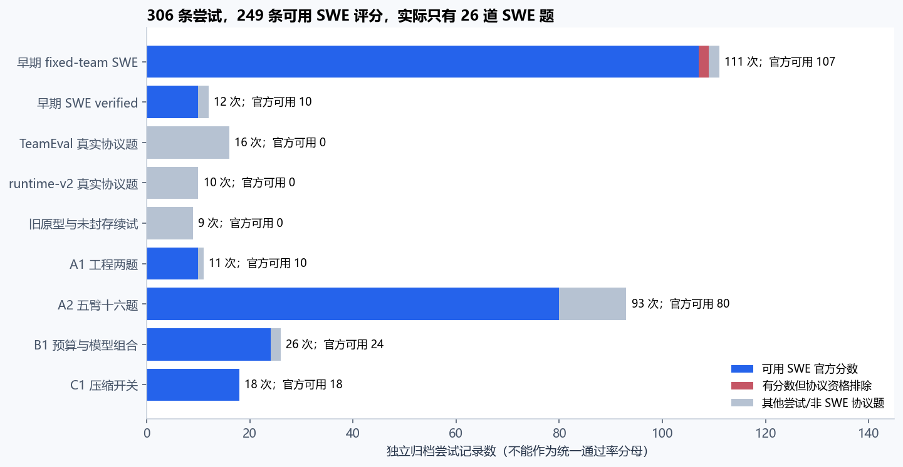

**249 次不是 249 道独立题。**Sphinx-8035 一题就占 66 条可用官方结果，约 26.5%；重复最多的前三题共 109 条，约 43.8%。若直接把所有通过/失败相加，会把某些已知诊断题、某些多次修改后的版本赋予更大权重，同时混入任务选择、预算、角色、适配器与时间变化。

B1 的 CORE9 是后期 Coding ALL16 的子集，不再加一次；26 次物理尝试中包含旧通道重做，不能仅按短 run_id 去重。A2 的 salvage 是已有候选的结果恢复，不是新生成；C1 的一次同补丁重评分也不增加模型实验次数。另有 8 条早期 WideSearch 评分快照单独保存，不与 SWE 互换分母。大量确定性测试夹具、MockProvider 日志和仅有计划的目录不当作模型实验证据。

来源：ALL_ATTEMPTS.csv、INVENTORY.json、v1 各分层 audit。v1 独立复核已重新读取 249 个原始结果；v2 复用冻结库存，并另行复算新的跨阶段配置对和机制表，未声称再次完成同样一轮全来源读取。

## 3. 综合的单位：先合并可比证据，再检验跨设置一致性

**全量分析不等于每个机制都用 249 个评分当分母。**一个实验只有实际暴露该机制，才能贡献过程证据；只有合适对照，才能贡献净效果证据。例如 C1 的 18 条成绩是 CM 的直接开关证据，却不能增加“团队相对单体”的样本，因为 C1 没有单体臂。

| 证据面 | 本版实际整合 | 不合并的原因也逐条保存 |
|---|---|---|
| 实验库存 | 306 次尝试、249 条合格 SWE 评分、26 道题 | 未评分、协议资格、非 SWE、恢复副本分别处理 |
| 团队配置 | 163 个题级配置对、92 个严格配置序列；75 个题级对保持 Lead 不变 | 147 个去重 episode、20 道题；88 个题级对同时更换 Lead，不能归因为团队；共享基线不重复算独立样本 |
| 上下文机制 | 全 306 次配置与暴露覆盖；规范调用明细 242/306、机制事件明细 241/306 | 14 条 CM 配置未知；规范化明细缺失不代表原始日志必然不存在 |
| 角色阶段 | 可归一化来源覆盖 292/306 次尝试，恢复 248 独立 worker＋92 脚本角色阶段 | 缺入此角色来源表的是 A1 一条基础设施失败、A2 十三条未合格尝试；全量库存仍保留它们。没有独立 worker 的阶段保留零独立 worker 暴露，脚本角色调用另计 |
| 预算对照 | 20 组已有审计的变化：8 组 B1 预算组合、7 组 B1 角色配置、3 组旧 CM 池、2 组跨版本根预算 | 不是 20 个纯预算随机实验；角色配置、联动旋钮和代码变化分别标识 |
| R2 选择 | 全 18 个父任务与 36 个内部候选 | 没有其他历史 R2 臂；内部候选不是独立父任务，也没有独立官方评分 |

**第一，比较冻结代码、完整题号、角色模型、预算、通道和评分契约。**A1-v2 与 A2 的 86 份冻结源码一致，18 道题可合成描述性敏感性层；旧 v10/v12 的 52 份源码和相应配置一致，允许两题合并。B1 Coding 两个控制器层 132 份源码中 131 份一致、execution.py 有差异，因此正文保留严格分层，只另给带说明的三题补充汇总。相同模型请求标签不保证供应商服务端版本始终相同。

**第二，重复先在题内平均，再在同一具体配置对内给题目等权。**三次重复不是三道题；同一个 Solo 给多个团队作对照保留相同 baseline ID。92 个严格序列不能求一个总体“胜率”，19 道跨设置去重任务也不是新的随机测试集。跨设置只报告正、负、持平支持及其条件。

**第三，过程与效果分开。**实例化、调用、观察到非空工作区 delta、完成可交付、采纳、最终严格保留、官方通过，是不同阶段。被阻塞 worker 的非空快照不自动是交付；被 Lead 改写不自动是零贡献；同一根任务的两名 worker 不构成两次成功。

**第四，量纲和统计量明确。**新增跨阶段表使用“题内重复均值→题间等权均值”；新时间比是这些均值的比。原实验图表保留原来的生成耗时中位数并标注。逐调用秒数之和可能并行重叠，不能当端到端墙钟；调用耗时占比也不是用户等待占比。价卡成本是对应冻结情景，未知费用不归零。

**第五，证据不完整不强填。**全历史没有完整可靠的总费用。A2 的 10 次未知调用与 308,099 预留 token、B1 的 5 次未知和 3 次待结算、旧系列未知用量均保留。CM ON-only 只能支持执行和资源结构，不能与另一个版本的 OFF 硬配为净收益。

统计上 A2 仍是 16 个任务配对，T−S 只有 2 个不一致对；“只有 3 题区分五臂”不是正式 n=3。C1 是 9 个同题×轮次配对、3 道独立任务。任务类型与历史失败率是事后描述，不能用基于结果筛出的分组反过来证明机制特长。完整映射见 MECHANISM_EVIDENCE_MAP.csv，以及三个 synthesis 目录的 COVERAGE.csv。

## 4. 最大同源跨题层：A2 与 A1+A2

A2 的五臂均有 600,000 根 token 上限、28 普通调用、8 worker 工作调用、12 CM 调用等冻结设置。S 为 Sol 单体，L 为 Luna 单体，R2 为两个 Sol 候选加选择，D 为 Sol 实现/整合加 GLM-5.3 测试者，T 为 Sol Lead、Terra 实现者与 GLM-5.3 测试者。

| A2 配置 | 通过/16 | 生产交付/16 | 总 token | 每次价卡费用 | 每解一题费用 | 生成耗时中位数 |
|---|---:|---:|---:|---:|---:|---:|
| S | 10 | 12 | 5,640,318 | $1.708 | $2.733 | 6.605 分 |
| L | 9 | 10 | 7,536,794 | $0.145 | $0.258 | 9.406 分 |
| R2 | 11 | 13 | 7,555,520 | $2.329 | $3.388 | 6.702 分 |
| D | 10 | 12 | 7,591,190 | $1.978 | $3.164 | 9.669 分 |
| T | 12 | 15 | 7,627,217 | $1.741 | $2.321 | 9.487 分 |

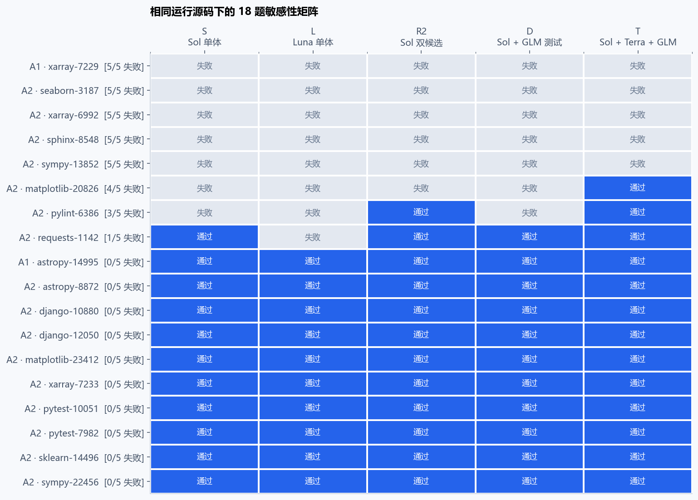

图轴按 A1/A2 五臂失败数降序，属于事后描述难度。A2 四题全败、九题全过，差异只由 Requests-1142、Matplotlib-20826、Pylint-6386 承载。T 比 S 多通过后两题；R2 比 S 多通过 Pylint；L 在 Requests 独败。A1 增加 Astropy-14995 五臂全过与 Xarray-7229 五臂全败，因此**扩大了覆盖，却没有增加分歧对**。

| 18 题敏感性 | T | R2 | S | D | L |
|---|---:|---:|---:|---:|---:|
| 官方通过 | 13 | 12 | 11 | 11 | 10 |
| 最终生产交付 | 17 | 14 | 13 | 13 | 11 |

18 题下 T 相对 S：多 2 题，约 +11.1 个百分点；总价卡费用 $32.223 对 $32.186，约 +0.115%；token +30.5%；中位生成时间仍 +43.6%。这加强了“**混合模型可以在近似美元成本下维持更多生产交付**”的描述，但不能称为同算力收益，也没有新增质量差异证据。A1 中 Luna 有一次实际 602,116 token，超过 600,000 约 0.35%，已单列，不能声称历史预算从无超额。

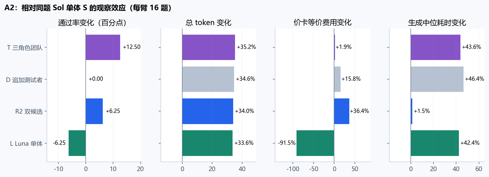

T 对 R2 在 A2 多 1 题、费用低 25.3%，但中位生成时间长 41.6%。按原先相对 R2“质量至少多 2 题、时间不超过 1.30 倍”的规则，T 两道必要门槛都未过；累计分析不事后改判。若业务愿意为批处理质量多等一会儿，T 仍是合理候选；这属于应用约束的选择，不是统计晋级已成立。

来源：FOCUS_AGGREGATES.csv、FOCUS_PAIRED_EFFECTS.csv、A1_A2_TASK_MATRIX.csv、../cumulative_analysis_20260907_v1/a2_audit/runtime_comparability.json。

## 5. 固定团队：逐模型组合整合所有可比历史

覆盖清单逐条落账全部 306 次历史尝试；其中 249 条有合格 SWE 评分。本分析识别 163 个“具体配置对 × 同一道题”对照，涉及 147 个去重 episode、20 道去重任务、56 组可去重追溯的 solo baseline。75 行保持 lead 模型不变，其余明确属于“换模型并换团队配置”，不能归因为团队。所有数字均来自已有结果，没有再次调用模型或 grader。

重复运行先在题内求均值，再在同一冻结配置对内按题等权。三个重复只提高同一道题的重复证据，不产生三道独立题。相同 solo 对照多个团队时沿用相同 baseline ID；不同版本重复出现的 Sphinx 也不能当作新任务。team_synthesis/COMPARISONS.csv 保留每条 episode ID、配置、预算、运行时、transport 和设置变化；team_synthesis/COVERAGE.csv 给出全部尝试的纳入或排除理由。

### 当前可以成立的判断

固定团队的收益依赖具体角色组合、任务和运行条件。不能从历史结果推出“多agent普遍更强”，也不能用一个最新阶段覆盖此前的反例。最大可合并的同源层 A1-v2+A2 为18题：Sol lead + Terra实现 + GLM测试(T) 对 Sol solo(S) 为13/18对11/18，只有 Matplotlib-20826、Pylint-6386 两道题产生正差，零负差；其余16题相同。逐个去掉这两道信息题后，优势都从11.1个百分点降到5.9个百分点（1/17）；同时去掉则为0/16。这是受少数题支撑的正向证据。

Sol + GLM测试(D)在相同18题对Sol solo为11/18对11/18。这个两角色配置没有净正确率提升，不能把三角色T的收益移植给D。Luna solo是更换lead模型的成本替代方案；与它比较的差异应同时包含模型因素。

### 同一具体组合跨设置是否稳健

下表只去重题号并列出出现过的方向，预算、CM、assembly、transport和runtime仍保留在各自对照中。正负题集可能重叠；一个任务出现过正差，不能说明所有设置下都为正差。层数不充当独立样本数。

| lead / 按实现、测试顺序的worker模型 | 可对照去重题数 | 出现正差的去重任务 | 出现负差的去重任务 |
|---|---:|---|---|
| gpt-5.6-sol / glm-5.3 | 18 | matplotlib__matplotlib-20826 | 无 |
| gpt-5.6-sol / gpt-5.6-terra,glm-5.3 | 19 | matplotlib__matplotlib-20826, pylint-dev__pylint-6386, sphinx-doc__sphinx-8035 | 无 |
| gpt-5.6-sol / glm-5.3-flash,glm-5.3-flash | 4 | matplotlib__matplotlib-20826, sphinx-doc__sphinx-8035 | 无 |
| glm-5.3-flash / glm-5.3-flash,glm-5.3-flash | 1 | 无 | matplotlib__matplotlib-20826 |
| gpt-5.6-sol / glm-5.3,glm-5.3 | 2 | sphinx-doc__sphinx-8035 | 无 |
| gpt-5.6-sol / gpt-5.6-luna,gpt-5.6-luna | 2 | sphinx-doc__sphinx-8035 | 无 |
| gpt-5.6-sol / gpt-5.6-sol,gpt-5.6-sol | 2 | sphinx-doc__sphinx-8035 | sphinx-doc__sphinx-8035 |
| gpt-5.6-sol / gpt-5.6-terra,gpt-5.6-terra | 2 | 无 | sphinx-doc__sphinx-8035 |
| gpt-5.6-sol / glm-5.3,gpt-5.6-luna | 1 | 无 | 无 |
| gpt-5.6-sol / glm-5.3,gpt-5.6-sol | 1 | 无 | 无 |
| gpt-5.6-sol / gpt-5.6-sol,glm-5.3 | 1 | 无 | 无 |
| gpt-5.6-sol / gpt-5.6-terra,glm-5.3-flash | 1 | 无 | 无 |
| gpt-5.6-sol / gpt-5.6-terra,gpt-5.6-luna | 1 | 无 | 无 |

Sol lead+Terra实现+GLM测试的去重正向支持集中在3题：Matplotlib-20826（A2，600k/28）、Pylint-6386（A2，600k/28；B1 Coding，2.4M/160）、Sphinx-8035（v10 assembly ON/OFF；v13 OFF且CM池24）。19道去重可对照任务中未出现负差，但其余任务与这些任务的不同设置仍有大量持平。这是组合特定、条件特定的支持，不能等同为额外19道新测试或普遍可靠收益。

两Sol worker在同一Sphinx上既出现正差也出现负差；两Terra worker有负差而无正差。把这些组合合成一个“team”处理会抹去真实方向冲突。完整设置与来源见CROSS_STRATA_TASK_SUPPORT.csv和SUMMARY.json。

### 各固定组合的可比历史层

| 来源层 / 固定团队 | solo | 题数 | 团队 / solo 按题成功率 | 正/负/平题数 | token比 | API等价成本比 | 生成时间比 |
|---|---|---:|---|---|---:|---:|---:|
| a1-v2,a2-backfill-v1,a2-recovery-b-v1,a2-resume-v2,a2-resume-v3,a2-v1 / D | S | 18 | 61.1% / 61.1% | 0/0/18 | 1.30× | 1.14× | 1.28× |
| a1-v2,a2-backfill-v1,a2-recovery-b-v1,a2-resume-v2,a2-resume-v3,a2-v1 / T | S | 18 | 72.2% / 61.1% | 2/0/16 | 1.30× | 1.00× | 1.38× |
| b1-v1 / D11 | S-S | 1 | 0.0% / 0.0% | 0/0/1 | 1.00× | 0.77× | 0.94× |
| b1-v1 / S-FF | S-S | 1 | 0.0% / 0.0% | 0/0/1 | 未知 | 未知 | 1.02× |
| b1-coding-continuation-v1 / D11 | S-S | 1 | 100.0% / 0.0% | 1/0/0 | 1.39× | 1.05× | 1.52× |
| b1-coding-continuation-v1 / F-T | F-S | 1 | 0.0% / 100.0% | 0/1/0 | 1.88× | 1.86× | 0.97× |
| b1-coding-continuation-v1 / S-FF | S-S | 1 | 100.0% / 0.0% | 1/0/0 | 1.40× | 0.75× | 1.86× |
| b1-coding-continuation-v1 / T11 | S-S | 1 | 0.0% / 0.0% | 0/0/1 | 1.38× | 0.77× | 1.02× |
| b1-mvp-six-v1 / T11 | S-S | 2 | 50.0% / 0.0% | 1/0/1 | 0.71× | 0.45× | 0.57× |
| pilot_v3 / fixed_glm-5.3 | solo | 1 | 100.0% / 0.0% | 1/0/0 | 0.80× | 0.49× | 1.00× |
| pilot_v3 / fixed_glm-5.3-flash | solo | 1 | 100.0% / 0.0% | 1/0/0 | 未知 | 未知 | 3.21× |
| pilot_v3 / fixed_gpt-5.6-luna | solo | 1 | 0.0% / 0.0% | 0/0/1 | 1.13× | 0.38× | 1.13× |
| pilot_v3 / fixed_gpt-5.6-sol | solo | 1 | 100.0% / 0.0% | 1/0/0 | 1.10× | 1.00× | 0.76× |
| pilot_v3 / fixed_gpt-5.6-terra | solo | 1 | 0.0% / 0.0% | 0/0/1 | 0.98× | 0.70× | 0.54× |
| pilot_v4 / fixed_gpt-5.6-sol | solo | 1 | 0.0% / 0.0% | 0/0/1 | 未知 | 未知 | 0.45× |
| pilot_v6 / fixed_glm-5.3 | solo | 1 | 100.0% / 0.0% | 1/0/0 | 0.65× | 0.53× | 0.99× |
| pilot_v7 / fixed_glm-5.3-flash | solo | 1 | 100.0% / 0.0% | 1/0/0 | 0.73× | 0.40× | 1.36× |
| pilot_v6 / fixed_gpt-5.6-luna | solo | 1 | 100.0% / 0.0% | 1/0/0 | 1.17× | 0.37× | 0.59× |
| pilot_v13 / heterooff_gpt-5.6-terra__glm-5.3.cm6 | solo_gpt-5.6-sol.cm6 | 1 | 100.0% / 100.0% | 0/0/1 | 1.02× | 0.79× | 1.04× |
| pilot_v10,pilot_v12 / hetero_gpt-5.6-terra__glm-5.3 | solo_gpt-5.6-sol | 2 | 100.0% / 50.0% | 1/0/1 | 1.06× | 0.86× | 1.42× |
| pilot_v10,pilot_v12 / heterooff_gpt-5.6-terra__glm-5.3 | solo_gpt-5.6-sol | 2 | 100.0% / 50.0% | 1/0/1 | 1.05× | 0.81× | 1.08× |
| pilot_v2 / fixed_glm-5.3 | solo | 1 | 100.0% / 100.0% | 0/0/1 | 2.37× | 1.50× | 2.69× |
| pilot_v2 / fixed_glm-5.3-flash | solo | 1 | 100.0% / 100.0% | 0/0/1 | 2.73× | 1.70× | 4.54× |
| pilot_v2 / fixed_gpt-5.6-luna | solo | 1 | 100.0% / 100.0% | 0/0/1 | 3.03× | 0.98× | 2.46× |
| pilot_v2 / fixed_gpt-5.6-sol | solo | 1 | 100.0% / 100.0% | 0/0/1 | 2.52× | 2.27× | 3.07× |
| pilot_v2 / fixed_gpt-5.6-terra | solo | 1 | 100.0% / 100.0% | 0/0/1 | 1.87× | 1.27× | 1.19× |
| pilot_v8 / fixed_glm-5.3 | solo_gpt-5.6-sol | 1 | 100.0% / 100.0% | 0/0/1 | 0.55× | 0.27× | 0.40× |
| pilot_v8 / fixed_glm-5.3-flash | solo_gpt-5.6-sol | 1 | 100.0% / 100.0% | 0/0/1 | 未知 | 未知 | 1.16× |
| pilot_v8 / fixed_gpt-5.6-luna | solo_gpt-5.6-sol | 1 | 100.0% / 100.0% | 0/0/1 | 1.05× | 0.24× | 0.67× |
| pilot_v8 / fixed_gpt-5.6-sol | solo_gpt-5.6-sol | 1 | 0.0% / 100.0% | 0/1/0 | 0.97× | 0.81× | 0.42× |
| pilot_v8 / fixed_gpt-5.6-terra | solo_gpt-5.6-sol | 1 | 0.0% / 100.0% | 0/1/0 | 1.03× | 0.61× | 0.46× |
| pilot_v8 / hetero_glm-5.3__gpt-5.6-luna | solo_gpt-5.6-sol | 1 | 100.0% / 100.0% | 0/0/1 | 0.84× | 0.39× | 0.75× |
| pilot_v8 / hetero_glm-5.3__gpt-5.6-sol | solo_gpt-5.6-sol | 1 | 100.0% / 100.0% | 0/0/1 | 0.80× | 0.52× | 0.51× |
| pilot_v8 / hetero_gpt-5.6-sol__glm-5.3 | solo_gpt-5.6-sol | 1 | 100.0% / 100.0% | 0/0/1 | 0.73× | 0.58× | 0.49× |
| pilot_v8 / hetero_gpt-5.6-terra__glm-5.3 | solo_gpt-5.6-sol | 1 | 100.0% / 100.0% | 0/0/1 | 0.81× | 0.39× | 0.56× |
| pilot_v8 / hetero_gpt-5.6-terra__glm-5.3-flash | solo_gpt-5.6-sol | 1 | 100.0% / 100.0% | 0/0/1 | 0.75× | 0.45× | 0.55× |
| pilot_v8 / hetero_gpt-5.6-terra__gpt-5.6-luna | solo_gpt-5.6-sol | 1 | 100.0% / 100.0% | 0/0/1 | 1.04× | 0.37× | 0.33× |
| pilot_v13 / heterooff_gpt-5.6-terra__glm-5.3.cm24 | solo_gpt-5.6-sol.cm24 | 1 | 100.0% / 0.0% | 1/0/0 | 0.95× | 1.06× | 1.70× |

v2-v8里的单题成功不能累计成彼此独立的“团队胜场”：多组使用同一Sphinx solo，且版本、CM和实现不断变化。v8同为Sol lead时，两个Sol worker、两个Terra worker均输给Sol solo；GLM/Flash/Luna及所测异构组合与Sol solo持平。更早v3的Sol/GLM/Flash worker组合和v6-v7的GLM/Luna/Flash组合对Sphinx表现正向。两组证据共同说明：模型标签或“有worker”本身不足以预测收益，旧版对照中的solo失败也随运行时发生变化。

v10与v12的52份runtime源完全相同，且相应预算、模型与设置吻合，因此每个固定组合可合为2题。Terra+GLM的assembly ON和OFF均为2题内100%，Sol solo为50%；优势全部来自Sphinx，Astropy两侧均通过。每臂3次重复不是6道题；去掉Sphinx后优势为0/1。ON/OFF共用相同solo来源，两条效果也不是两项独立证据。OFF对solo同时改变assembly设置，不能称为纯团队开关效果。

v13对相同Terra+GLM OFF组合：CM池6时团队与solo均通过；CM池24时团队通过、solo的2次均失败。池大小保持分层。v13不能直接并入v10/v12：runtime已变化；v14的solo为CM池12，不能冒充v13池6或24的控制。

B1 Coding同为2.4M token/160普通调用，T11对Sol solo在控制器严格分层为1题与2题。补充合并三题得到团队33.3%对solo0.0%，正/负/平为1/0/2；唯一正差在Pylint，去掉后0/2。两个层的132份runtime仅execution.py不同，已保存diff：变化涉及MVP准入、前置条件与身份记账，131份其余源及transport一致。该合并保留控制器变化说明，不声称全部源完全相同。

B1 Coding的Matplotlib单题上，Sol+Flash+Flash(S-FF)优于Sol solo；Flash+Flash+Flash(F-T)却输给Flash solo。同题的Sol+GLM测试(D11)优于Sol solo，Terra+GLM(T11)与Sol solo都失败；因此“大预算团队”也不能归为一个统一处理。Sol solo在这题有transport/tool-policy终止，优势首先是所交付系统结果的差异，不能剥离成纯推理能力因果效果。

### 没有直接对照的证据仍保留

v5没有同源solo；v9只有DeepSeek solo，team的Sol lead同时变化，因此只进入换模型组合比较。v11虽与v10/v12同runtime，预算却是900k/40，没有同预算solo。v16与v15b同runtime但团队600k/28、solo900k/40，不纳入直接团队效应。hard canary与更晚solo存在实现或控制差异，同样保留为无可比对照。

swe_verified名为dpswarm的五条正式评分，实际workers=0、delegations=0，只能评价当时的单lead控制路径。C1是固定Flash团队内部CM开关，没有同源solo；其18条结果不进入团队对solo分母。B1早期标准API与后续Coding运行分别保留；标准API有未知usage的成本/token保持未知。T00对S-S同时改变预算，不能用于等预算团队收益。

表内token、成本与生成时间均为先题内重复均值、再题间等权均值；时间不是中位数。API等价成本是冻结价格情景，不是订阅实际现金；未知usage不补零。历史题目经过诊断性选择且多次暴露，这份分析给出特定样本与冻结条件下的描述结果，不作总体SWE题库推断。共享baseline、同题跨版本复用及不同配置对之间的相关性，使全表合并胜率或全表显著性检验没有合理独立单位。

### 可复核文件

- team_synthesis/COMPARISONS.csv：题级全部可比固定组合，含共享baseline与源episode IDs。
- team_synthesis/SERIES_AGGREGATES.csv / team_synthesis/SUMMARY.json：每个同源固定配置对的等题权汇总、正负一致性、逐个剔除信息题的敏感性。
- team_synthesis/COVERAGE.csv：306次尝试完整纳入/排除路径。
- team_synthesis/CROSS_STRATA_TASK_SUPPORT.csv：每个具体角色模型组合跨设置的去重正向、负向、混合和仅持平任务，以及每次支持所在的设置。
- team_synthesis/MODEL_COMBINATION_CONSISTENCY.csv：同一具体模型角色组合跨严格历史层的方向一致性、冲突及任务重用；不把层数当独立样本。
- team_synthesis/B1_CONTROLLER_DIFF.txt：Coding两控制器层的唯一源差异。
- synthesize_team.py：可离线重建全部本目录结果。

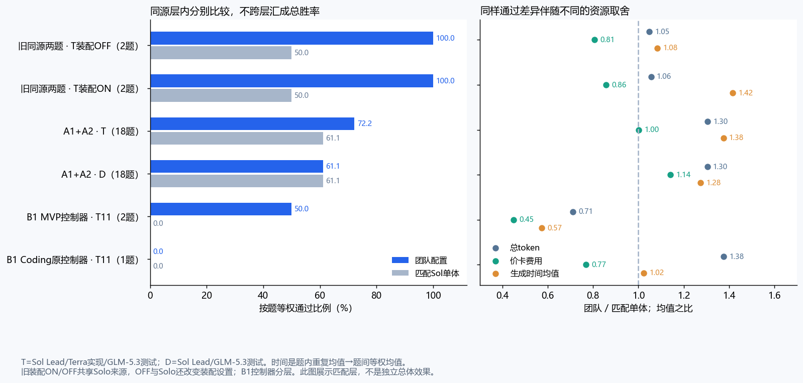

## 6. 预算：全局放大、角色份额、停止纪律是三个问题

**本节同时使用所有已审计的 20 组预算/角色变化、历史 CM 池、R2 局部额度及 C1 小额度角色阶段；不能只从 T00/T11 判断预算机制。**8 组 B1 预算组合、3 组 CM 池和 2 组旧根预算变化检验不同资源约束；另 7 组 B1 同预算模型/角色变化用于识别配置差异，不能标作纯预算消融。全部列表见 role_synthesis/BUDGET_COMPARISONS.csv。

| 核心 MVP，同三题 | T00 小预算团队 | T11 大预算团队 | S-S 大预算 Sol |
|---|---:|---:|---:|
| 官方通过 | 2/3 | 1/3 | 0/3 |
| 生产交付 | 3/3 | 2/3 | 1/3 |
| 实际总 token | 1,483,640 | 4,547,857 | 4,792,589 |
| 总价卡费用 | $6.039 | $11.311 | $20.106 |
| 生成耗时中位数 | 9.383 分 | 16.952 分 | 30.229 分 |

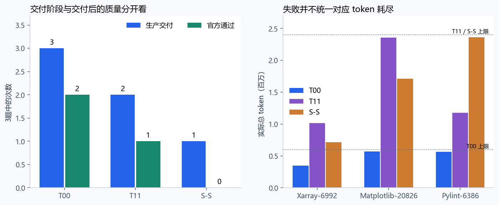

T00→T11 的预设 token 从 60 万增至 240 万，普通/worker/CM 调用从 28/8/12 增至 160/48/64。实际多用 206.5% token，少过一题，是当前最明确的不经济配置变化。**但这不是“多给测试者预算”的实验**：三个调用上限和根 token 一起改变，角色实际消耗是结果变量，不是独立操纵的预算份额。

把新增 3,064,217 token 分清后：

| 消费者 | T00 token | T11 token | 新增 token | 占总增量 |
|---|---:|---:|---:|---:|
| Lead | 663,333 | 1,128,306 | 464,973 | 15.2% |
| 实现者 | 431,356 | 1,447,272 | 1,015,916 | 33.2% |
| 测试者 | 193,343 | 772,115 | 578,772 | 18.9% |
| CM | 195,608 | 1,200,164 | 1,004,556 | 32.8% |

测试者增长约 4.0 倍，大于实现者 3.36 倍；CM 增长更高，约 6.14 倍。**相对增长率、绝对增量、预设分配比例不能混用。**现有证据不足以决定同样总预算下多分给测试、实现还是 Lead 最优。

Matplotlib 的 2×2 则给出一个有价值但很小的模式：T00、T10 低调用组合均通过，T01、T11 高调用组合均失败；token 高低与结果不对应。它支持“停止与交付节奏可能比总 token 更关键”的假说，不能证明仅普通调用上限造成失败，因为 worker 与 CM 额度同时改变，每格也只有一次。

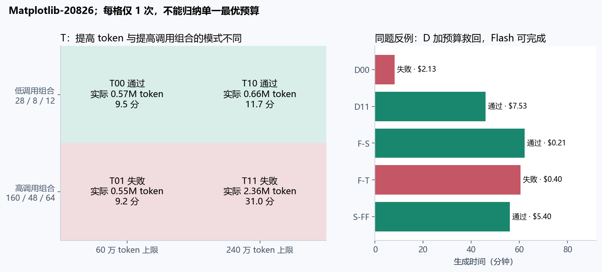

反例必须保留：同题 D00→D11 由失败转通过，实际 token 0.563M→2.383M，时间 8.10→45.89 分；旧 Sphinx 单体 600k/28 为 1/3，900k/40 为 2/2，但还变了冻结 cli.py/test_runner_rev11.py，属于跨版本组合观察，不能称为干净的加 token 实验。旧 Xarray-7229 在这次扩大下仍全败。

因此当前可以排除的是“统一放大必然带来收益”的策略预期；不能排除**针对明确交付瓶颈的局部扩额**。T00 的两次成功也很贴近预算边界，不能倒过来断言小预算总是充足。

跨历史共同指向的不是“预算太多”或“预算太少”，而是**额度是否在正确阶段可用**。旧 CM24 队列可能只执行 16 次压缩便被共同根 token 准入停止；R2 四个回退任务的八个候选在局部 27 万额度内受预约限制，根快照仍有约 10.4–14.9 万；C1 多个实现者则在 8 次工作调用后进入硬收尾。三者分别是根资源、不可转移局部资源、工作阶段调用上限，不能都叫 token 耗尽。另一方面，高预算 S-FF 的 Flash 实现者用 47 次调用形成非空交付并被采纳，否定“Flash 从来不会实现”的解释。

这些是跨来源互相补充的约束证据，尚不能确定最优转移阈值、最优测试份额或多给某角色多少调用会提高多少通过率。并未把实际消费份额当作随机分配的预算份额。

## 7. CM：现在已知的是小幅净收益，未知的是泛化与最优策略

### 全历史暴露和资源结构

全历史账本能确认 CM 配置 ON 220 条、OFF 72 条，14 条配置缺失；实际 CM 调用发生于 219 条，73 条已有明确零调用，14 条缺少该计数。这里的差异来自“开启但未调用”，不能把开关数当触发数。较早的 TeamBench、logpipe 和未集成 CM 的 SWE 基线留在覆盖矩阵中，不用它们与后期 ON 做伪配对。

历史 ON-only 证据扩展了 CM 的工作范围：旧 fixed 系列记录 731 次 compression 事件，A1/A2 为 81/517 次，B1 合格终态事件为 669 次；C1 59 次 CM 调用中 56 次采用、3 次拒绝。A1/A2 598 次即时压缩均缩短了当时上下文，其中位缩减约 38.28%/41.72%。这证明压缩发生过，尚不证明语义保真、减少后续重复阅读，或提高任务正确率。不同实现的 compression 事件口径不同，未把这些数相加当成统一成功率。

|同一来源内的资源队列|episode 总数 / 有调用账本|CM calls / 全 calls|CM token 占比|CM 等价费用占比|CM 调用时长占比|
|---|---:|---:|---:|---:|---:|
|A1 qualified|10 / 10|81 / 274|18.67%|1.41%|21.80%|
|A2 qualified|80 / 80|517 / 2067|16.45%|1.44%|20.17%|
|B1 all16 S-S|3 / 3|114 / 244|32.72%|2.54%|40.77%|
|B1 all16 S-FF|1 / 1|49 / 153|30.22%|4.35%|23.76%|
|B1 all16 F-S|1 / 1|33 / 105|41.15%|76.98%|21.46%|
|B1 all16 F-T|1 / 1|64 / 184|39.09%|73.78%|18.16%|
|C1 FCM_ON|9 / 9|59 / 303|18.46%|1.78%|9.77%|

这些时长是逐调用秒数之和；并行 Worker 会重叠，不能当成端到端延迟占比。美元沿用各来源冻结的公开 API 等价价格场景，既不是订阅现金账单，也没有跨场景求总体美元均值。完整分母、未知调用和已知小计都保存在 context_synthesis/CM_RESOURCE_SUMMARY.csv。

最需要保留的异构结论是：**CM 相对便宜取决于它在替代谁的上下文。** A1/A2 的费用占比只有约 1.4%，C1 为 1.78%；Flash Lead 的单人/团队样本里却达到 **76.98% / 73.78%**，token 占比 **41.15% / 39.09%**。后两组各只有一个同题 episode，CM 都开启，能揭示成本结构，不能证明关闭 CM 会节省这么多钱或保持质量。它们与强 Lead 的差异提出了“按角色与相对价格选择 CM”的具体设计动机，仍不是已验证策略。

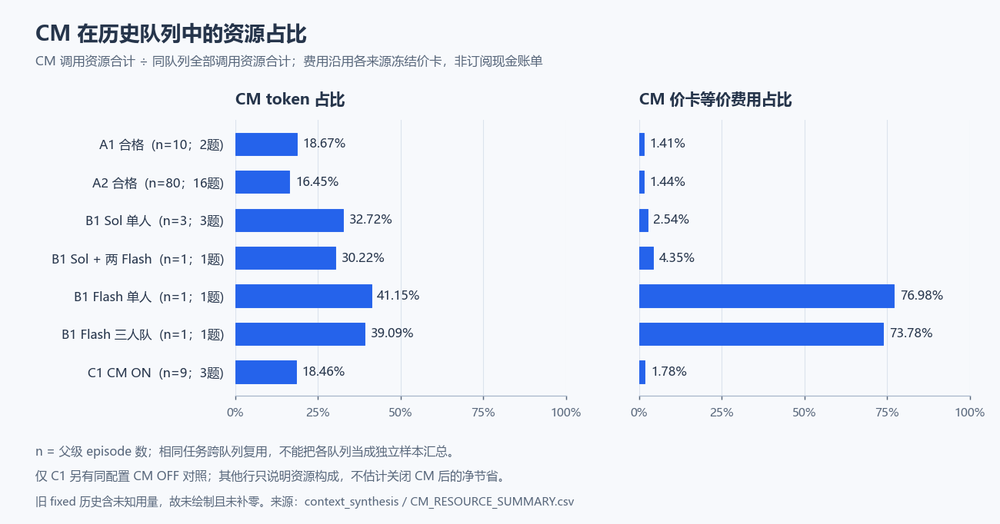

### 直接开关的净效果及其边界

C1 是目前最接近直接机制因果对照的一组：Sol Lead、两个 GLM-5.3-Flash worker，根 token 60 万、普通调用 28、worker 工作 8；只有 DeepSeek CM 开关与其调用池不同，记忆和编辑保护均关闭。ON 与 OFF 在三题各重复三次，9 个配对官方结果全部一致。

| C1，每臂 9 次 | ON | OFF | ON 相对 OFF |
|---|---:|---:|---:|
| 官方通过 / 生产交付 | 4 / 8 | 4 / 8 | 均无变化 |
| 总 token | 3,747,917 | 3,950,377 | −5.125% |
| 普通调用 token | 3,055,983 | 3,950,377 | −894,394 |
| CM token | 691,934 | 0 | 消耗掉普通调用观察差额的 77.4% |
| 价卡费用 | $11.517 | $14.464 | −20.373% |
| 生成耗时中位数 | 13.992 分 | 13.511 分 | +3.562% |
| 生成耗时均值 | 12.667 分 | 12.979 分 | −2.407% |

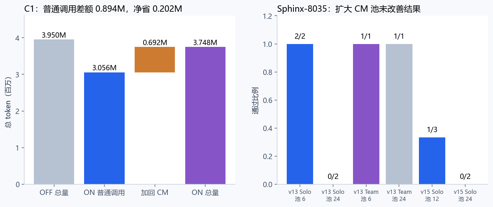

**即时压缩明显，不等于端到端省得明显。**C1 59 次请求中 56 次摘要被接受，3 次因长度拒绝；被接受时即时缩短中位约 44.8%，最终总 token 只少 5.1%。A2 的 517 次即时缩短、零压缩调用失败是过程健康证据，不能替代此前缺少的 ON/OFF 净效果。

节省也并不均匀：C1 只有 5/9 配对 token 更少，7/9 配对价卡费用更低；总净 token 节省的 82.1% 来自第一轮六格全部失败。仅看四个两臂都成功的配对，净省约 1.71%；这是按事后成功条件切片的描述，不用于无偏估计“成功任务上的 CM 效应”。

按原规则要求总 token 至少节约 15%、质量和生产交付不降、中位时间不超过 1.2 倍，当前 ON 未达 token 门槛，OFF 也没有满足相对效率晋级。**不改判为“CM 已充分证明值得默认开启”或“应关闭”。**价卡节约更大，部分来自减少昂贵普通模型 token、增加便宜压缩模型 token；它回答费用问题，不替代共享 token 或订阅配额问题。

历史调用池又增加一条信息：Sphinx-8035 的 v13 单体 CM6 为 2/2，CM24 为 0/2；v15 默认 CM12 为 1/3，CM24 为 0/2。两版的 CM24 描述性合计 0/4，仍只是同一题，不是四道独立题。v13 团队 CM6 与 CM24 各 1/1，但 CM24 生成更慢约 49.4%。**扩大 CM 池没有显示稳定质量好处，压缩额度也无法突破共同根预算。**这不证明 6 是通用最优值。

当前 CM 的适用边界是：在已测的低预算双 Flash 团队中，存在小幅 token、较明显价卡成本节省的观察；对 Terra/GLM 团队、高预算、长期上下文或全 Flash Lead 的净收益尚无直接开关证据。C1 的 CM 为 DeepSeek；全历史另含 24 条 GLM-5.3-Flash CM 配置，但没有同配置下的 CM 模型替换对照，故替代净效果仍未知。

## 8. 上下文装配与保护：全部控制合并后的阴性与未知

`heterooff` 实际只关闭这三个装配开关，两边 CM 都开着。v10 Sphinx-8035 与 v12 Astropy-14995 的 **52 个冻结 runtime hash 完全一致**，limits、角色、模型 effort、价格相关实际设置和评分版本也一致。因此可以跨批次合成两个任务的装配控制；验证记录见 context_synthesis/SUMMARY.json 的 assembly_comparability。

|可合并控制|OFF / ON 通过|ON token 变化|ON 等价费用变化|ON 生成时间变化|解释|
|---|---:|---:|---:|---:|---|
|同代码 Sphinx-8035 + Astropy-14995，先任务均值|6/6 / 6/6|+0.745%|+6.286%|+30.641%|未观察到质量增益；两个任务都处在通过率上限|
|v16 Xarray-7229 + Seaborn-3069，另作一层|0/4 / 0/4|-0.774%|-11.882%|+43.344%|四个 ON 均有 SCOUT_TOOL_UNAVAILABLE，实际侦察流程受损|

旧装配路径存在 164 次 memory_promoted、30 次 scout_distilled、60 次 cm_assembly 事件。三个开关共有 42 条配置 ON，但部分是 Solo，配置不代表实际给 Worker 组装上下文；真正含对应事件的 episode 分别是 42、30、30 条，另列在 context_synthesis/SUMMARY.json。记忆晋升不是“后续决策正确采用记忆”的证据；装配事件也不足以单独量出 Bootstrap 的贡献。

所有历史装配控制都没有出现质量分离，但两类任务分别被通过率上限和全失败压住，v16 还叠加工具故障。三个开关始终绑定切换，因而不能给 Memory、Scout、Bootstrap 各自排名，也不能把 C1 的 CM 节省归因于这套装配机制。A1/A2/B1 的 Memory 和宵禁关闭，仍大量使用 CM，进一步说明应把“摘要压缩”和“跨角色装配”分开核算。

### CM 池、F1 宵禁、F2 上限、F3 收尾豁免、F5 提醒

同题控制保留在 context_synthesis/CONTEXT_COMPARISONS.csv：Sphinx-8035 的 Solo CM6→24 为 2/2→0/2，TeamOFF CM6→24 为 1/1→1/1；后来的 Solo CM12→24 为 1/3→0/2。这些全部是 CM ON，改变的是压缩额度。后一个 CM24 的两次只各用 16 次 CM 就因总 token 准入停止，说明额度扩容没有移除真实预算瓶颈；不能解释成 CM 一概有害，也不能与 C1 ON/OFF 混为一个估计。

F1 的同版本 Sphinx 宵禁 ON/OFF 为 1/3 对 2/2，但默认三次均在首次编辑前耗尽 12 次 CM。后续 curfew skip 不等于阻止了原本还可获准的压缩。一个无宵禁成功轨迹在编辑前做 8 次 CM、编辑后又做 4 次，证明写后压缩不是这些成功的禁忌；它不证明宵禁普遍有害。A1/A2/B1/C1 的宵禁关闭队列能增加无宵禁可运行的事实，无法扩大这个小对照的因果精度。

F2 将输出上限从常见 2048 提高至 4096；旧 v15/v15b/v16 的 `length` 截断仍分别为 40/166、12/47、16/76。旧实现有截断后仍采用摘要的轨迹，C1 则拒绝了 3 个截断摘要。不能把跨实现“采用率”混合，更不能把后来通过归因于单独提高 cap；全历史无独立 F2 开关控制。

F3 的 v16 四次 closing 开始时仍有 8/6/7/8 次普通调用，都未进入最后两次 Lead 保留区；虽然开关 ON，核心豁免边界在这组证据中没有被触及。F5 零编辑提醒无独立消融，v15b 同时把预算从 600k/28 增为 900k/40，过半提醒绝对阈值由 300k 变为 450k；v16 Team 的有效提醒又关闭。它们是配置与执行签名证据，尚不足以支持独立质量收益。

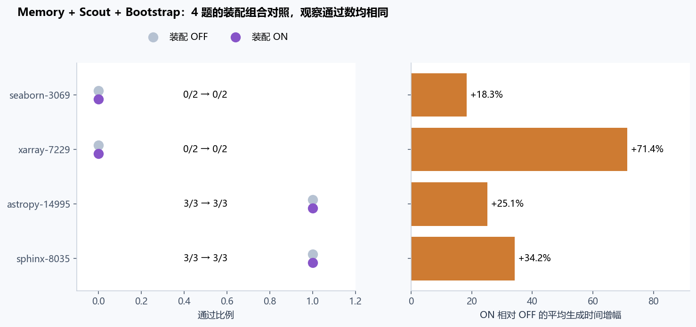

机制暴露必须看字段覆盖：Memory 已知 ON 42、OFF 179、未知 85；宵禁已知 ON 27、OFF 136、未知 143。较早缺失字段不编码为关闭。所有 306 条记录的开关与事件在 context_synthesis/COVERAGE.csv，可归一化事件范围为 241 条；此覆盖差异不能被隐藏为零触发。

## 9. 角色与 review：统一阶段数据之后还能说明什么

实例化 → 有调用 → 观察到非空delta → 完成且可交付 → 生产/测试内容 → 采纳 → 最终保留 → 根任务质量。

非空delta可能是被阻塞worker的工作区快照，不自动等于成功交付。role_synthesis/UNIFIED_WORKERS.csv新增worker_completed、delta_status、eligible_delivery；后者只在completed且present非空delta时置真，缺少字段保持未知。生产与测试按实际修改路径分类，不按分配角色倒推完成。

采纳使用既有详细审计及legacy review_worker的tool_completed.result；reviewed=true不代表adopt。最终保留要求所有修改文件与worker完成时一致；False只表示不满足严格判据，Lead可能部分吸收或重写。空delta的保留不适用。根质量是同一episode的官方或指定基准结果，两worker不能算两个独立成功样本。

| cohort | 角色记录 | 非空delta（字段已知分母） | 生产/测试 | 非空采纳/空采纳 | 最终严格保留（可检查非空分母） |
|---|---:|---|---|---|---|
| legacy fixed-team |126|94/125，1未知|47/48，有重叠|61/0；采纳字段106/126已知|2/2，其余未知|
| A1 |6|5/6|1/4|4/0|4/5|
| A2 |48|45/48|16/29|41/0|32/45|
| B1全部尝试 |32|20/32|11/9|18/1；采纳字段27/32已知|12/20|
| C1 |36|19/36|6/13|17/2|14/19|
| TeamEval脚本阶段 |60|未知/不适用|未知/不适用|未知/不适用|未知/不适用|
| runtime-v2脚本阶段 |32|未知/不适用|未知/不适用|未知/不适用|未知/不适用|

legacy 126个worker回收到125个delta判定、106个采纳判定；106由103个原始completed review_worker事件（61 adopt、42 discard）加3个终态death_phase支持的False组成，后三个不是采纳完成事件。但只有2个可用直接工作区快照完整核对最终文件，均一致；其余不能写成“不保留”。较早SWE Verified的12次root尝试未回收到实际独立worker，原型日志9条仅有根级信息。role_synthesis/COVERAGE.csv逐episode列出缺口。

92个脚本阶段来自原始planner、executor、verifier、oracle、repair等记录。共享工作区缺少每阶段独立补丁，非空、采纳和保留为未知/不适用。role_synthesis/ROLE_RESOURCES.csv从control.usage.by_role提取可观测调用及token；root workers=0不代表角色调用或资源为零。

### 角色机制累积判断

A1两题各臂均1/2，D/S与T/S没有成绩变化。A2的16题中S=10/16、D=10/16、T=12/16。D相对S没有胜负不一致题；T相对D或S多解Matplotlib-20826与Pylint-6386两题、无丢失题，小样本不足以支持稳定增益。48角色观察到45个非空delta、41个非空采纳、32个严格保留；其中42个completed、3个blocked；完成且present非空delta为42，不能称45次成功交付。

D/S测量“加入GLM-5.3测试worker的整套配置”，同时影响根预算分配、Lead协调审阅、测试提示和工作区可见性。10/16对10/16支持此配置本轮未显示增量解题，不能当作测试模型内在能力测验。T/D增加Terra实现角色，也不能把两题提升完全归因于某段worker代码而忽略Lead集成。

大预算core中Sol Lead、Terra implementation、GLM-5.3 test保持组成，T00→T11联合增加根token、普通调用、worker工作调用及CM额度。实现非空生产delta从3/3变2/3；测试从1/3变3/3、非空采纳从1/3变2/3、严格保留从0/1变2/3；根通过却从2/3变1/3。“测试角色真正执行得更充分”和“整体更好”是两条不同结论，T00不能称3个有效测试worker。

C1固定有测试角色，36worker中19非空（6生产、13测试），17非空采纳另有2空采纳，14严格保留。6个生产delta全部来自失败的Xarray条件；成功Pylint可以由Lead在实现worker无生产delta时完成。C1能定位阶段断点，但没有tester-off来估计去掉测试者的结果。小调用上限、提前停止和任务差异，与B1的48-call运行不能合并成Flash实现能力排名。

大预算Matplotlib S-FF是直接反例：Flash实现47次调用、测试15次，两者都有真实delta并采纳；Lead之后修改相关文件，严格保留两者为False，但根任务通过。因此“最终字节不等=零贡献”会误删真实实现、测试与采纳。F-T也不是没有修复目标：官方F2P=1/1，但P2P=671/673，两个旧测试回归导致整题失败。

早期pilot_v8同一个Sol Lead下交换Sol/GLM的实现与测试方向，两臂各1/1；它没有比较GLM Lead与GPT Lead。固定Terra实现、切换Luna与GLM测试也各1/1，各只有一题一次。pilot_v10 Sphinx上solo0/3、关闭worker assembly的team3/3，而pilot_v12 Astropy两者3/3；这是任务依赖的整队配置证据，不是统一模型胜负率。

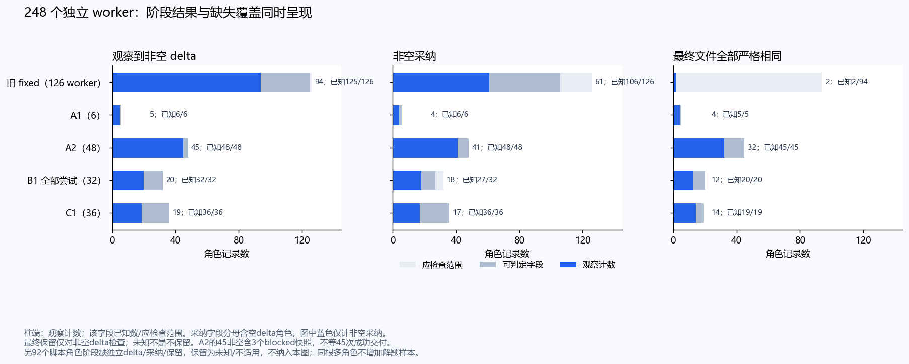

### review 的效果缺口在全历史中仍未补齐

旧 fixed 的 61 个非空采纳来自实际完成的 review 工具结果；103 个完成 review 判定含 61 采纳、42 丢弃，另 3 个不采纳来自终态阶段证据，合计采纳字段 106/126 可判定。它们证明 Lead 有真实决策，不能用完成事件数当 review 正确次数。旧最终保留仅有 2 个直接快照可完整核验，2/2 不能外推为全部 126 个角色的保留率。

C1 保存 37 次 review 请求、涉及 35 个 worker，但请求时 worker 全部未静止封存，后续 Lead 还会修改候选；A1/A2 的 36 个 R2 候选也无独立官方评分。跨历史角色采纳、根官方结果和非 SWE verifier 轨迹都已纳入，仍缺“固定候选的正确性 × 实际选/弃”的联合标签，故不能计算选择准确率、错拒率或净救回率。

A2 Pylint 的 D 测试交付被拒且根失败，不能据此断言拒错；MVP Xarray 的严格断言被拒、C1 Pylint 的断言不可达则是可定位的验收问题。非 SWE 首次失败后最终通过的轨迹见第 15 节：这是反馈修复可执行的补充证据，未设随机 review-off，不能补成因果对照。

**累计结论是“过程发生过，净贡献尚未分离”。**D/S 是增加测试 worker 的整套配置效果；T/D 是再加入实现者和协调的配置变化。它们不能替代固定模型、总预算和协议下的纯 tester-off，也无法量出异模型 review 优于同模型多少。模型、工作调用上限、任务语义及 Lead 集成共同影响阶段产出。

## 10. R2：纳入全部父任务、候选与局部预算后

R2 实际出现在 A1/A2，共 18 个父任务、36 个内部候选；其他历史没有可追加的同类臂。A1 的两题为全臂一题通过、一题失败，因此同源 18 题合并为 R2 12/18、Sol 11/18，唯一正差仍是 Pylint-6386。原 A2 预定层为 11/16 对 10/16、费用 +36.4%、中位生成时间约 +1.5%；A1 扩充没有增加不一致任务。

| 全部 R2 的选择机会 | A1 两题 | A2 十六题 | 合计 |
|---|---:|---:|---:|
| 父任务 / 内部候选 | 2 / 4 | 16 / 32 | 18 / 36 |
| 进入选择流程 | 1 | 13 | 14 |
| 无合格候选，回退空补丁 | 1 | 3 | 4 |
| 进入选择且生产改动相同 | 1 | 8 | 9 |
| 生产改动存在差异 | 0 | 5 | 5 |
| 候选补丁整体字节相同（包含空补丁对） | 1 | 3 | 4 |
| 候选独立官方评分 | 0 | 0 | 0 |

因此 18 题中只有 5 题存在生产候选差异；实际进入选择的 14 题中为 5/14。其余 9 个进入选择的同生产补丁对仍可能测试内容或轨迹不同，不能说第二次采样完全没有价值。Pylint 独赢时两候选生产相同，故不是已证明的“从一好一坏中选对”。

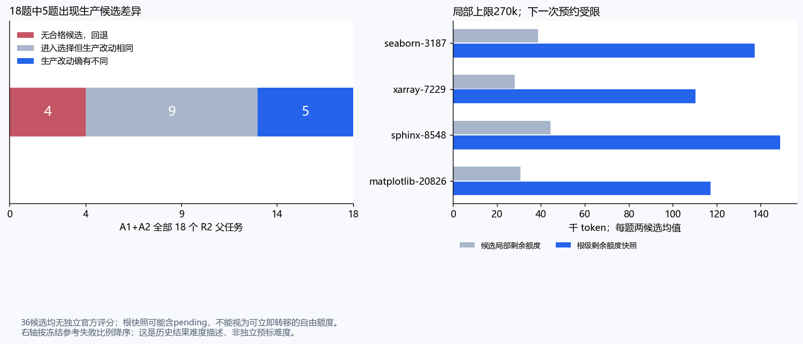

**四个回退父任务是 A1 Xarray-7229，以及 A2 Matplotlib-20826、Seaborn-3187、Sphinx-8548。**八个候选都停止于 TOKEN_BUDGET_EXHAUSTED，但普通调用仍各剩 3–5 次；局部剩余 20,871–45,895 token，根剩余额度快照为 104,483–148,986。冻结实现把两个候选各限 270,000 token、12 次普通调用、6 次 CM，选择器另有 60,000 token、4 次调用；组件额度不可转移，预约先检查局部，再检查根。

这支持“局部切分与下一次预约共同构成约束”，修正把顶层 call_limit 一概解释为普通调用耗尽或根 token 全用光的说法。日志没有保留被拒请求的具体预约大小，部分根快照还有 pending；不能据此算出转移后可多跑几轮，更不能保证会救回。当前数据能诊断预算约束，不能代替重分配反事实。

**整体配置收益、候选多样性、选择正确性是三个问题。**前两项已有局部量化，第三项的选择准确率、相对随机选择的收益、oracle best-of-2 上限全部未知。R2 独立采样也不是共享前缀的 SPLIT。完整证据见 R2_CUMULATIVE.csv、R2_CANDIDATE_OUTCOMES.csv、R2_BUDGET_SCOPES.csv 与独立复核。

## 11. 题目特性：可以找到瓶颈模式，不能建立稳定的题型收益模型

**把所有数据按题目重新对齐后，机制的任务覆盖仍很窄。**全库有 26 道去重 SWE 题，可构成至少一个团队/单体配置对的有 20 道；具体 Sol/Terra/GLM 组合覆盖 19 道去重题，正向仅 Sphinx-8035、Matplotlib-20826、Pylint-6386。这三个任务分别涉及文档/签名、绘图对象状态、静态分析边界；不能合并成已证实的单一“难题优势”。同为状态问题的 Xarray-6992 未被救回，而另一道 Xarray-7229 是不同任务。

在相同配置内，题级差异可以支持局部案例分析；跨所有阶段按类型直接汇总，会把预算、模型和某些诊断题的大量重复混入类型效应。两 Sol worker 在 Sphinx 同题上跨设置出现相反方向，进一步说明类型标签本身不足以解释机制收益。以下保留完整题号、测试形式及冻结参考难度；没有补入未经验证的 leaderboard 通过率或人工修复时间。

本次把 A1/A2 的 18 道题与遗留独有 8 道题补成 26 题特征表，依据冻结公开题面、官方目标节点与离线测试材料描述问题类型、测试形式和覆盖边界。**这些是评分后的解释性标注，不是求解前可用的官方答案或外部难度标签。**公开题面中的要求、官方测试实际检查的要求、模型自建测试检查的要求分别处理。

| 任务特性与完整题号 | 观察 | 对机制适用性的含义 |
|---|---|---|
| Xarray-6992：MultiIndex 跨操作坐标/维度不变量 | 5 个 A2、3 个 B1、6 个 C1，共 14 个可用官方结果均失败 | 当前最稳定的语义整合瓶颈；角色更多、预算更大与 CM 开关都未显示突破 |
| Xarray-7229：where/keep_attrs 与坐标属性传播 | 17 个跨历史结果均失败，和 6992 是两题 | 指向另一类属性传播困难；不能当作 6992 的 17 次重跑 |
| Seaborn-3069：分类轴边界、网格、方向与显式 limits | 9 个历史结果均失败；有修好 x 轴却遗漏 y 轴的轨迹 | “多轴/多条件验收”可能比局部实现更关键；这里目标是 axes 状态断言，不是像素对比 |
| Matplotlib-20826：clear/cla、共享轴生命周期 | A2 T 独过；MVP 多种配置可过；C1 两臂各 2/3 | 团队有救回实例，但单体 Flash 也能过；交付、作用域与回归边界比仓库标签更有解释力 |
| Pylint-6386：短参数解析到实际 verbose 行为 | A2 R2/T 通过；MVP T00/T11 通过；C1 两臂各 2/3 | 只改 nargs 或只测异常不足；测试需要贯通实际行为 |
| Sphinx-8035：private-members 选项与成员过滤 | 有重复通过实例（如同组 3/3）；合资格历史 42/66 仅作库存 | 同一题的预算、CM 池和实现纪律影响很大；不等于所有 Sphinx 任务受益 |
| Sphinx-8548：继承实例属性提取 | A2 五臂均失败 | 与 8035 不是相同语义，不能用旧成功作新题能力证据 |
| Matplotlib-25122：PSD 窗归一化公式 | 7 个历史结果全过；有 12 个参数化目标节点 | 节点多不一定复杂：局部公式修正可同时解决一组参数化测试 |
| 明确局部类型/参数/生命周期边界 | A2 九题五臂全过；旧 Flask 空名称、Astropy 缺失 mask 等也能通过 | 结果已饱和，额外角色难显示通过率增益；这不是这些角色永远无价值 |

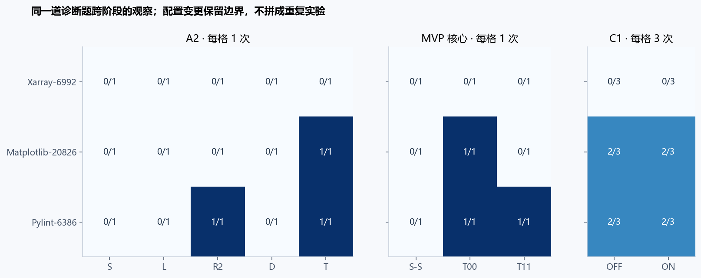

Xarray-6992 的三个阶段尤其有信息量。MVP 的 T00/T11 主要停在 `__len__` 表象，S-S 已修改 reset_index 的 `_coord_names`；C1 多数补丁继续处理坐标集合状态，但仍未覆盖官方跨操作契约。它们不能概括为“所有模型写了同一个补丁”，更准确是**不同表面修法共同未满足完整状态语义**。大量 P2P 通过说明已有行为保持，不能代替 F2P 目标修复；C1 多数这类补丁 P2P 945/945 而 F2P 0/12。

目标节点数不作为独立样本量或固有难度：Matplotlib-25122 的 12 节点来自频谱参数组合，Xarray-6992 的 12 节点覆盖不同转换路径；pytest-7571 虽仅 1 个 F2P，内部还生成运行 3 个测试；Sympy-16792 题面表现为 Cython 调用失败，官方目标却只断言生成 C 签名文本。**测试类型比“某某仓库、几个测试”更能解释为何自测与官方评分错位。**

对于 A2 的“人类修复超过 1 小时”旧说法，本次未找到可独立核验的冻结人类工时元数据，也未找到逐题 leaderboard 成绩快照。因此不继续把该标签当作已确认的能力边界。可以确认的是这些具体任务上的观察失败，不能据此推断外部强模型也全部失败。本报告未联网更新榜单，也没有用缺失榜单数值填 0；外部相对难度、其他系统逐题通过率仍未知。

目前最合理的类型假说是：**题意和验收边界清楚、能拆出局部实现与独立回归的题，更可能得到便宜测试者或固定分工的帮助；跨操作状态语义、验收解释不完整的题，多个共享解释的角色会一起犯错。**这来自案例机制推断，尚无足够题目做预设类型分层的效应估计，不能训练出可信的自动路由规则。

## 12. 失败到底在哪里：不能只看 budget_exhausted

累计失败应按“信息/语义—实现—交付—集成—目标—回归—运行环境”定位，终态标签只能作线索。现在没有把所有 249 条强行统一成一个主观根因饼图：旧版本日志字段和可观测程度不同，部分候选原因不可完整重构。完整定量分类限于已有专门失败审计的队列。

C1 的 10 次失败可分为：5 次 Xarray 生产补丁语义不足、1 次 Xarray 交付未集成即被根预算预约阻断、2 次 Pylint 只完成参数表象修复、2 次 Matplotlib 编辑失败后仍执行结束。也就是 **7 次语义不足、2 次编辑/交付闭环失败、1 次预算阻断集成**。不是十次都“token 不够”。

C1 的 5 次根 budget stop 反而有 4 次通过、1 次失败。预算耗尽时已形成正确补丁与尚无候选是两种情况。MVP T11 Matplotlib 则是真正的长探索无生产交付：Terra 大量调用但没有生产 delta，测试补丁被采用，最终根预算结束；S-S Matplotlib 的原生工具适配故障又属于不同原因，不能当作纯 Sol 能力不足。

worker 局部工作额度与根总 token 也不同。C1 有 10 个无编辑实现者，其中 9 个在 8 次工作调用后转入强制结束路径，1 个在同样工作次数自报 blocked；根还剩 token 并不授权 worker 继续工作。这支持“8 次窗口可能在部分轨迹不足”的诊断，但没有固定其他条件比较 8 与 16/48，不能把这十次都算作已经证明的预算因果损失。

还有两类评分边界需要保留。其一，C1 某个 Matplotlib 失败补丁产生 NameError，导致收集阶段失败；不能称“673 个回归逐个失败”。其二，某些正式通过补丁在冻结 P2P 范围之外仍有额外失败；F-T 则在冻结 P2P 内有两个极坐标图像回归，因此正式不通过。**官方通过、目标修复、全文件测试通过、完整仓库质量不是同一终点。**

## 13. 异构经济性：便宜是真的，但便宜的来源要讲清

**全历史经济性并不支持一个通用的“便宜 worker 最优”结论。**第 5 节的 38 个同 Lead 严格配置序列已同时列出成功差、token、价卡成本和平均生成时间；未知用量的系列留空。v10/v12 两题的 Terra＋GLM 在 assembly OFF 条件相对 Solo 费用比约 0.81、平均时间比约 1.08；A1+A2 同组合费用比约 1.00、时间比约 1.38，收益与等待代价明显不同。OFF 对 Solo 还涉及装配设置差异，不能称纯委派效果。

低价模型本身也会改变 CM 的相对成本：B1 全 Flash Lead 样本中 CM 占价卡费用约 74%–77%，强 Lead 的 A1/A2 约 1.4%、C1 约 1.8%。这是完整调用账对比出的成本结构差异，不是关闭 CM 即可节省相同比例的净效应。以下逐模型实例保留其预算与速度条件。

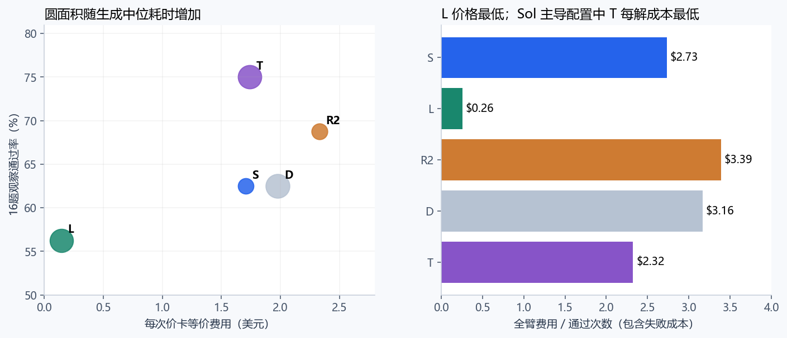

Luna 在 A2 的价卡费用比 Sol 低约 91.5%，但 token 高 33.6%、生成中位时间长 42.4%，且少通过一题。这是明显的价格结构优势，不是更省计算或更快的证明。T 的近似美元成本也来自混合单价，它相对 S 多用 35.2% token。若约束改为总 token、订阅各模型配额或延迟，配置排序会变化。

Matplotlib 单题 F-S 价卡费用约 $0.214、62.13 分，通过；T00 约 $2.178、9.47 分，通过。F-S 是价卡费用约十分之一、等待时间约 6.6 倍的例子，不是已经建立了 Flash 稳定胜率。S-FF 同题通过但用了约 2.391M token、56.09 分、$5.396；不能因子角色便宜就说整个团队便宜，Lead 和重复上下文仍占资源。

也不能把 CM 一概称为金钱上近乎免费。T00/ T11 / S-S 核心中 CM 的价卡占比较小；**F-S 的 CM 约 $0.165，占总价卡费用约 77.0%；F-T 的 CM 约 $0.293，占约 73.8%**。原因是 Flash 本身单价极低，DeepSeek 压缩相对反而昂贵。C1 的 Sol Lead 团队不适用于这个成本比例。对全 Flash 系统，是否值得 CM 必须单独做净效应比较，现有 ON-only 实例无法给出反事实。

因此有实际依据的经济建议是：按目标预算分别看“质量/价卡费用”“质量/根 token”“质量/等待时间”。现有数据支持便宜模型的角色使用可行性，尚不支持固定一套模型分级、自动升级阈值或所有任务最优组合。

## 14. 设计的其余部分：哪些只到执行层，哪些仍未触及

**这部分已检查全历史的暴露范围，没有把较新固定团队的开关替代全系统覆盖。**旧 fixed、A1/A2、B1、C1 提供固定创建 worker 的记录；TeamEval/runtime-v2 另外包含 92 个 planner、executor、verifier、repair 等脚本阶段。早期 SWE verified 名义 dpswarm 的五个合格结果实际 workers=0、delegations=0，不能用它们证明团队效果，也不能由它们否定其他层真实派生。

固定 worker 的实际恢复数量为 248，包含未完整交付与缺可判定字段的角色；这证明控制路径被使用，并不证明自主选择何时派生。SPLIT/FISSION、成本画像和自动升级仍没有跨全部历史找到可用的独立端到端开关对照；原型、事件和确定性测试留在“执行/可行性”层。全量逐机制索引见 MECHANISM_EVIDENCE_MAP.csv，逐来源控制字段见 CONTROL_AND_ACCOUNTING_COVERAGE.csv。

将当前机制设计拆成具体问题后，累计证据覆盖如下。这里以“效果直接对照”“配置观察”“运行证据”“未识别”区分，不打一个任意的综合分数。

| 设计部分 | 已有实验证据 | 还不能主张什么 |
|---|---|---|
| 事实注入、模型成本/能力画像 | 模型与角色人工冻结、身份/价格可追溯 | 未证明让 Lead 看模型画像后会作出更优动态选择 |
| 观测与账本 | 调用、未知用量、补丁/评分绑定；不同版本能重新对账 | 不是质量增益消融；不能声称旧实验从无故障或用量缺失 |
| 测试、review 与验收 | 真实交付、拒绝、采用、改写和最终评分 | 测试者独立贡献、review 准确率及语义独立性收益未知 |
| CM 历史压缩 | C1 直接开关；旧 CM 池对照 | 净收益不能推广到所有模型、预算和长期任务 |
| 上下文装配 | Memory/Scout/Bootstrap 组合有同版对照 | 单独长期 Memory、Scout、Bootstrap 的净贡献未拆开 |
| 编辑保护、关闭期例外、提醒 | 旧真实轨迹与部分开关/版本观察 | F1 实际暴露弱；F2/F5 无独立消融；F3 关键预留边界未触及 |
| 记忆晋升、失效、context rollover | 有事件与原型/离线功能证据 | 跨长任务/多轮状态的可靠质量与成本净收益未知 |
| 委派经济性 | 固定团队与单体、R2 的配置对照 | 自主决定何时委派、多少角色、如何分配预算未被证明 |
| DERIVE | 大量真实固定 worker 创建与交付 | 强制建队不证明自主派生决策正确 |
| SPLIT、FISSION、动态 DAG | 原型事件、状态路径和确定性测试 | SWE 固定二 worker 流程未测完整动态拓扑；R2 不等于共享前缀 SPLIT |
| 模型分级、升级、跨模型方向 | 少量角色互换、纯 Flash/异构实例与原型升级事件 | 未建立稳定角色能力曲线、自动升级净收益或默认最优模型层级 |
| 一致性、封存、恢复 | 已有中断恢复、seal、patch freeze、账本与哈希证据 | 没有在各种并发/故障分布下验证整个生产系统；成功封存不等于解题成功 |

早期固定团队累计存在 4 次 CM 调用失败等运行问题，不能把 A2“零 CM 失败”推广为整个历史零故障。旧 v16 的团队完整性指标也曾很低，而某些不完整团队依然通过，说明过程完整与最终质量要分开。

运行异常也需要按通道拆开。B1 早期普通 API 有 5 次约 300 秒读取超时，后来的普通流式接口出现 HTTP 429/业务码 1113（余额或资源包不足）；后两批改到 Coding 接口，16 格用量完整。这不是“Coding Plan 没额度”或“并发超限”已经被证明。另两次 ZCode 原生 CLI 的单请求因验证码失败，没有测出 Coding API 并发上限。C1 实际最高 4 队、12 候选容器；516 次资源采样均成功，抽样单容器峰值约 0.559 GiB。采样未记录 OOMKilled，不能由采样成功推断没有 OOM；抽样峰值也不等于物理硬峰值，不能验证更高并发或更小内存安全。上述均为历史记录，未在本次新查额度或发请求。

这并不贬低执行层价值：能从中断恢复、保留未知账目、查清候选和评分身份，使后续比较可信，是已经实现的工程收益。但它不能被包装成某项机制让 benchmark 多通过了多少题。

## 15. 早期非 SWE 结果为何单列

TeamBench/日志管线使用真实模型调用和自含验收，能说明协议或反馈修复路径可执行；部分脚本化确定性测试只能说明功能。旧原型存在输出上限事故、被后续版本替代的结果和三次有真实新调用但无归档终态的续试，均保留在尝试库存，不虚构最终成功。

WideSearch 的 8 条历史快照跨 4 个任务，指标是字段/行匹配，不是 SWE resolved。按当前可绑定快照：ws004 团队字段和整行准确度更低且 pending 更多；ws008 两侧均完全匹配；ws074 团队 item F1 约低 1.79 个百分点；ws079 团队 item F1 约高 6.64 个百分点，但伴随 gold-derived 缺失行反馈和重试，不能当作无答案辅助的独立净收益。后续叙述中的修复后满分不覆盖旧快照。

“独立 verifier 反馈纠正遗漏”和“把评测答案用于补缺”也不是同一强度的证据，需看具体输入；不能把所有带 oracle 字段的离线评分都说成给模型泄漏答案，也不能把已知 gold 反馈的修复当纯盲测。该层对机制的主要贡献是发现遗漏/修复循环和输出纪律问题，不能与 SWE 合并成全系统准确率。

来源：../cumulative_analysis_20260907_v1/non_swe_audit/WIDESEARCH_SCORE_SNAPSHOT.csv、NON_SWE_SCOPE.json，以及 legacy_audit 的协议题和原型分类。

### 全部真实协议任务的反馈修复轨迹

| 历史层 | 运行数 | 首次 verifier 通过/有观测 | 最终 verifier 通过/有观测 | 有观测首次失败→最终通过 | 各自 benchmark 通过 |
|---|---:|---:|---:|---:|---:|
| main | 12 | 5/10 | 8/12 | 1 | 8/12 |
| native_followup | 4 | 1/4 | 4/4 | 3 | 4/4 |
| regression_20260903_v2 | 6 | 0/3 | 1/6 | 1 | 2/6 |
| regression_budget_visible_20260903 | 4 | 3/4 | 3/4 | 0 | 3/4 |

这些是 26 次非 SWE 运行的纵向轨迹，给角色分工与反馈修复提供执行层支持。首次判定不完整时保留可观测分母，例如 main 为 10/12 可观测，不能补成首次 5/12。runtime regression 的最终 verifier 为 1/6、benchmark 为 2/6，判据不同，必须分列。首失败后最终成功表明修复路径有实际成功案例；没有 review-off、相同候选封存评分或一致评分体系，不能相加为 review 净增益，也不能与 SWE 成绩合并。

## 16. 现在适合怎样设置：有依据的选择与未识别的选择

以下是基于既有数据的工程取舍，不是新的自动配置修改，也不是批准追加实验。

| 使用目标或触发条件 | 当前较有依据的选择 | 代价与边界 |
|---|---|---|
| 短延迟、题目局部且验收明确 | Sol 单体可作为稳健起点 | A2 S 较快；部分任务 T/R2 有额外解题机会 |
| 批处理，愿意延长约四成生成时间争取质量 | Sol / Terra / GLM 固定三角色 T 可保留为候选 | A1+A2 多 2/18 题，跨设置正向集中于 3 道去重题；平均生成时间约 +38%，A2 原晋级规则仍未达到 |
| 主要压低价卡费用、可接受更慢 | Luna/Flash 路径值得保留候选身份 | 低价不等于低 token；Flash 多数证据仍单题，不能直接替代质量基线 |
| worker 正在读代码，局部工作额度即将结束 | 先区分工作次数耗尽、交付未封存与根 token 不足 | 现有记录支持诊断，尚未证实哪个局部扩额阈值最优 |
| 想通过多测试提高质量 | 先关注独立验收条件和实际测试行为 | 只提高测试者份额没有对照证据；D 在同源 A1+A2 的 18 题无增益；大预算有单题反例 |
| 已有双 Flash / Sol Lead、60 万预算，重视价卡成本 | CM ON 可保留为有小幅净收益观察的候选 | 当前总 token 仅 −5.1%，不能宣称达成预定效率晋级 |
| 全 Flash Lead 系统 | 不能沿用“CM 几乎免费”的假设 | 两个实例中 CM 占价卡费用七成以上，净收益未测 |
| 想启用记忆装配或扩大 CM 池 | 暂无证据支持因质量提升而默认启用/扩池 | 两个可合并历史层均无通过优势，平均生成分别慢约 31% 和 43%；不能否定未被独立测试的健康版本 |
| 多操作状态、索引或跨路径一致性任务 | 把验收语义完整性视为主要风险 | Xarray 历史仍失败；未证明加角色/加 token 就会突破 |
| 自动组队、裂变、角色升级 | 保持为尚待验证的策略能力 | 当前固定配置成功不等于自主决策有效 |

这些取舍可以支持下一次机制讨论，但不能从现有小样本中推出一个准确的规则，例如“某题型团队必增益 10%”“8 次调用一定不够”“测试者份额 30% 最优”。没有这类精度的证据。

## 17. 累计证据最缺的并非更多同题大矩阵

当前缺口主要是可识别性。要回答尚未知的机制问题，需要的是与问题相符的对照：固定总预算下的角色分配、测试者有无/独立验收解释、静止候选的独立评分、全 Flash 下 CM 的净效应、自主委派与固定委派的区别。对同一已知题重复更多不同版本，主要扩大诊断轨迹，不自动扩大泛化证据。

新题覆盖也必要。26 道题中后期大量预算集中在既知困难/分歧任务，且 A2 13/16 饱和。后续若要检验“什么任务适合团队”，需要求解前定义题型/验收边界、使用未被官方答案分析过的任务，并保留单体对照；本报告的评分后特征不能直接作为盲测提示。

本次没有启动这些工作，也没有改原先“不自动晋级”的规则。已完成的交付是把过去证据整理到足以作当前判断的程度：**固定异构配置存在局部收益，CM 存在有限资源净收益；更复杂的组件和更大预算未展示稳定增益，测试者、review、动态拓扑等关键活性成分仍未分离。**

## 18. 核验、复现与全部审计入口

本版以 v1 冻结的全历史库存为起点，**重新构造每种机制的适用证据集和可比汇总**。v1 的 249 原始成绩/补丁核验、来源哈希及 18 节报告保留，v2 不修改旧结果、不新增模型或评分、不改运行时或配置。新分析由三条互不重叠的数据工作线生成，再交叉复核团队、R2 和角色结论；制作者自检与独立复核分开记载。

- [全历史库存](<ALL_ATTEMPTS.csv>)、[合格 SWE 结果](<QUALIFIED_SWE_EPISODES.csv>)、[题目特征](<TASK_CHARACTERISTICS.csv>)：306 / 249 / 26 的完整范围，沿用冻结版本。
- [逐机制全部证据映射](<MECHANISM_EVIDENCE_MAP.csv>)：每部分纳入来源、直接对照、执行数据、不可合并因素和最终条件判断。
- [团队全对照](<team_synthesis/COMPARISONS.csv>)、[严格配置汇总](<team_synthesis/SERIES_AGGREGATES.csv>)、[具体模型跨设置任务支持](<team_synthesis/CROSS_STRATA_TASK_SUPPORT.csv>)、[团队覆盖去向](<team_synthesis/COVERAGE.csv>)：163 对照 / 92 序列、共享基线和精确任务支持。
- [上下文资源汇总](<context_synthesis/CM_RESOURCE_SUMMARY.csv>)、[全部上下文对照](<context_synthesis/CONTEXT_COMPARISONS.csv>)、[上下文配置与事件覆盖](<context_synthesis/COVERAGE.csv>)：规范明细、完整比例/已知小计和未知字段分开。
- [全部角色阶段](<role_synthesis/UNIFIED_WORKERS.csv>)、[角色分层](<role_synthesis/COHORT_ROLE_SUMMARY.csv>)、[预算对照](<role_synthesis/BUDGET_COMPARISONS.csv>)、[角色预算增量](<role_synthesis/ROLE_BUDGET_GROWTH.csv>)：248 独立 worker / 92 脚本阶段、可判定分母及 20 组变化。
- [全部 R2 汇总](<R2_CUMULATIVE.csv>)、[内部候选](<R2_CANDIDATE_OUTCOMES.csv>)、[候选与根预算](<R2_BUDGET_SCOPES.csv>)：18 父任务 / 36 候选及四个回退案例。
- [非 SWE 反馈修复](<NON_SWE_VERIFIER_SYNTHESIS.csv>)、[控制与字段覆盖](<CONTROL_AND_ACCOUNTING_COVERAGE.csv>)：补充控制和修复路径，绝不冒充 SWE 结果。
- v1 报告（本地归档）、A1/A2 审计（本地归档）、预算审计（本地归档）、早期审计（本地归档）、v1 独立数据复核（本地归档）：原始阶段详情与既有核验链。
- C1 原报告（本地归档）：直接 CM 对照、失败和机制审计。
- [v2 团队/R2 独立审查](<independent_review/TEAM_AND_R2_REVIEW.json>)、[v2 角色独立审查](<independent_review/ROLES_REVIEW.json>)、[最终报告验证](<REPORT_VALIDATION.json>)、HTML 收据（本地归档）、输出哈希（本地归档）。

Python 图提供 PNG/SVG：原九图保留其原阶段统计含义，新增图 10–13 用于累计 R2、CM、角色和匹配团队对照。HTML 保留全文并嵌入图表及选定原生数据表；它不把所有原始日志打进单文件。报告内相对 CSV 来源在便携阅读器中可能显示为来源文字，CSV 文件在同目录另行保留，不能把来源可见性等同可点击或全量日志内嵌。

验证按实际完成项目报告：规范结构校验与实时桌面/窄屏 Playwright 检查分列；已知规范 CLI 虚拟时间浏览器验证超时不冒称通过。新报告/HTML/数据 SHA 在最终收据绑定；原始源哈希复用与本次新目标检查范围另列，不把历史核验次数充当新独立检查数量。
