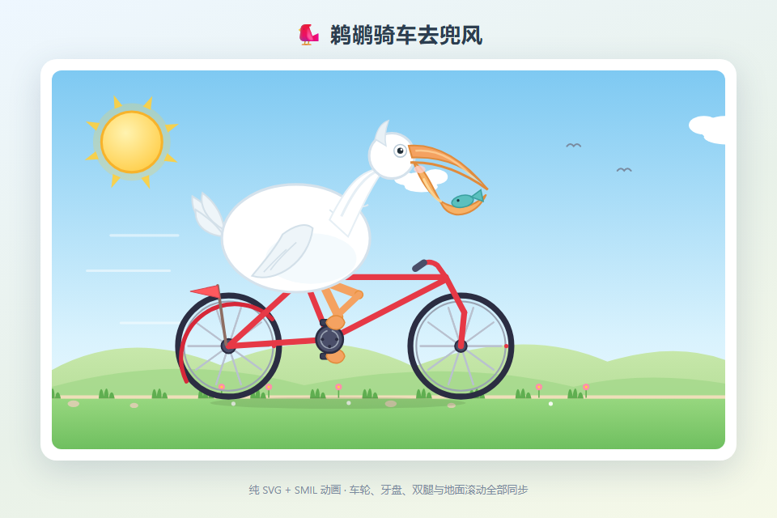
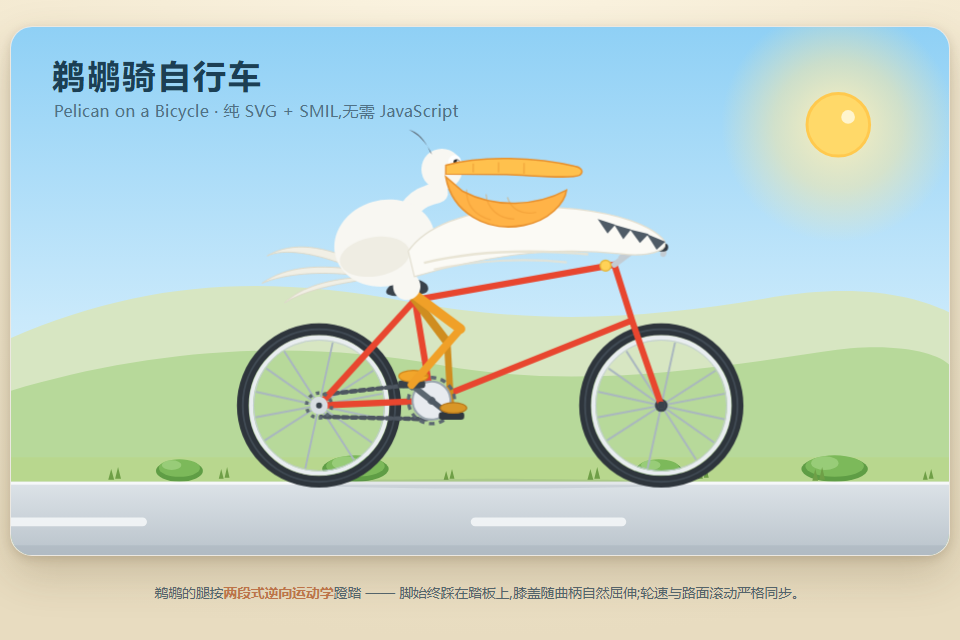
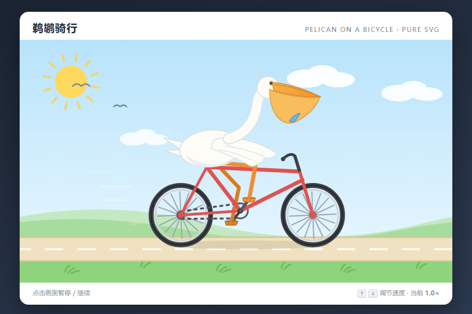

# DPH 鹈鹕动画实验公开快照

截止时间：**2026-09-08T05:03:21.332081+00:00**。这是一份静态发布，后续运行不会自动改变它。

[打开离线画廊](index.html) · [逐组 CSV](results.csv) · [结构化 JSON](results.json) · [源与发布哈希](publication-manifest.json)

同一提示词：

> 创建一个HTML，内容是SVG绘制一个鹈鹕骑自行车的2D动画，放到本机dev目录，你不需要任何测试

## 分母与完成边界

| 批次 | 组数 | 已确认最终 HTML | 仅中间稿 | 状态 |
|---|---:|---:|---:|---|
| 原始 32 组 · 四模型历史对照 | 32 | 32 | 0 | {"reused": 2, "finished": 30} |
| 预算主矩阵 48 组 · 截止快照 | 48 | 43 | 0 | {"finished": 44, "running": 1, "prepared": 3} |
| 旧版 0.7.0 · 独立历史 15 组 | 15 | 12 | 2 | {"historical_ended": 15} |
| 保存补跑 · 单次 Pro 例外 | 1 | 1 | 0 | {"finished": 1} |

原32组包含 V4 Pro 历史。预算主矩阵固定48组；待派发、运行中与API终止格都保留，不冒充全部完成。旧15组与单次Pro保存补跑单独展示，不加入主48分母。旧保存失败保留记录，成功补跑不回填覆盖旧尝试。

## 路由与机制证据

主矩阵原0.7.1批次有 **17格确认实现者错误路由到 DeepSeek V4 Pro / high**，均已逐格标记，不能用于声称预期模型配置的团队效果。新0.7.2格的已观察路由来自原生 request/header 与模型回复 source；未派发或无请求的角色保留未知。原始32组展示实际观察模型，不把它们自动判定为已完成独立路由审计。

开关表示请求启用；team_invoked、team_call_count、cm_calls、cm_adopted 才描述实际调用与采用。没有调用不等于机制已充分接受检验。未知费用保留 null / CSV 空格，不等于零；不根据订阅额度推算费用。

## 保存与作品

HTML按源字节复制，公开文件SHA与原始保存记录一致。auto V4 Flash 创造模式团队格采用已验证的最终 write/edit 补充快照，旧初版证据仍保留。旧15里仅有成功中间稿、未确认最终版本的作品明确标注为中间稿。

画廊只加载已存在的静态缩略图并提供HTML链接；本次发布没有调用模型、启动DPH或运行动画。缩略图是历史固定时刻画面，只有其源HTML哈希与公开HTML相同才复用。截图、成功保存、官方评测和视觉质量是不同概念；这里不提供质量排名。

下载整个目录后打开 index.html 即可浏览；点击作品会由浏览器运行动画。保持 artifacts 与 previews 相对目录。文件可能使用作者原本引用的外部资源，本次发布不替换或补齐它们。

## 可追溯与隐私

publication-manifest.json 记录每个输入源的逻辑标识和SHA、每个导出文件的SHA及变换。仅公开必要字段，不发布密钥、认证token、宿主profile、会话原文或个人本机路径。带个人路径或凭据特征的HTML会被留空，不修改内容后冒充原作。

生成器：仓库 scripts/publish_pelican.py。必须指定独立的新输出目录；不会覆盖现有发布或修改实验源数据。

## 历史例图：原32组 · 标准模式 · 基线

以下为同一固定时刻的历史静态画面，只作作品入口，不是质量排名。

| V4 Pro | V4 Flash | GLM 5.3 | GLM 5.3 Flash |
|---|---|---|---|
|  |  |  |  |

## 用量口径

observed_total_tokens 直接保留collector已观测值；ordinary_observed_tokens 与 cm_observed_tokens 分列。usage_complete=false 时，它们是观测下界，不补估缺失用量。ordinary_calls_observed 是原生已完成模型回复条数，不包含无法确认的内部重试；未知消息/重试/CM用量另外保留。Auto实际额度只导出角色、token/调用上限与决策来源，不公开理由或任务全文。无来源字段为null/CSV空白。

## 冻结配置协议

[查看完整公开协议](protocol.json)。实现者请求跟随对话模型；测试者与CM请求使用 GLM 5.3 Flash；Reviewer由Lead承担。DeepSeek推理强度请求为max。实际路由与开关曝光以逐组证据为准。

原32组没有子worker终身token/调用限额。新手动2倍组对每个子worker分别设120万token/56次调用；这是新表单参考60万/28的两倍，不能称作原32组预算的两倍。Auto由Lead读题后分别分配子worker额度；不限制Lead或整个团队。

[发布脚本](../../../scripts/publish_pelican.py) · [公开数据](results.json)
