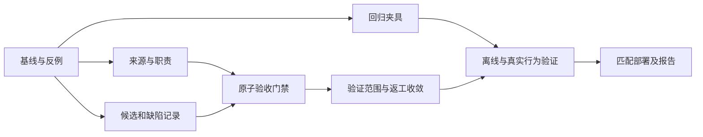

# DPswarm 验收与返工修复计划

日期：2026-09-12。状态：**原计划已获准实施；进度与实测结果见[实施记录](acceptance-repair-implementation.md)**。依据为会话 `6ccc299c`、最终 HTML 的坐标与真实渲染、实际安装版审计，以及本轮对当前源码的接口核对。

目标：让用户要求在返工过程中保持可追溯；已发现的相关缺陷持续影响验收；验收绑定实际被检查的候选版本。避免“局部改动完成 + PASS 报告”掩盖整个作品的已知错误，同时不把审美建议一律升级为阻塞项。

## 1. 推荐决策与范围

推荐采用 **提示分层 + 持久缺陷记录 + 候选快照 + 原子验收**。提示修正先做，完整修复须接上程序门禁。只增加一句“仔细检查”、多派一个 Reviewer、换模型或增加预算，都不足以解决这次已知错误被放行的问题。

本轮交付本计划；实施时优先修复原生 DPH fixed-team 路径，并验证串行、并行和分阶段的共用验收入口。保留用户选择的模型、协作模式、额度和权限。修复本身不要求自动拓扑、额外常驻角色、全仓库快照或重写 Python 编排器。

原动画作为回归证据保留。后续可在独立副本中修复膝盖分支并验证完整踏频，再决定如何交付；不能覆盖旧文件后失去故障样本，也不能把“修好一个 HTML”当成 DPswarm 机制已修好。

**版本边界：**事故运行的是安装版 0.9.7 加补丁；当前仓库 JS 为 0.11.0，另含本工作区已有的恢复修复。机制主文档部分版本叙述较旧，不能当当前实现清单。2026-09-11 冻结纪律允许真实任务暴露的缺陷修复；本计划按该范围推进，不借机全面扩建。Python 实验编排器的 mandatory/unknown 与候选绑定规则可以参考，但不视为原生 DPH 已有能力。2026-09-05 的测试证据合同仅先落在 SWE 实验路径，也不能直接充当本次修复证明。

## 2. 必须保留的七条规则

1. **需求来源不能升格。**真实用户正文由宿主事件提供；Lead 的计划、建议代码和解释永远带来源标签。原始消息身份正确，不代表 Lead 扩写必然正确。附件内容仍是任务资料，不能自动变成用户或系统指令。
2. **编辑范围不等于验收范围。**实现者只改指定位置；验证者检查整个任务中相关的要求与已知问题。发现范围外缺陷时先记录、报告，由 Lead 调整后续编辑范围，不授权验证者自行越界写文件。
3. **发现项不会因换轮或换人消失。**相同业务交付血缘沿用稳定 finding ID；新 generation、新 item、压缩、重启均不能清空旧问题。
4. **缺陷分类必须有依据。**“不准改这里”“背景元素”“只改了几行”本身不能证明问题不影响需求。颜色偏好等没有需求关联的建议可以不阻塞；有争议的相关发现须留下 Reviewer 的裁决和证据。
5. **验收针对被检查的版本。**工作者报告哈希和作品文件哈希分别保存；报告中的路径、测量值、文件哈希只是主张，需与运行时收集的证据关联。
6. **未验证与失败分开。**必要要求缺少可用验证证据时不报完整成功；能力缺失不等于作品已失败，也不能扩大为禁止所有工具。可继续进行的读取、修复、报告与清理不受阻断。
7. **算术门禁不替代语义判断。**程序能要求每个相关发现有裁决、每项必要要求有结论，不能自动证明模型的分类正确。协议回归与真实质量评估分别报告。

## 3. 最小数据合同

以下名称是拟议设计，实施时统一 schema 常量与校验器，不靠散落的字符串拼接维护。

### 3.1 TaskContract v2：把来源分开

```text
task_binding       宿主消息 ID、content hash、root/session 与 fork 边界
user_request       经绑定复验的原始 content；大内容用可读取的持久引用
lead_plan          Lead 的实现方案；旧 task/acceptance 作为派生内容保留
requirements[]     ID、描述、来源引用、必要/可选、验证方式及其依据
rework_instruction finding ID、问题现象、requested_change、edit_scope
```

由 `team-required` 从已有可信原生消息与 inbox/fork 接缝读取正文，dispatcher 内部传入 controller；不让模型通过工具参数设置具有权限效力的 `user_said_no_tests` 等标志。区分“用户明确约束”“宿主权限”“Lead 自检安排”“验证者自己的选择”。大正文不得静默截掉必要要求；用带哈希的完整引用和简短索引控制上下文体积。

需求列表可由 Lead 合理推导，无须用户逐项批准；Reviewer 要检查它是否忠实于原文。主控自行添加的 100/112 像素腿长、禁止 JavaScript 等实现选择，不能冒充用户硬要求。后续可信用户消息若改变任务，应建立新 requirement revision 并保留历史；对相关验收重新取证，不能原地改掉过去标准。

### 3.2 CandidateManifest v1：版本是实际字节

由运行时收集明确交付范围内的文件集合，保存不可变快照，记录规范相对路径、文件操作/删除标记、SHA256、大小及内容寻址引用；汇总为 manifest digest。绑定 root、业务交付血缘、generation、实现者提交包与 requirement revision。

首版覆盖有界本地文件集合，第一条端到端夹具使用该单 HTML；不扫描整个用户磁盘。路径必须在已授权工作区，核对 Windows 大小写、路径穿越、symlink/junction 与重复路径。正文经运行时读取，不能让模型复制文件内容到报告来充当快照。文件数、字节总量和 API 请求上限明确校验；超限报具体未封存部分，不静默遗漏必要文件。

Reviewer 读取、渲染和计算的对象是这个快照。在可变工作目录执行检查时，证据必须匹配对应内容哈希；前后哈希相等也不应被包装为防任意外部写入的 OS 锁。接受的是不可变快照，当前工作区若发生变化则显示“不再与已验收版本一致”，需要新候选复核。纯文本交付可用报告内容作为候选；文件型任务不能因报告写得完整而退化成纯文本验收。

### 3.3 Finding 与 ReviewRecord：保留反证及其处理过程

```text
Finding
  id / task_lineage / requirement_refs / affected_paths
  observation / evidence_refs / reported_by / first_candidate
  proposed_classification: defect | suggestion | unknown
  state: open | fix-claimed | verified-resolved | not-a-defect
  decision_history: actor、reason、证据、适用 candidate、revision

ReviewRecord
  schema / verdict: pass | needs-rework | blocked
  requirement_results[]: met | failed | unknown，附证据或推理依据
  finding_decisions[]: 每条既有相关发现的复验或分类裁决
  coverage / unavailable_checks / evidence_refs
```

身份、generation、候选 hash、submission package 和角色由运行时绑定，模型自报不能替换。Tester 的建议不是自动否决，但其发现须进入 Reviewer 的裁决清单；首版完整交付只登记已提交报告中的发现，预算中断且没有报告时按检查未完成处理，不假称所有潜在发现已被收集。未来如要实时登记中途发现，可另加工具，不作为首版依赖。

每个候选冻结本轮已派发的验证工作项清单。接受前，清单内工作项均须到达可结案状态，报告已登记或明确标记缺失；当前 Reviewer 的裁决引用该清单与对应报告/发现 revision。Tester 已完成但报告尚未登记时，不能先接受候选再把其发现视为“迟到事实”。没有报告的角色保留 incomplete；若其覆盖的必要项也没有其他有效证据，则不能完整通过。这个屏障只等待本轮已派发的验证，不自动增加新角色。

实现者只能声明 `fix-claimed`。配置独立 Reviewer 时，只有当前 Reviewer 的匹配版本证据能完成复核；沿用既有“谁提谁验”的血缘接续，但允许原提出者不可用时由已授权替代验证者接续，不能靠不可恢复的角色身份造成永久死锁。无独立 Reviewer 时，Lead 承担相同结构化检查，最终标明 Lead 核验。

`not-a-defect` 必须解释与原要求的关系，保留原始 observation；不能直接删除记录。某版本已关闭的问题在受影响文件改变后须复验；首版可以对每个新候选要求全量既有相关发现确认，后续再优化为按变化范围复用证据。遇到新发现与旧 ID 合并时保留别名与依据，不以一句新表述制造“新问题”来清掉历史。

首版不新增用户豁免入口。现有 `takeover + reason` 只能改变验证责任与验收依据，不能清除发现、跳过版本检查或冒充用户接受缺陷。Lead 必须提交自己的完整复核；确需缩减用户要求时使用可信用户新指令建立需求修订。

### 3.4 结构化结果传输与权威存储

首版优先复用工作者最终报告，在约定的唯一标记区提供严格 JSON，并保存完整原文。只接受唯一、完整、符合 schema 的结构化区；缺失、重复、截断、非法 enum 或正文结构化字段冲突不能被“猜成 pass”。普通叙述正文不做关键词式语义保证；后续模型评估要覆盖正文承认缺陷却漏填结构字段的情况。

不先新增 Reviewer 专用工具，避免新调用与权限面。运行时从可信终态会话补足身份，将 report hash、解析结果、候选引用一并提交 Python。若已有报告格式不合规，可在原有额度和工具权限内修正报告，不自动追加隐藏模型调用；没有资源时保留候选与具体错误，等待后续处理。API 重试必须幂等。

权威 TaskContract、Candidate、Finding、ReviewRecord 放入 **Python EventStore 状态机**；JS audit 是展示和诊断投影。不得采用“先在 JS audit 清问题，再到 Python accept”两套账。Python 的接受事务同时核对 requirement revision、当前候选、期望 ledger revision、执行身份、当前 Reviewer、报告包、所有必要项和发现项；失败不发布 accepted。

该事务还校验验证清单已封口、可用报告已全部入账，且最终 ReviewRecord 覆盖其最新 revision。审查结束后新报告或新发现改变清单 revision 时，旧结论不能直接接受，需要补充裁决。由同一事件事务完成这些检查，避免“检查无问题后，接受前又登记新问题”的窗口。

明确区分“Reviewer 报告已提交/被保留”与“候选作品已通过”。不能让审查工作项 accepted 自动表示它审查的作品正确。结构化拒绝只影响相应候选的接受；读取状态、提取产物、登记新问题、正常返工、取消和清理仍可执行。

## 4. 分阶段实施与完成条件

阶段是开发依赖，不代表增加用户操作步骤。核心修复为 P1–P4；P0 是准备，P5 是验证与交付。

| 阶段 | 工作与责任边界 | 主要源码/拟新增文件 | 完成条件 |
|---|---|---|---|
| P0 冻结基线 | 记录 Git 差异、源码/安装路径与能力；冻结原始坏样本和报告索引；核对现有测试基线 | `reports/2026-09-12/`；拟建专用测试 fixtures | 原 HTML 哈希可复算；已有未提交恢复补丁单列保留；明确哪些是原样本、哪些是合成反例 |
| P1 来源与职责 | 接入可信用户正文，拆分主控方案/编辑范围/验收范围；移除条件禁测语句被无条件传播的歧义；修复“Reviewer 权威”与“只负责建议”的提示矛盾 | JS `team-required.js`、`team-dispatch.js`、`fixed-team.js`、`role-guidance.js`；拟增 `task-contract.js` | 所有初次派发、返工、压缩/恢复路径都能追溯真实原文；禁止改远腿仍允许报告该处错误；主控建议不禁止验证者复算 |
| P2 候选与验收记录 | 实现有界文件快照、结构化结果、跨代 finding/requirement 状态、验证清单、幂等提交和重放 | Python `types.py`、`control.py`、`events.py`、`state.py`、`invariants.py`、`server.py`；拟增 `acceptance.py` 与快照模块；JS `delegation.js`，拟增 `acceptance-contract.js` | 所有记录绑定真实执行与候选；新代不丢发现；快照篡改/缺失/错误版本拒收；崩溃重放恢复同一结论 |
| P3 共用接受门禁 | 新合同候选在 Python 同事务完成检查；JS 只做前置反馈与展示；补全串行/并行/分阶段、Lead 核验和 takeover | JS `fixed-team.js`、`sidecar.js`、`index.js`、`audit.js`、`client.js`；Python `session_server.py`、`plugin_audit.py`、`server.py`、`control.py` | 验证清单未收齐、未裁决相关发现、必要项 unknown、旧代 pass、错 candidate 或伪用户豁免均不能完整通过；已有 status/report/cleanup 可用 |
| P4 验证与返工收敛 | 区分静态推理/执行检查/渲染/视觉观察；返工围绕 finding 和反例；携带未解决清单与变化摘要 | JS `role-guidance.js`、`fixed-team.js`、`handoff.js`、`worker-diagnostics.js`；验收状态展示 | 无视觉能力不会报视觉通过；相同缺陷反复出现触发换方法；可选建议不触发无关返工；遵守用户额度 |
| P5 分层验证与匹配部署 | 确定性回归→原生宿主离线链路→有界真实模型试点→匹配安装验证 | 下节测试入口；`VALIDATION.md`、修复报告、机制文档 | 各层证据分别发布；新运行确认合同能力、源码哈希与实际宿主；不存在测试后遗留隐藏宿主/监听进程 |

开发并行：P1 与 P2 可在先冻结接口后并行，测试夹具设计也可同时进行；P3 依赖 P1/P2，P4 提示部分可提前、状态部分依赖 P2/P3。涉及 `fixed-team.js` 的实际写入安排一名集成负责人；其他工作者提交限定模块，避免同时重排这个大文件。



### P4 的具体策略

- Lead 默认给出问题现象、需求关联和能区分错误实现的反例；具体补丁可作为建议，但不能用“已验证、禁止重算”阻止验证者挑战。
- Reviewer 每轮看完整需求、当前候选、未解决发现和本轮差异。历史长报告保留 hash/ref，提示优先放简短事实清单；不能在压缩中只留下最新 PASS。
- 针对同一 finding，连续两次没有新修复证据是建议的策略复盘触发点；下一轮要说明新方法或新信息，例如由手算坐标改为独立分支检查/允许的多相位渲染。这是换策略信号，不是自动判无解，也不是私加总轮次上限。
- 用户的 manual/auto/unlimited 策略仍按冻结配置执行。已失败的方法不能无限原样重试；确实缺少权限、信息或资源时记录具体阻塞并交回结果。预算不足不能自动接受错误作品，也不能挪用其他角色额度。
- 工具不可用、执行被拒绝、结果未观察分别记录。浏览器检查适合动画，但不是所有任务的强制动作；必要观感无法确认时保留 unknown，若能通过允许的其他证据解决问题则采用等价路径。模型切换仍须遵从用户已选路由，不静默换成带视觉模型。

## 5. 验证矩阵与放行标准

### 5.1 确定性回归：程序究竟能保证什么

复用现有入口：JS `team-required.test.mjs`、`fixed-team.test.mjs`、`fixed-team-rework.test.mjs`、`fixed-team-parallel.test.mjs`、`worker-diagnostics.test.mjs`、`worker-rework-budget.test.mjs`、`sidecar-runtime-contract.test.mjs`；Python `test_plugin_audit.py`、`test_session_server_20260907.py` 和 `test_finalize_protocol.py` 中的模式作为参考，另加直接经过 DPH bridge 的合同测试，不能只测实验 Orchestrator。

| 反例 | 必须得到的结果 | 正向对照 |
|---|---|---|
| 用户未禁浏览器，Lead/旧报告声称用户禁止 | 保留真实来源，不生成用户权限禁令 | 用户确实禁止时遵守；宿主真实拒绝单独报告 |
| 本轮禁止编辑远腿，已有远腿方向缺陷 | 问题保留并进入整体验收；需要时扩大下一轮实现任务 | 无需求关联的颜色偏好可被说明后判可选 |
| 两腿长度正确、脚贴踏板，但 IK 分支相反 | 坏样本由独立反例检查识别，相关发现不能消失 | 一致分支且动作成立的样本通过；不把一种固定坐标当所有动画唯一正确答案 |
| 新候选只修近腿，旧报告说远腿已好 | 要求当前版本复核既有问题 | 真正修复并有证据时关闭 finding |
| 结构化 PASS 附 open/fix-claimed 相关发现 | 拒绝候选接受，返回具体未决项 | 有依据的 not-a-defect 或 verified-resolved 可通过 |
| 必要项 unknown / 可选项 unknown | 前者不能报完整成功，后者可保留限制 | 无关探索失败不否决已满足的交付 |
| 审查 A，接受 B；工作区检查后变动 | 错版本拒收；快照 accepted 与当前工作区状态区分 | 同快照、同 revision 的幂等重试成功 |
| 错角色、旧 generation、旧 epoch、报告/快照损坏 | 不改变验收状态；可读诊断与恢复 | 合法重启后重放得到同一结论 |
| Reviewer 尚未登记/JSON 缺失或重复 | 仅阻断对应接受步骤，不锁住全会话 | 合法补交可恢复；同一次 API 幂等重试不重复记账，重新生成报告仍消耗原有额度并正常计量 |
| Tester 已结束但报告晚登记，或最终审查后出现新 finding | 验证清单/revision 不匹配，接受事务拒绝；补齐后重新裁决 | 本轮报告全部登记且裁决覆盖当前 revision 可接受 |
| Lead takeover、无独立 Reviewer | 仍检查版本、覆盖与 finding；依据标成 Lead | 正常 Lead 核验可通过，不强制多派一个角色 |
| 返工两次无进展，用户明确 unlimited | 发出策略复盘，不能改成隐藏硬额度或自动接受 | 有新证据时按既有授权继续 |
| 老会话、旧插件/新服务、新插件/旧服务、协作关闭 | 按冻结合同/能力明确分流；诊断与清理可用 | 新合同的三个协作模式均通过原生集成 |

补足事务与恢复用例：提交快照成功但事件未提交、报告提交后进程崩溃、重复请求、并发审查导致 revision 冲突、接受后迟到旧 finding，以及用户取消。迟到事实保留审计；不能悄悄改写历史 accepted，必要时标记需要重新审查并形成新候选/决定。

离线完成标准：相关新增回归全部通过；源码全量回归对照 P0 无新增失败，既有失败若存在须单列、解释且不能掩盖本次路径。关键原生链路使用本地确定性模型和真实 sidecar，核验提示→快照→报告→finding→接受/拒绝→清理的整个过程。测试前后用户原 HTML 哈希一致。

### 5.2 模型行为验证：判得对不对

上述回归只能证明“结构化报告承认问题后，程序按规则处理”。若模型一开始就把真实错误归为建议，或正文发现问题但 JSON 漏报，仍可能误判，需要独立评估。

建议先做小规模、只审查候选的配对试点：两组好/坏对照共四题，旧/新合同各审一次，共八个审查任务；包括该已知分支缺陷、明确的非阻塞偏好，以及未参与提示编写的新例。先固定模型/努力级别、输入证据、顺序、允许工具和每次预算，记录 cached/uncached/输出/未知用量、耗时、误通过与误阻塞。不更换模型来混入第二个变量，也不先启动八轮完整团队实现。

进入下一步的最低条件：本案已知错误候选被拒，正确对照与纯偏好不被无故阻断，能力缺失能被如实记录；任何反例失败都回到对应分类/提示/合同修复。小样本仅作 canary，不宣称总体成功率提高。之后再做一条有明确上限的完整团队新任务，观察返工是否收敛。实际模型试点属于后续实施验证，开始前依据当时授权和额度冻结执行条件；本次规划没有调用供应商模型。

## 6. 迁移、部署与回退

- 新任务冻结 TaskContract v2 / acceptance contract v1；具体产品包版本在实施时确定。利用现有 `dpswarm-runtime-capabilities-v1` 握手增加验收能力字段，按能力判断兼容，不能只比较 npm 版本。旧全局 revision 的等值判断需做兼容测试，不随意全局加一使所有历史路径失配。
- 老的已结束任务保留原结果并标记 legacy，不能事后伪造结构化发现与关闭证据。老的在途任务及其返工血缘继续冻结的 legacy 规则，显示“未按新合同复核”，不能因 child 是新建的就混用新合同。
- 旧任务若要升级：先确认工作者停止与清理，恢复可信用户正文，对旧报告逐份记录 hash/ref 并审查成基线发现清单，再建立当前快照和一次新复核。缺原文/旧证据时说明升级缺项，不用一个 `history_reviewed=true` 代替真实基线。
- 新严格路径缺必要能力时，在新派发/验收前给可操作的兼容错误；status、report、读取、取消和清理保留。不要重现“缺任务信息把全部工具锁死”的故障。
- 串行、并行与 staged 的最终接受都走同一服务，但首版不改变 staged 的阶段内调度语义：下游可以消费已封存且带版本的 ready 快照，明确其尚未最终验收；它不等于 child completed 或 accepted。最终 Reviewer 核对整合候选与实际消费的上游版本。既有要求 accepted 的业务依赖继续守原规则；不把所有 ready 依赖强制改成 accepted，避免阶段内互相等待。逐阶段独立验收及其额外调用成本另列后续方案。既有 mailbox 不承担修改合同或伪造用户豁免的权限。
- 部署核对 JS、Python、原生宿主三方实际加载路径和能力。当前安装 0.9.7 与源码 0.11.0 有差异，先确定匹配发布组合，避免只复制单个 JS 文件造成协议混装。
- 回退使用匹配旧 JS/Python，并保留新状态目录与事件原文；旧读取器不可重放自己不认识的新事件。必要时新建隔离状态目录，不删历史。先在隔离宿主验证，再按既有启动方式切换；不留下额外隐藏 DPH，也不抢占用户手动启动的端口。
- 完成后更新 `DPswarm-机制架构.md`、插件 `VALIDATION.md` 与修复报告，分列设计、离线结果、真实试点和实际安装版本。本计划不能提前写成已实现机制。

## 7. 暂不纳入首版

不建立新的模型评分/动态路由系统；不默认增加 Reviewer 人数；不把动画专用 IK 规则写成所有任务的全局验收标准；不自动替用户放宽要求；不全面回移实验编排器 O1–O6；不加入全仓库不可变构建环境。若首版事实表明这些能力是必要依赖，再说明证据和增量范围。

首次保存文件被预算收尾阻断是另一项已知问题，应单列跟进：在保留额度约束下核对可用交付与最终报告的容量，不把两次允许请求当成两次预算已预留。它不是最终反向腿被放行的直接原因，因此不与本计划核心验收事务混成一个大改动。

## 8. 本案修复完成时应看到什么

对于“只修改近腿，但远腿仍反向”的候选：实现者遵守编辑范围；测试者的发现被保留；Reviewer 判断它影响骑行动作，给出需求关联和证据；控制面拒绝完整通过并返回该 finding；Lead 派发必要修复；新候选在独立验证分支、连接与多相位动作后关闭问题。最终交付能说明检查了哪些内容、仍有哪些未知，且每一项都指向被接受的版本。

如果 Reviewer 判定某项只是样式偏好，它必须说明理由并保留裁决，而不是机械地多返工。这两种对照同时成立，才是本计划追求的结果。

参考：[根因分析](session-6ccc299c-root-cause.md)、[原审查及更正](session-6ccc299c-audit.md)。本地接口研究保存在 `.tmp/session-audit-6ccc299c/analysis/plan-plugin-contract.md`、`plan-acceptance-contract.md`、`plan-validation-convergence.md`；规划执行图为 `.flowmap/acceptance-repair-plan-20260912.json`。原生完整日志留在本地，不作为公开代码夹具直接提交。
