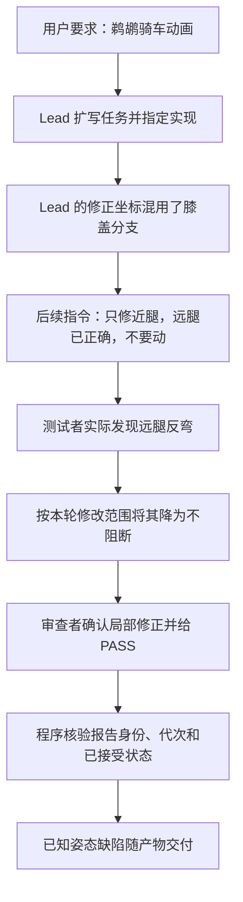

# 6ccc299c 深度根因分析：错误如何被发现后仍通过验收

范围：用户给出的原生会话、已安装 0.9.7 修复版代码、对应控制面只读快照，以及最终 HTML 的真实多相位渲染。本文区分直接证据、因果解释和后续设计建议；没有实施新策略或启动新的供应商任务。先前关于姿态缺陷的漏审已经在原审查报告中更正。

**核心判断：这次失败包含两个独立环节——生成了错误姿态，以及允许这个已知错误以 PASS 交付。第二个环节是更值得修复的系统问题。** 首个环节来自两条腿采用相反 IK 分支；第二个环节来自编辑范围被用来缩小验收范围、已知缺陷被降级、以及程序缺少逐项缺陷裁决的约束。没有证据表明本次是后台协议、端口、线程竞争或文件版本被偷换导致。

**一、直接技术原因：验收指标没有区分两个合法的数学解。**

髋点和脚点固定、两段腿长固定，膝盖通常有两个镜像位置。两种位置都满足相同长度与端点连接。最终远腿位于髋→脚连线一侧，近腿位于另一侧，全周期有向叉积符号相反。同一脚位置 (390,338) 下，两个膝点为 (287.8,292.3) 和 (446.2,241.1)，相距约 166.47 SVG 单位。这个差异和此前不足 0.7 单位的插值误差是不同问题。

Root seq93 已给出不同侧的坐标；seq161 又声称远腿与近腿同向，却继续给出反侧解；seq196 最后修好近腿的长度并要求保留远腿。结果是局部数字越来越准确，整体姿态仍错误。归咎于“SMIL 不行”或“再算多些小数就能好”没有依据；使用一致分支即可避免该缺陷。

**二、任务来源失真：绑定了用户身份，但子代理看到的 Original task 是 Lead 的扩写。**

程序没有丢弃持久任务身份。原始用户消息 id/hash 被保留并在返工时校验，防止串任务。但实际安装 `fixed-team.js:491–501` 冻结的是 `args.task / args.acceptance`，也就是 Lead 在 dpswarm_run 中写的约 2369 字符任务；返工 `924/998/1062` 附上的 Original task 仍取 `frozen.task`。最终 Tester 和 Reviewer 的实际任务正文与该扩写逐字相同，没有直接包含用户那句原话。

Lead 选择 SVG/CSS 动画、要求固定某些形式，作为实现方案并非天然错误；问题是它们没有与用户硬约束清晰区分，后续可能被当成不可挑战的原始要求。原始任务身份正确，并不能证明派发正文没有增加、缩小或误解需求。

**三、最关键的权限混淆：本轮能改哪里，被误当成整个作品只需检查哪里。**

“这次不要修改远腿”可以合理限制实现者的写入范围；它不能让审查者忽略远腿已经违反的整体目标。但后续报告明确按后一种方式解释了它。

最终 Tester 99a4e9ba 的 seq33/JSONL L35 正式报告写出：远腿采用 mirrored IK branch，膝盖相对近腿朝后弯，却同时称其为 background element、non-blocking、explicitly out of scope。第 5 轮 Tester 8eb4e10d 的 seq43/L45 已更早说明主控的“同向”断言不成立。某轮审查也曾发现另一条腿仍大幅伸缩，却把未在本次指定修改的部位列为残余而通过本轮。

代码仍有“对原始任务独立检查”“不要信任报告”的要求，因此不能说程序强制禁止报告旧缺陷。更准确的因果解释是：近期、具体、权威口吻的返工指令，压过了宽泛的整体审查要求；编辑权限、检查重点和验收目标在同一自然语言反馈里混在了一起。

这种混淆还有另一条可见路径：root seq58 的“写完后只做两三次廉价 grep”本是对实现者的节奏限制，返工时全文传给验证者；R1 Tester ffbc85 的最终 seq38/L40 却将它重述为“任务允许的检查仅限 grep/结构检查”。这一步把实现者自检安排提升成了验证权限。

**四、反过度打磨规则缺少边界，已知缺陷被包装成偏好。**

role-guidance 要求“不要把偏好当阻断缺陷”“最小必要修正”“不要扩大任务”。这些规则本来用于控制成本，应该保留。此次却没有配套区分：颜色、装饰之类的可选调整，与角色关节方向互相矛盾这类动作正确性问题。

测试者不是没有信息，而是将反向腿合理化为鸟类姿态或背景装饰，再用“范围外”支持不阻断；其自身还把另一条腿按人类骑行姿态判断。当前证据支持错误分类，不支持真实解剖依据。主控原始“远腿正确”的断言和后续审查结论互相强化，问题因此留到了最后。

**五、程序验收保障了证据归属，没有保障每个已知缺陷已得到裁决。**

实际门禁强于简单读取 PASS：已安装 `fixed-team.js:794–826` 检查当前候选代次、对应独立 Reviewer、已接受状态、submission package，以及对应 worker/run 的诊断报告；若报告明确含独立一行 `VERDICT: needs-rework` 或 `VERDICT: blocked`，会拒绝接受实现者。Python 还校验执行身份和报告包完整性。最终 root seq219 先接受实现者被 REVIEWER_PENDING 拒绝，接受当前 Reviewer 后 seq228/229 才成功。这里确实发挥了作用。

本次最终报告确有 pass，且没有靠旧代次 takeover 绕过。缺口是“反向腿”没有一个必须处理的、绑定原始验收目标的独立 finding 状态；它只存在于报告自然语言中。程序无法知道该缺陷为何被降级、谁裁决、是否修复或用户是否接受。只要 Reviewer 的总体结论通过，报告中已知的语义矛盾就可能继续存在。

代码还存在兼容旧报告时不强制正向 `VERDICT: pass` 的边界，但本案实际已有 pass，所以这不是此次缺陷通过的直接原因。报告哈希与身份复验也不能代替对动画语义的判断。

还需准确区分报告与文件：实际 `delegation.js:269–274` 提交的是工作者最终报告 `out.text`，`control.py:662–671` 对该报告保存 SHA256/size；`worker-diagnostics.js:96–100` 对候选文件仍标注 current_file_state=unknown，不重新打开 HTML。因此它证明报告正文未被替换，不能自动证明报告内的几何结论或 HTML 版本。本案另行核对的最终 HTML 与报告中的 MD5 一致，没有发现交付文件被换版；文件快照绑定是额外的合同边界，不是已证实的本次姿态错误来源。

**六、缺少视觉核验是重要的最后一道防线，但不是唯一根因。**

静态坐标已经足够证明两腿分支相反，且测试者实际写出了这个问题。因此“模型看不到图”无法独自解释为什么一个已知缺陷被接受。实际渲染会使问题更明显，但如果仍以“范围外、可忽略”裁决，仅增加截图也可能无效。

视觉路径确实不完整：某些子角色尝试 Chrome 遇到权限拒绝；最终 Lead 生成了 PNG，但所选模型不支持 read_image，改用颜色抽样。不能把“有一张截图、像素统计成功”写成“已经看过并确认整个动画”。同样，档案中没有用户禁止浏览器的直接要求；最初预算理由里的 static inspection only 并未作为任务正文传给 worker。渲染受限既有真实权限问题，也有后续对范围的误读，不应一概归为用户禁令或 Lead 明令禁渲染。

**七、为什么多代理和更多 token 没有自动纠正它。**

这些角色是不同执行会话，但共享同一种模型、Lead 的处方和继承报告。独立身份提供了可追踪性，并不自动消除共同的错误前提。一次错误被先称为“已验证”，再在验证结果中被称为“范围外”，后续角色会重复围绕同一个局部目标检查。

本案不能证明“同模型必然失败”或“换模型一定修好”：同模型的第 4 轮实现者曾主动拒绝 Lead 错误的坐标，说明纠错能力存在；最初验证者也正确发现了 84 单位的踏板脱离。主要问题是有效反证没有稳定转化为阻断/返工条件。

6 次返工，每次又串行运行实现、测试、审查，是错误处方和范围漂移的成本放大器。首次无产物预算中断增加了恢复成本；它并不是最终反向腿被接受的必要原因。总计约 899.5 万 token、190 次有 usage 的响应，说明增加计算量本身没有覆盖缺失的正确性条件，不能据此推导模型能力排行或并行模式本身有缺陷。

**后续改进应围绕下列可检验边界，以下均为建议而非已实现。**

| 改进 | 本案应出现的行为 | 避免的新问题 |
| --- | --- | --- |
| 区分用户原话、推导验收、Lead 方案、修复指令 | 禁止 JS / 少做 grep 等来源可见；Lead 方案不能被称为用户禁令 | 不要求用户逐条批准日常实现选择 |
| 分开编辑范围与验收范围 | 实现者只改近腿，Reviewer 仍能报告并阻断整体反向腿 | 不授予 Reviewer 越界改代码的权限 |
| 保留结构化缺陷记录 | 反向腿不会因新一次反馈“不要动”而消失；需修复证据、误报裁决或真实用户接受 | 不把每个审美建议都升级成必须返工 |
| 对冲突意见做显式裁决 | 已报告反向腿而总体 PASS 时，必须解释它与原目标的关系并记录决定 | 不靠关键词匹配替代全部语义判断 |
| 区分验证能力与证据种类 | 数学采样、渲染截图、实际视觉观察各有范围；已知缺陷仍需处理 | 用户确实限制检查时如实报告未知，不绕过权限 |
| 返工检查是否在收敛 | 同一缺陷反复变形或被重开时，更换解决/验证方法；无产物先恢复产物 | 不以固定次数自动接受错误结果，也不放松预算 |

最低限度的回归场景应覆盖：长度正确但分支相反的候选；Lead 禁止编辑某处而该处仍有功能错误；Reviewer PASS 同时附带未处理的相关缺陷；没有视觉能力却宣称已视觉确认。程序侧应检查记录与裁决的规则，模型侧需用受控案例实测它能否正确识别和分类，不能用协议单元测试代替后者。

最终需要增强的是对反证的处理：发现问题后，系统应持续保留它与用户目标的关系，直到被明确解决。已有日志、代次和门禁构成了基础，但本次还没有把“报告问题”可靠地接到“是否可以交付”。我上一轮审查也沿用了数值与 cosmetic 分类，未实际查看姿态，属于同一类漏检，已纠正。

证据：`analysis/deep-scope-review.md`、`analysis/deep-acceptance-review.md`、`analysis/deep-causal-challenge.md`（均在 `.tmp/session-audit-6ccc299c/` 下），原始会话 seq93/161/196、最终 Tester 99a4e9ba seq33、当前 Reviewer db64a4fe seq68，以及 `visual-knee-review/render-evidence.json`。已安装代码行号按本次读取版本记录；源码 0.11.0 与已安装 0.9.7 未混为同一版本。
