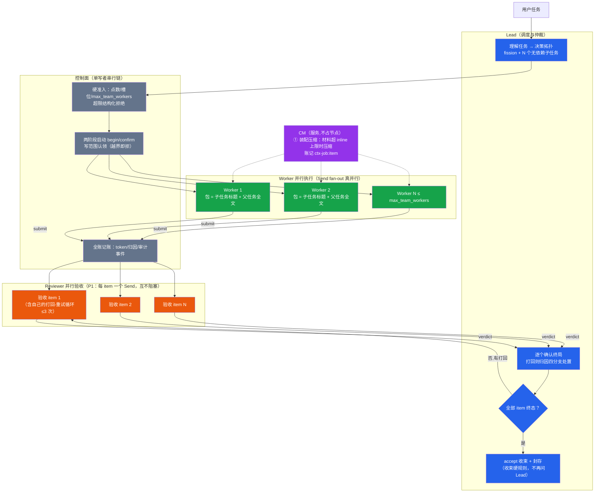
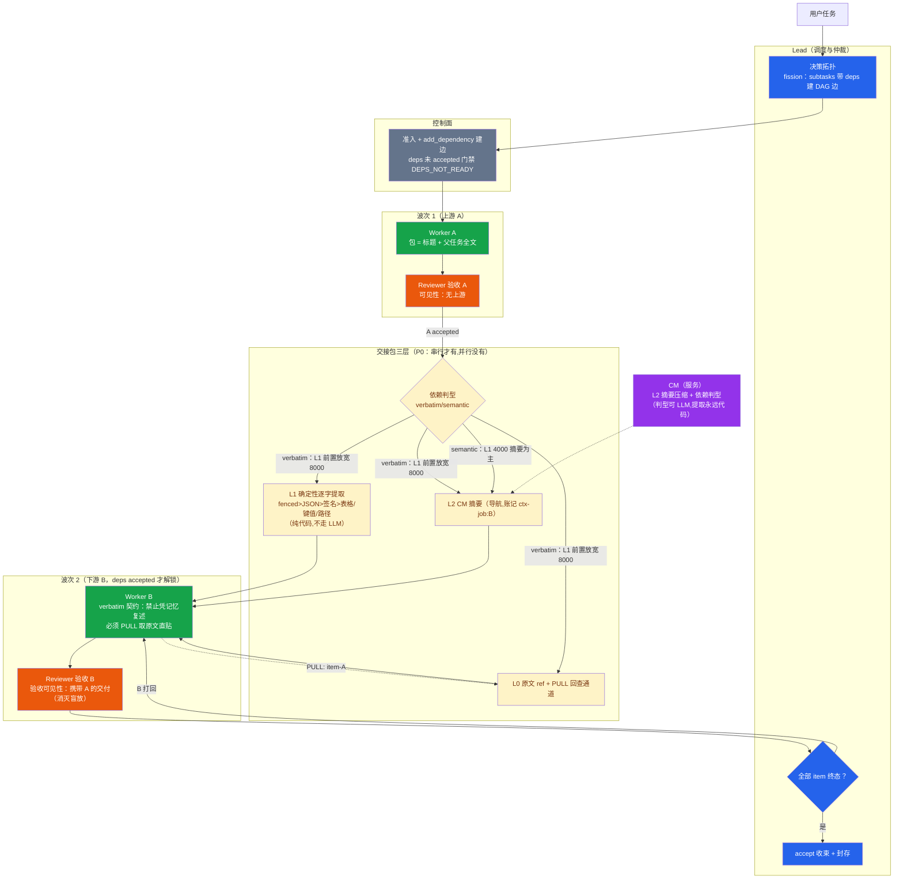

# DPswarm 机制流程图：并行与串行协作（2026-09-10，r5 后状态）

实体配色：Lead（蓝）/ Worker（绿）/ Reviewer（橙）/ CM（紫）/ 控制面（灰）。
口径：Python 编排器（OrchestratorLG）为准；DSH 插件差异在文末标注。

## 图一：并行（fission 无 deps，N 个 worker 同时干）

## 图二：串行（fission 带 deps，A→B 依赖链）

## 共同点（串行 = 并行共用的机制底盘）

| 机制 | 说明 |
|---|---|
| 硬准入 | 点数/槽位/max_team_workers，超限结构化拒绝（不静默截断） |
| 两阶段启动 | begin_node + confirm_node，节点不过 PROVISIONING 不算活 |
| 全账记账 | 每次 LLM 调用记 token 分账；CM 成本记触发方 ctx-job |
| 截断阶梯 | stop_reason=max-tokens → max_tokens 翻倍重试（worker/Lead 决策/验收三面，不耗 attempt 预算） |
| 归因四分支 | capability/context/description/contradiction；同构目录下 capability 改道修述（attribution_remapped） |
| 收束硬规则 | 全树终态 → 不再问 Lead，直接 accept 收尾封存 |
| 验收制 | Lead 终裁；worker 交付超 inline 走引用投递 |

## 区别（串行独有 vs 并行独有）

| 维度 | 并行（无 deps） | 串行（deps 链） |
|---|---|---|
| 执行结构 | 单波 Send fan-out，N worker 同时 | 多波次，deps accepted 才解锁下游 |
| 交接包 | 无（worker 之间不传东西） | 三层（L2 摘要+L1 逐字+L0 回查） |
| 依赖判型 | 不涉及 | verbatim/semantic（handoff_profile 审计） |
| PULL 回查 | 只查 MemoryService | 可查上游交付原文（source=upstream） |
| 验收可见性 | 验收只看本 item | 验收必须携带上游交付（防盲放） |
| 验收并行度 | N 个 review 同时（r1 实测 -40% 墙钟） | 每波内并行，波间受 deps 串行约束 |

## DSH 插件（DPH v0.10.0）差异标注

- Reviewer 是**可选独立角色**（单实例，verdict 门控 Lead 验收），不是 Python 侧的"Lead 模型并行验收节点"
- 返工走**血缘**：打回原实现者（链式延续），原测试者/复核者自动复验——Python 侧是重试同节点
- L0 回查通道 = **产物读门**（ARTIFACT_NOT_READY 对未 ready 产物拒绝），不是 PULL 协议
- 无 CM 服务：判型恒 rule（关键词），摘要恒截断式；max_tokens 阶梯不适用（宿主管控）
</content>
</invoke>
