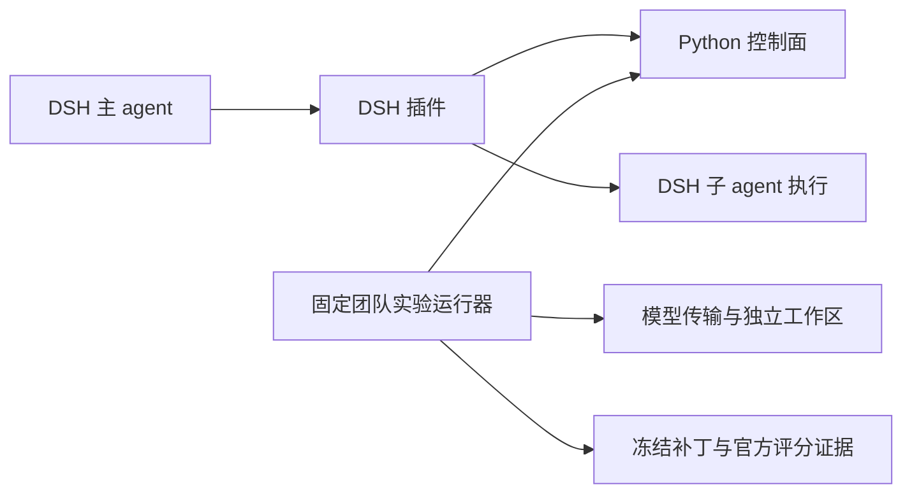

# DPswarm 项目现状分析

核查日期：2026-09-05。范围：当前工作区文件、代码、离线测试及已有实验原始证据。

本次由主代理与三个并行审查分支完成：Python 控制面、DSH 集成、SWE 实验证据分别核查；主代理核查架构、版本状态、早期实验口径并汇总。未修改业务源码，未启动新模型实验、远程任务或官方评分器。本文是现状分析，不是修复完成声明或后续执行授权。

## 1. 总体判断

**项目已达到“有真实模型实验、有可运行控制面、有可复核证据的研究型原型”阶段。产品宿主的完整执行闭环和异构团队的可泛化收益，仍需分别验证。**

目前最有价值的资产有三个：

1. 可独立运行的 Python 控制面：准入、状态机、事务事件、fence、证据提交、验收和资源释放已经有实际代码。
2. 能调用不同模型的固定团队实验系统：包含独立 Worker 工作区、Lead 采纳、上下文管理、调用计量、冻结补丁及官方评分证据。
3. 越来越严格的实验分析：最新整合报告主动区分运行完整性、协作完整性、最终正确性、费用估算和因果结论。

当前限制也有三个：

1. 持久化恢复和证据归属仍有可复现漏洞，现有测试通过不等于全部一致性保证成立。
2. 实验运行器的能力尚未全部接入 DSH 日常插件：真实身份绑定、失败回收、实际用量、配置与目录一致性未闭合。
3. 样本集中在少数反复分析过的题，处理条件同时变化，尚不能建立稳定的模型角色排序或同成本收益结论。

## 2. 项目构成与实现边界

| 部分 | 当前职责和状态 | 边界 |
|---|---|---|
| `dpswarm-plugin` | Python 控制面、Provider、编排器、上下文、画像、面板、协作运行时 | 有实际运行和测试；仍需修复下文恢复与验收漏洞 |
| `dpswarm-dsh-plugin` | DSH 工具和面板客户端，调用 sidecar 与公开 subagent API | 固定本机配置可受控验证；不是完整通用分发与恢复方案 |
| `modelbench/swe_fixed_team_20260903` | 固定 Solo/Team、异构 Worker、CM、实验冻结、计量及审计 | 实验条件强制建队，不能证明模型自主决定组队或完整动态拓扑 |
| `prototype*` | 四套早期逻辑原型 | 适合追溯设计与比较实现，当前主实现应以 `dpswarm-plugin` 为准 |
| `experiment-01-teambench`、`experiment-02-widesearch` | 早期机制与调研实验 | 部分结论受标准答案反馈、条件选样影响，不能直接作独立性能证据 |
| `deepseek-harness-master` | 本地上游源码快照 | DSH 自有能力与 DPswarm 新增能力须分别归属 |
| 机制文档、架构文档 | 设计共识、旧架构路径和未确认问题 | 不能直接作为“代码已实现”的证据 |

两个使用路径共用部分控制能力，但集成程度不同：

### 已实现的机制

- 事件事务 envelope、fsync、连续序号验证、控制面跨进程单写者锁。
- WorkItem / Node / Team 生命周期、依赖解锁、槽位和点数准入、Spec revision、seal 和 deadline API。
- 提交正文内容寻址保存，常规 review 路径拒绝替换已绑定的证据；epoch/session 校验。
- 上下文包、required/optional 材料、记忆晋升和作用域、rollover 控制 API。
- AA/目录/容量事实注入，画像记录及失败归因。
- DSH 按子任务指定 provider/model/effort；fission 使用 `Promise.allSettled` 并发，等待真实子任务终态和 dispose 后才 submit。
- 实验侧固定两名 Worker、独立工作区、交付/采纳、CM 计量、token/工作调用/墙钟准入和最终补丁冻结。

### 仍属于边界或后续能力

- **生产画像不回流路由。** [routing.py](K:/秋招/项目/DPswarm/dpswarm-plugin/dpswarm/routing.py:8) 明确 V1 只攒不用；[profile.py](K:/秋招/项目/DPswarm/dpswarm-plugin/dpswarm/profile.py:142) 当前计算计数和接受率，不能把它描述为已经形成在线自学习选模系统。
- **没有实时美元准入。** 费用是历史价格场景的离线估算；token 预约不等于服务端保证绝不超出的美元上限。[主计划](K:/秋招/项目/DPswarm/modelbench/swe_fixed_team_20260903/validation/NEXT_EXPERIMENT_PLAN_20260905.md:46)
- **真实长窗口监控尚未贯通宿主。** rollover API 存在，70%/85% 阈值的真实 session 观测仍待接入。[插件说明](K:/秋招/项目/DPswarm/dpswarm-plugin/README.md:135)
- **DSH split 为先协助者、后主执行者的串行过程。** 文件写范围靠提示，没有独立工作区/工具过滤形成强隔离；DAG pending 后继还需 Lead 再次调用 delegate。[桥接实现](K:/秋招/项目/DPswarm/dpswarm-dsh-plugin/lib/index.js:264)
- 独立 reviewer 语义、人工 override matrix、root 最终验收权等仍列在机制文档留白；代码中的占位实现不能替代设计确认。[机制文档](K:/秋招/项目/DPswarm/DPswarm-机制架构.md:368)

## 3. 本次测试和审计

| 核查 | 本次实际结果 | 能证明的范围 |
|---|---:|---|
| Python 控制面现有测试 | 363 passed，约 21.86 秒 | 当前测试覆盖的状态机、安全、恢复与机制场景 |
| SWE fixed-team 六个测试文件 | 72 passed，约 25.34 秒 | 假模型、假容器下的实验协议和计量逻辑 |
| DSH 插件现有测试 | 23 passed，0 skipped | 模拟 fetch/subagent 的生命周期与清理顺序 |
| DSH JS 语法及打包检查 | 三个运行文件语法检查通过；npm dry-run 成功 | 源文件可解析、包内容可收集；未发布/安装 |
| v15 原始证据审计 | frozen snapshot-only PASS，0 error / 0 warning | 冻结版本证据自洽 |
| v15b、v16 原始证据审计 | 当前源码/输入模式 PASS，0 error / 0 warning | 所检查的计量、工件和规则自洽 |

现有测试合计 458 次通过，各套覆盖有重叠，不是 458 个独立端到端真实场景。

SWE 测试第一次执行因指定临时目录的父目录尚未创建而出现 65 个 setup error；创建专用目录后完整重跑 72 项通过。前次结果属于测试环境初始化失败，未解释为代码断言失败。有效记录：[swe-verified-junit.xml](K:/秋招/项目/DPswarm/test-artifacts/current-state-audit-20260905/swe-verified-junit.xml)。

v15 以当前源码审计时有三项历史指纹漂移：`cli.py`、`test_runner_rev11.py`、`gate_revision11.json`；改用当时冻结快照后通过。这说明后续版本发生过变化，不说明原实验损坏。

审计 PASS、Workers completed、Lead adopted、官方 resolved 是不同事实，必须并列呈现。

## 4. 当前最重要的问题

### 4.1 P1：崩溃残尾恢复后继续写入，可能丢失已确认事件

**已复现。** 在有效 JSONL 后追加无换行的残缺事务，重新打开 EventStore 会忽略残尾；再 append 返回成功，内存显示 seq=1；再次重开却只剩 seq=0。

原因是 [_load](K:/秋招/项目/DPswarm/dpswarm-plugin/dpswarm/events.py:255) 只在内存解析时忽略残尾，没有截断或隔离磁盘残留；[append](K:/秋招/项目/DPswarm/dpswarm-plugin/dpswarm/events.py:233) 仍从文件尾追加，新记录与旧残片拼成坏行。再有后续事务时还可能演变成中段损坏而拒绝启动。

影响：事件是状态唯一真源，该路径会破坏“已成功返回的操作重启后可恢复”的保证。应在持锁情况下明确恢复到最后完整字节边界，或拒绝继续写入，并覆盖“恢复→新事务→再次重启”测试。

### 4.2 P1：空提交能借其他任务的交付证据通过验收

**已复现。** 创建两个合法委派 A/B；A 提交正文并生成包；B 提交空字符串后没有 `submission_package_id`；对 B 执行 accept 并提供 A 的 package，最终返回 accepted。

[control.submit](K:/秋招/项目/DPswarm/dpswarm-plugin/dpswarm/control.py:636) 仅在 output 非空时绑定正文包；[server.review](K:/秋招/项目/DPswarm/dpswarm-plugin/dpswarm/server.py:570) 允许调用方给 package，并在 B 未绑定包时跳过相等检查；[accepted invariant](K:/秋招/项目/DPswarm/dpswarm-plugin/dpswarm/invariants.py:426) 只确认 package 存在。

影响：B 没有自己的交付证据仍可 accepted、释放资源并解锁依赖。共享上下文材料可以被多个任务读取，但它不能自动成为另一个任务的提交交付。应验证 submission/item/attempt 与证据包归属，并在无绑定提交时拒绝 accept。

### 4.3 P1：实验宿主工具合同与故障传播仍不一致

**原始轨迹与当前代码均确认。** [scout](K:/秋招/项目/DPswarm/modelbench/swe_fixed_team_20260903/runner.py:593) 声明 Lead 全部工具，执行时只处理 bash/finish。v16 四个 ON run 各有两次 collect 被拒，共 8 次 `SCOUT_TOOL_UNAVAILABLE`。这是已声明能力未兑现，会污染装配 ON 的效果比较。

另一个 v16 Seaborn Worker 出现 `budget.json.tmp -> budget.json` 的 Windows PermissionError；[异常路径](K:/秋招/项目/DPswarm/modelbench/swe_fixed_team_20260903/runner.py:964) 将 Worker 标成错误并置空补丁，run 的 `infrastructure_error` 却为空，该 Worker 的 delta 文件也缺失。[原始 delivery](K:/秋招/项目/DPswarm/modelbench/swe_fixed_team_20260903/pilot_v16/results/mwaskom__seaborn-3069__heterooff_gpt-5.6-terra__glm-5.3/worker-2/delivery.json:2)

影响：宿主错误可能被混入模型失败，且缺失工件不能解释为实测零差异。当前 event 已有锁，现有日志不足以认定具体锁竞争或杀毒软件为根因。应先完善分阶段 I/O 故障处理、执行健康字段和批次停止规则，再研究机制效果。

### 4.4 P1：DSH 真实身份与失败回收未闭合

**已以模拟 DSH 执行复现身份断点。** DSH 子任务的真实 session 为 `actual-child-session`，提交回 CP 的却仍是准入返回的 `cp-session`；真实 ID 只返回给 Lead。helper 已有 `onPublished` 回调，入口没有用于绑定。[委派与提交](K:/秋招/项目/DPswarm/dpswarm-dsh-plugin/lib/index.js:222)、[session 回调](K:/秋招/项目/DPswarm/dpswarm-dsh-plugin/lib/subagent-run.js:57)

新建委派没有传入真实 caller/root/node/model。CP fence 可检查自身登记值，却不能据此证明实际 DSH child 与该登记一致。[PanelState](K:/秋招/项目/DPswarm/dpswarm-plugin/dpswarm/server.py:90) 初始化一个控制面，未配置 root 模型时默认 S；它没有在此次委派中绑定真实 DSH Lead 的身份与层级。多任务共用同一个 sidecar 时，root 归属也需明确。

子任务失败、取消或 dispose 失败时，插件会停止成功提交，但主要只返回 failed；CP 节点仍可能 active，重跑提示 `ITEM_ALREADY_RUNNING`，需 Lead 主动 terminate。[失败分支](K:/秋招/项目/DPswarm/dpswarm-dsh-plugin/lib/index.js:298)

影响：真实执行已结束而准入容量仍被占用，无法据此宣称自动恢复。修复应先建立真实身份映射，再统一取消、失败、提交失败的控制面终局。

### 4.5 P2：上下文包的目标预算没有约束压缩结果

**已复现。** `token_budget=100`，注入的 compress_fn 返回 6000 字符摘要，主代理独立复现的最终包内部估算为 2069 token，仍正常返回。

[assembler](K:/秋招/项目/DPswarm/dpswarm-plugin/dpswarm/context/assembler.py:114) 直接接收摘要；[布局](K:/秋招/项目/DPswarm/dpswarm-plugin/dpswarm/context/assembler.py:259) 只把剩余预算算成负数，没有限制摘要本身；最终估算用于 inline 判定，没有整体重裁剪/拒绝。

此处字段本来称“裁剪目标”，不能误称硬 token 上限；但目标显著超出仍不反馈，会削弱上下文裁剪和费用控制。应明确软目标/硬限制，计入框架文本开销并校验最终包。

### 4.6 P2：编辑遥测和自动报告仍有误导性字段

- 编辑状态由命令字符串正则在执行前置位，不保证写入成功，却参与 F1 压缩限制及 F4 分类。[检测](K:/秋招/项目/DPswarm/modelbench/swe_fixed_team_20260903/runner.py:347)、[调用点](K:/秋招/项目/DPswarm/modelbench/swe_fixed_team_20260903/runner.py:778)
- 自动报告仍硬编码“两个同候选 Worker”“仅两题”和“CM not_integrated”，与新批 Solo/异构/CM 的实际配置冲突。[reporting.py](K:/秋招/项目/DPswarm/modelbench/swe_fixed_team_20260903/reporting.py:241)
- 异构结果 `worker_pool=[None]`，`mechanism_coverage.cm=not_integrated` 又与 `cm_status=integrated_on_demand` 并存。[runner.py](K:/秋招/项目/DPswarm/modelbench/swe_fixed_team_20260903/runner.py:1104)
- 现有审计没有完整检查字段语义、Worker 角色顺序绑定及真实工作树状态。

应版本化新增观测字段，保留历史原值；报告从生效 manifest/实际模型身份生成。当前解释实验应优先阅读已纠偏的 consolidated_v16 报告。

### 4.7 P2：DSH 配置、模型目录与计量仍依赖固定环境

Host 注册了 settings source，但工具继续使用初始化 config。离线模拟中，保存的 URL/provider 被读取 0 次，实际调用仍走初始配置。[index.js](K:/秋招/项目/DPswarm/dpswarm-dsh-plugin/lib/index.js:114)

Client 面板 URL 固定为 8791；根 README 的服务快速开始则是 8790。插件 README 提供了 8791 的特定接法，因此这不是完全无法启动，而是默认入口和配置源未统一。[client.js](K:/秋招/项目/DPswarm/dpswarm-dsh-plugin/lib/client.js:33)

模型目录只来自 CP，未与 DSH 已配置可执行模型取交集；Host 也尚未把真实 DSH token/费用写入观测。因此目录可见不保证实际可调用，账面零不能解释为真实零消耗。

### 4.8 单写者边界补充：ExecutionStore 跨实例竞争

**已定向复现。** 两个 ExecutionStore 实例对同一路径，在 freshness 检查后同步进入 append，都能成功写 seq=1；重开时报 `JOURNAL_CORRUPT`。[ledger.py](K:/秋招/项目/DPswarm/dpswarm-plugin/dpswarm/team_runtime/ledger.py:247)

它使用实例内 RLock，不能原子保护跨实例“检查后写”。需与上面的 ControlPlane EventStore 区分：后者已有 OS 单写者锁。当前产品主路径未发现 ExecutionStore 的直接实例化，这项属于组件被恢复器/外部调用者共享时的边界风险，不能声称已导致 v16 文件替换异常。

## 5. 实验实际支持什么

### 5.1 库存与新增计量

consolidated 有效库存为 **108 次已评分运行、10 道题、62 Team/46 Solo**。其中 66 次通过只是库存描述，不能用 66/108 推断面向新任务的总体正确率。目录另有 v1 的 2 个早期 result，直接遍历会得到 110。

| 批次 | 运行数 | 官方通过 | 已完成调用 | 已知 token | 历史 API 等价费用 |
|---|---:|---:|---:|---:|---:|
| v15 | 14 | 6 | 421 | 7,661,120 | $35.946 |
| v15b | 4 | 2 | 149 | 3,230,217 | $19.456 |
| v16 | 10 | 2 | 342 | 5,650,382 | $23.662 |
| 新增合计 | 28 | 10 | 912 | 16,541,719 | 约 $79.063 |

费用合计按未四舍五入数据计算，所以可能与显示行相加有末位差异。它沿用冻结单价和汇率，是 API 等价费用，不是订阅实际扣费。新增调用实际 service tier 均无回报，GPT Fast 是请求/估算情景，未证实实际档位。

108 次库存累计 3167 调用、已知 token 下界 53,762,479，另有 9 次未知用量。不得将 unknown 补成零。调用账有 started/completed 两种行，计数要避免重复。时间累加也不是并行批次实际历时。

来源：[整合报告](K:/秋招/项目/DPswarm/modelbench/swe_fixed_team_20260903/validation/consolidated_v16_20260905/REPORT_ZH.md:9)、[全局计量](K:/秋招/项目/DPswarm/modelbench/swe_fixed_team_20260903/validation/consolidated_v16_20260905/data/cost_usage_audit.json:4)，本次已从最新三批原始 result/calls 独立核对。

### 5.2 值得保留的结论

1. **Sphinx 的固定团队成功可复现。** v16 Team OFF 2/2 通过；同时无宵禁 Solo 600k 也为 2/2。Team 均费约 $2.432、11.63 分钟，无宵禁 Solo 约 $2.962、8.76 分钟，体现本批费用与延迟取舍。
2. **xarray/Seaborn 当前团队配置未完整解决任务。** ON/OFF 合计 0/8；存在部分修复、回归和宿主错误，不能概括为任务超纲。
3. **v15 默认难档没有达到预设目标。** 实际 2/8、Sphinx 1/3；门槛为至少 4/8 且 Sphinx 至少 2/3。
4. **Worker 完成与最终正确性不等价。** v16 team_valid 仅 1/10，唯一 true 的 xarray 未通过；两个成功的 Sphinx 都 false。20 名 Worker 均有实际调用，但仅 9 completed、7 blocked、3 budget_exhausted、1 worker_error。
5. **Sphinx 的生产修复由 Lead 补做。** 两次 Terra 生产 delta 均为 0，GLM 测试被采用；不能把成功解释成生产/测试两名 Worker 都成功完成。
6. **“45% 写好却丢失”不成立。** 7 个 edited_no_delivery 中 5 个最终 delta 为 0；非空但未正式 adopted 是 4/20，且非空不等于正确。cleanup discard 的三个非空工件仍在磁盘。

来源：[Sphinx 对比](K:/秋招/项目/DPswarm/modelbench/swe_fixed_team_20260903/validation/consolidated_v16_20260905/REPORT_ZH.md:39)、[失败与交付复核](K:/秋招/项目/DPswarm/modelbench/swe_fixed_team_20260903/validation/consolidated_v16_20260905/REPORT_ZH.md:86)。

### 5.3 尚不能成立的强结论

- “团队达到同等能力只需 Solo 固定比例预算”：已有 Solo 600k 成功，大预算同时提高 token 与调用数，还改变提醒时点。
- “F1 有害/F2 或 F5 是改善原因”：样本小且缺独立对照；F1 部分触发时 CM 额度早已用完。
- “F3 收尾豁免无效”：本批四次 closing 尚余 8/6/7/8 个工作调用，没有进入其针对的最后两票区域。
- “装配机制无用”：ON 的宿主合同本身有错误，零比零也受失败地板与小样本影响。
- “跨厂商优于同家族”“GLM 更适合测试”“反向组合更省”：历史大多每格一次，最新三批没有补上方向交换或同家族对照。
- “固定团队结果证明自主按需协作”：当前是否组队与角色由实验协议固定。

此外，早期 WideSearch 05B 的 0.9942 / +6.6pp 经门诊断提供漏行信息再补录产生。[实验记录](K:/秋招/项目/DPswarm/实验记录-逻辑原型验证.md:294) 明确记录了这一反馈链。应作为标准答案辅助修复结果或机制演示，不能继续作为干净独立的质量增益证据。[根 README](K:/秋招/项目/DPswarm/README.md:78) 目前仍有未纠偏摘要。

## 6. 版本、文档和可复现性

- 审查开始时根目录是 Git 仓库，HEAD 为 `086e662`（Revision 7+8）；有 11 个已跟踪文件修改、69 个默认状态输出中的未跟踪条目，包含目录汇总，因此不等于 69 个文件。当前分析针对工作区，不只针对 HEAD。
- rev9/rev10/rev11 测试、v15/v16 分析及新计划有未提交文件；不能让读者误以为只 checkout HEAD 就能得到当前状态。
- 原始实验目录、快照、大文件大量被 `.gitignore` 排除，凭据也被排除。排除大数据本身合理，但分享/复现需要独立的工件清单、hash 和可取得来源；代码仓库不自动等于完整实验归档。
- 根 README 的 363 tests 本次已验证；子插件说明仍有 211 等旧数字，自动 pilot 报告也有旧模板字段。机制文档是共识来源，最新整合报告是现状解释入口，两者用途不同。
- 主 `.flowmap/flow.json` 仍停留较早收束状态；新的 `.flowmap/post-v16-plan.json` 才反映 v16 后计划。后续应明确主入口，避免把旧暂停节点当全部当前进度。

## 7. 后续顺序判断

已有[后续主计划](K:/秋招/项目/DPswarm/modelbench/swe_fixed_team_20260903/validation/NEXT_EXPERIMENT_PLAN_20260905.md:3)及[附件说明](K:/秋招/项目/DPswarm/modelbench/swe_fixed_team_20260903/validation/post_v16_plan_20260905/README.md:3)相当完整，当前状态为可评审、未执行。490 个设计格含互斥方案、条件分支和占位，不是已排队的实验。

建议将这次发现补入现有工程阶段后，按以下顺序推进：

1. **先修可靠性和测量。** EventStore 残尾恢复、submission 归属；实验宿主 I/O 故障传播、scout 工具合同、真实 diff 状态、正确元数据。用故障注入和冻结旧批回读验收。
2. **随后验证 DSH 完整路径。** 真实 root/node/session/model 绑定、失败与取消回收、统一设置、实际模型目录和用量；用本地假 Provider 完成“委派→执行→提交→验收→重启恢复”的宿主联调。
3. **工程稳定后做小型可用性检查。** 对应已有 P1 的 6 次；它证明通道能跑，不作为性能结论。本次未启动。
4. **再做可识别的机制与角色比较。** 对应 P2 的 F1/F2/F5 因素设计与 P3-core 角色方向；保持相同有效配置、计量、角色提示和同期对照。P1/P2/P3-core 的最小包为 168 次，不应自动扩成全部条件分支。
5. **最后验证经济性与泛化。** 严格同美元比较先实现 R-cost；当前十题已反复接触，泛化应在冻结未见题上验证。费用、失败和选择器全部入账。

项目现阶段最需要的是让“发生了什么、谁完成了什么、失败归谁、代价是多少”更可信。把这些基础条件闭合后，再判断哪些任务值得团队化，已有实验数据才更有解释力。

## 8. 本次产物

- 本报告：`项目现状分析-20260905.md`。
- 当前 SWE 离线测试：`test-artifacts/current-state-audit-20260905/swe-verified-junit.xml`。
- [四项故障复现结果](K:/秋招/项目/DPswarm/test-artifacts/current-state-audit-20260905/local-findings.json)：主代理独立重跑，四项均复现；均为临时目录、模拟数据，未启动 HTTP 服务或真实模型。
- 最小复现脚本及控制面临时工件保留在 `test-artifacts/current-state-audit-20260905/`，控制面临时目录已归档到其 `control-plane/` 子目录。
- 独立审查进度：`.flowmap/current-state-audit-20260905.json`；未改既有实验计划账本。

本轮没有修改上述发现涉及的业务代码。文中的修复建议与后续实验都仍待实施。
